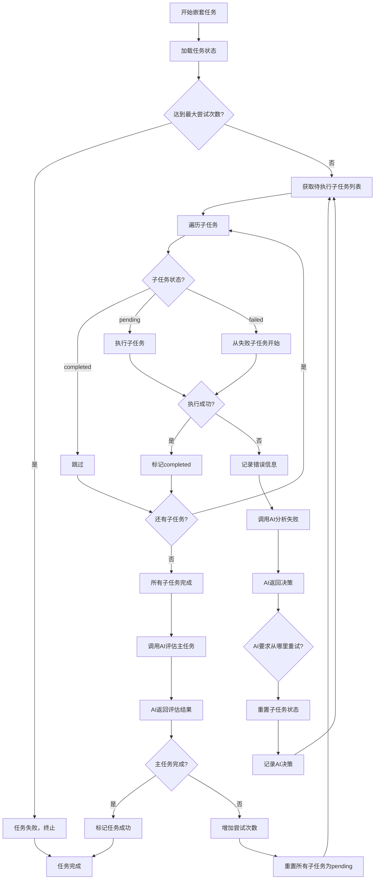
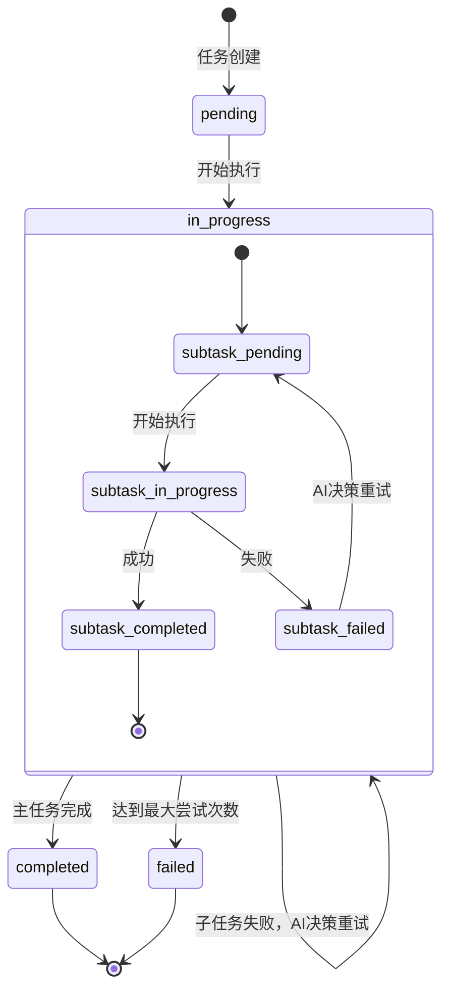

# 架构设计文档

本文档详细描述 LangGraph + CodeBuddy Todo Orchestrator 的架构设计。

## 目录

- [系统架构](#系统架构)
- [核心组件](#核心组件)
- [任务类型](#任务类型)
- [数据流](#数据流)
- [状态管理](#状态管理)
- [长时间任务处理](#长时间任务处理)
- [错误处理](#错误处理)
- [扩展性设计](#扩展性设计)

## 系统架构

### 分层架构

```
┌─────────────────────────────────────────┐
│  应用层 (Application Layer)             │
│  - orchestrator.py                      │
│  - CLI 命令行接口                        │
└────────────────┬────────────────────────┘
                 │
┌────────────────▼────────────────────────┐
│  业务逻辑层 (Business Logic Layer)      │
│  - TaskOrchestrator 类                  │
│  - 任务调度器                           │
│  - 配置解析器                           │
└────────────────┬────────────────────────┘
                 │
┌────────────────▼────────────────────────┐
│  任务执行层 (Task Execution Layer)      │
│  - SimpleTaskExecutor                   │
│  - NestedTaskExecutor                   │
│  - SubtaskExecutor                      │
└────────────────┬────────────────────────┘
                 │
┌────────────────▼────────────────────────┐
│  AI 能力层 (AI Capability Layer)        │
│  - CodeBuddyClient 类                   │
│  - 提示词构造器                         │
│  - 响应解析器                           │
└────────────────┬────────────────────────┘
                 │
┌────────────────▼────────────────────────┐
│  基础设施层 (Infrastructure Layer)      │
│  - 文件系统                             │
│  - 子进程执行                           │
│  - Nohup 监控                           │
│  - Git 操作（可选）                     │
└─────────────────────────────────────────┘
```

### 模块依赖关系

```
orchestrator.py
    ├── yaml (配置解析)
    ├── task_executor.py (任务执行)
    │   ├── codebuddy_client.py (AI 能力)
    │   │   └── subprocess (调用 CodeBuddy)
    │   └── subprocess (执行命令)
    └── monitor.py (长时间任务监控)
        └── subprocess (监控进程)
```

## 核心组件

### 1. TaskOrchestrator

**职责**：任务编排和执行管理

**核心方法**：
```python
class TaskOrchestrator:
    def __init__(self, todos_file: str = "todos.yaml", state_file: str = "todos_state.yaml")
    def load_todos(self) -> list
    def load_state(self) -> dict
    def save_state(self, state: dict)
    def run(self)
    def execute_task(self, task: dict)
    def execute_simple_task(self, task: dict)
    def execute_nested_task(self, task: dict)
    def execute_subtask(self, parent_task_id: str, subtask: dict)
    def call_codebuddy(self, prompt: str) -> str
```

**设计要点**：
- 单一职责：只负责任务调度，不涉及具体执行逻辑
- 状态持久化：支持保存和恢复执行状态
- 统一接口：所有任务类型通过统一接口调用

### 2. SimpleTaskExecutor

**职责**：执行简单任务（一次性命令 + AI 判断）

**执行流程**：
```python
def execute_simple_task_node(task: dict) -> bool:
    """执行简单任务"""
    attempts = 0
    max_attempts = 100  # 防止无限循环
    
    while attempts < max_attempts:
        attempts += 1
        
        # 1. 调用 AI 尝试完成任务
        result = call_codebuddy(f"""
        任务：{task['description']}
        
        完成条件：{task['completion_criteria']}
        
        初始提示：{task.get('initial_hint', '无')}
        
        请尝试完成这个任务。
        
        完成后，请回复以下格式：
        - ✅ 完成：如果满足完成条件
        - ❌ 未完成：如果不满足，并说明你打算如何改进
        """)
        
        # 2. AI 自己判断是否达标
        if "✅ 完成" in result:
            mark_task_completed(task.id)
            return True
        
        # 3. AI 决定如何改进，然后继续循环
        # （AI 自己决定改什么、怎么改）
    
    return False
```

**设计要点**：
- AI 完全自主判断完成条件
- AI 完全自主决定如何改进
- 持续迭代直到达标
- 防止无限循环

### 3. NestedTaskExecutor

**职责**：执行嵌套任务（包含子任务）

**核心设计**：AI完全掌控重试策略

**执行流程**：
```python
def execute_nested_task(task: dict):
    """执行嵌套任务"""
    task_id = task['id']
    max_attempts = 20  # 主任务最大尝试次数
    
    while get_task_attempts(task_id) < max_attempts:
        # 1. 获取待执行的子任务列表
        subtasks = get_pending_subtasks(task_id)
        
        # 2. 遍历并执行子任务
        for subtask in subtasks:
            result = execute_subtask(task_id, subtask)
            
            if not result.success:
                # 3. 子任务失败，调用AI分析
                ai_decision = call_codebuddy(
                    prompt="分析子任务失败原因并决定重试策略",
                    context={
                        "failed_subtask": subtask,
                        "task_history": get_task_history(task_id),
                        "error_logs": result.logs
                    }
                )
                
                # 4. 根据AI决策重置状态
                if ai_decision.retry_from != subtask.id:
                    reset_subtasks_from(task_id, ai_decision.retry_from)
                
                # 5. 记录AI的决策
                record_ai_decision(task_id, subtask.id, ai_decision)
                
                # 6. 跳出子任务循环，开始新一轮尝试
                break
        
        # 7. 所有子任务都完成了，调用AI判断主任务是否完成
        ai_evaluation = call_codebuddy(
            prompt="判断主任务是否完成并决定下一步",
            context={
                "task": task,
                "all_results": get_all_results(task_id)
            }
        )
        
        if ai_evaluation.main_task_completed:
            mark_task_completed(task_id)
            return True
        else:
            # 主任务未完成，准备下一轮
            increase_task_attempts(task_id)
            reset_all_subtasks(task_id)
            record_ai_evaluation(task_id, ai_evaluation)
    
    return False
```

**设计要点**：
- 子任务失败时，**必须调用AI分析**并让AI决定重试起点
- AI可以通过`retry_from`字段指定从哪个子任务开始重试
- 所有子任务完成后，**必须调用AI评估**主任务是否完成
- 如果主任务未完成，重置所有子任务为pending，开始新一轮尝试

#### AI决策点1：子任务失败分析

**触发时机**：子任务执行失败（命令返回非零退出码、超时、崩溃等）

**提供给AI的上下文**：
```yaml
failed_subtask:
  id: "task_2.2"
  type: "long_running"
  command: "python train.py --config config.yaml"
  exit_code: 137  # SIGKILL
  error_log: "Killed (CUDA out of memory)"
  
task_history:
  - subtask: "task_2.1"
    status: "completed"
    attempts: 2
    ai_reasoning: "增加了网络层数到10层"
  
  - subtask: "task_2.2"
    attempt: 2
    previous_errors:
      - attempt_1: "GPU内存不足"
      - attempt_2: "训练中段崩溃"
      
related_files:
  - "config.yaml"
  - "logs/train.log"
```

**AI返回的决策**：
```json
{
  "analysis": "任务失败原因是模型太大（10层）导致GPU内存不足。task_2.1的网络层增加是直接原因。",
  "retry_from": "task_2.1",
  "reasoning": "需要重新调整模型结构，减少网络层数",
  "suggested_fix": "将网络层数从10层减少到6层",
  "confidence": "high"
}
```

#### AI决策点2：主任务完成评估

**触发时机**：所有子任务都完成后

**提供给AI的上下文**：
```yaml
main_task:
  id: "task_2"
  name: "优化模型性能"
  completion_criteria: "val_loss < 0.5 且 accuracy > 0.9"
  
execution_results:
  task_2_1:
    status: "completed"
    modifications: "增加了dropout和batch normalization"
    attempts: 3
    
  task_2_2:
    status: "completed"
    training_log:
      val_loss: 0.52
      val_accuracy: 0.88
    attempts: 2
      
  task_2_3:
    status: "completed"
    ai_analysis: "val_loss接近目标但未达标，accuracy还有差距"
    attempts: 1
```

**AI返回的决策**：
```json
{
  "main_task_completed": false,
  "analysis": "val_loss为0.52，距离0.5的目标还差0.04；accuracy为0.88，距离0.9的目标还差0.02。两个指标都接近但未达标。",
  "next_strategy": "继续优化",
  "retry_from": "task_2.1",
  "suggested_improvements": [
    "尝试使用学习率衰减策略",
    "增加数据增强",
    "调整dropout比例"
  ],
  "confidence": "medium"
}
```

**AI的能力**：
- 可以要求从任意子任务重试（包括前面的子任务）
- 可以提出具体的修复建议
- 可以主动终止任务（如果认为无法达成）
- 完全掌控重试策略

## 任务类型

### 1. 简单任务 (simple)

**定义**：一次性执行命令，由 AI 判断是否完成

**配置示例**：
```yaml
- id: 1
  name: "下载数据集"
  type: simple
  completion_criteria: "data.csv 文件存在且大小 > 10MB"
  initial_hint: "使用 python download.py"
```

**执行流程**：
```
1. AI 尝试完成任务（根据 initial_hint）
   ↓
2. AI 自我评估是否满足完成条件
   ↓
3. 如果满足：标记完成
   如果不满足：AI 决定如何改进，重新尝试
   ↓
4. 循环直到满足条件或达到最大尝试次数
```

### 2. 嵌套任务 (nested)

**定义**：包含多个子任务的任务

**配置示例**：
```yaml
- id: 2
  name: "优化模型性能"
  type: nested
  completion_criteria: "训练成功完成且 val_loss < 0.5"
  subtasks:
    - id: 2.1
      name: "修改训练代码"
      type: ai_action
      completion_criteria: "代码修改完成"
      
    - id: 2.2
      name: "运行训练"
      type: long_running
      command: "python train.py --config modified_config.yaml"
      completion_criteria: "训练正常退出且验证集指标满足要求"
```

**执行流程**：
```
1. 执行子任务 2.1（AI 修改代码）
   ↓
2. 执行子任务 2.2（运行训练，可能很长）
   ↓
3. 所有子任务完成后，AI 判断主任务是否完成
   ↓
4. 如果未完成：重新从子任务 2.1 开始
   ↓
5. 循环直到满足条件或达到最大尝试次数
```

### 3. AI 操作任务 (ai_action)

**定义**：调用 AI 修改代码或执行其他操作

**配置示例**：
```yaml
- id: 2.1
  name: "修改训练代码"
  type: ai_action
  completion_criteria: "代码修改完成"
```

**执行流程**：
```
1. 调用 CodeBuddy 执行操作
   ↓
2. AI 自我评估是否满足完成条件
   ↓
3. 如果满足：标记完成
   如果不满足：继续改进
   ↓
4. 循环直到满足条件或达到最大尝试次数
```

### 4. 长时间任务 (long_running)

**定义**：使用 nohup 后台运行的任务，避免超时

**配置示例**：
```yaml
- id: 2.2
  name: "运行训练"
  type: long_running
  command: "python train.py --config modified_config.yaml"
  completion_criteria: "训练正常退出且验证集指标满足要求"
```

**执行流程**：
```
1. 构造 nohup 命令
   ↓
2. 启动后台训练
   ↓
3. 启动监控进程
   ↓
4. 监控进程持续检查日志
   ↓
5. 检测到完成：调用 AI 检查结果
   ↓
6. AI 判断是否满足完成条件
```

**技术实现**：
- 使用 `nohup` 在后台运行
- 启动独立的监控进程
- 监控进程持续检查日志文件
- 检测到完成标志后通知 AI

## 数据流

### 简单任务执行流程

```
1. 加载 todos.yaml
   ↓
2. 解析任务配置
   ↓
3. 尝试 #1：
   ├─ 调用 CodeBuddy
   ├─ AI 尝试完成任务
   ├─ AI 自我评估
   └─ 如果完成：标记完成
      如果未完成：继续
   ↓
4. 尝试 #2：
   ├─ 调用 CodeBuddy
   ├─ AI 根据上次的反馈改进
   ├─ AI 自我评估
   └─ 如果完成：标记完成
      如果未完成：继续
   ↓
5. 循环直到完成或达到最大尝试次数
```

### 嵌套任务执行流程（含AI决策）

```
开始嵌套任务执行
    ↓
读取子任务列表
    ↓
遍历子任务
    ↓
检查子任务状态
    ├─ completed → 跳过
    ├─ pending → 执行
    └─ failed → 从这里开始
          ↓
      执行子任务
          ↓
    成功？ → 更新状态为completed
    │
    失败？ → 更新状态为failed
              ↓
          【AI决策点1：失败分析】
          ↓
          调用CodeBuddy分析失败原因
              ↓
          AI返回：
          - 失败原因分析
          - 建议重试起点（retry_from）
          - 修复策略建议
              ↓
          根据AI的retry_from重置子任务状态
              ↓
          记录AI决策
              ↓
          开始新一轮子任务执行循环
              ↓
    所有子任务完成？
              ↓ 是
        【AI决策点2：主任务评估】
              ↓
          调用CodeBuddy评估主任务是否完成
              ↓
          AI返回：
          - main_task_completed: true/false
          - 结果分析
          - 下一轮策略建议
              ↓
        完成？ → 主任务成功
              ↓ 否
          增加主任务attempt计数
          重置所有子任务为pending
          记录AI评估
              ↓
          从第一个子任务重新开始
```

**关键流程说明**：

1. **子任务失败处理**：
   - 子任务执行失败后，立即调用AI分析
   - AI根据失败历史、错误日志、相关文件等信息，决定重试起点
   - 系统完全听从AI的决策，重置相应的子任务状态

2. **主任务完成判断**：
   - 所有子任务都完成后，调用AI评估主任务
   - AI根据所有子任务的执行结果，判断是否满足完成条件
   - 如果未完成，AI提出下一轮的优化策略

3. **重试机制**：
   - 子任务级别：每次失败后，AI决定从哪里开始重试
   - 主任务级别：每轮尝试后，AI决定是否继续或终止
   - 最大限制：子任务5次，主任务20次（可配置）

## 状态管理

### 状态文件结构

```yaml
# todos_state.yaml
tasks:
  - id: 1
    status: "completed"  # pending | in_progress | completed | failed
    attempts: 3
    last_attempt: "2026-03-23 22:30:00"
    
  - id: 2
    status: "in_progress"
    attempts: 3  # 主任务尝试次数
    current_round: 2  # 当前轮次
    max_attempts: 20  # 最大尝试次数
    subtasks:
      - id: 2.1
        status: "completed"
        attempts: 2
        last_success_time: "2026-03-23 22:30:00"
        ai_reasoning: "已添加学习率调度器"
        history:
          - attempt: 1
            time: "2026-03-23 22:00:00"
            action: "修改学习率为 0.001"
            result: "修改完成"
          - attempt: 2
            time: "2026-03-23 22:30:00"
            action: "优化网络结构"
            result: "修改完成，满足条件"
            
      - id: 2.2
        status: "failed"
        attempts: 2
        last_failure_time: "2026-03-23 22:48:00"
        error_type: "timeout"  # timeout | oom | crash | validation_failed
        log_file: "logs/task_2_2_attempt_2.log"
        ai_reasoning: "训练过程中GPU内存不足"
        ai_decisions:
          - attempt: 1
            time: "2026-03-23 22:40:00"
            failed_at: "task_2.2"
            retry_from: "task_2.1"
            reasoning: "需要重新调整模型结构"
            suggested_fix: "减少网络层数"
          - attempt: 2
            time: "2026-03-23 22:48:00"
            failed_at: "task_2.2"
            retry_from: "task_2.2"
            reasoning: "只是超时问题，可以继续"
            suggested_fix: "增加timeout时间"
            
      - id: 2.3
        status: "pending"
        attempts: 0
        
    main_task_evaluations:
      - round: 1
        time: "2026-03-23 22:50:00"
        completed: false
        analysis: "val_loss为0.52，距离0.5的目标还差0.04"
        next_strategy: "继续优化"
        suggested_improvements:
          - "尝试使用学习率衰减策略"
          - "增加数据增强"
```

### 状态流转规则

#### 子任务状态流转

```
pending → in_progress → completed/failed
           ↓              ↓
           ←------failed------←
               (重试)
```

#### 状态重置逻辑

1. **子任务失败后的重置**：
   - 根据AI的`retry_from`决定
   - 从`retry_from`到当前失败子任务之间的所有子任务重置为pending
   - 比如AI返回`retry_from: "task_2.1"`，则2.1和2.2都重置为pending

2. **主任务新一轮尝试**：
   - 所有子任务重置为pending
   - `current_round`加1
   - 主任务`attempts`加1

#### AI决策记录

每次AI决策都需要记录：
- 决策时间
- 失败位置（failed_at）
- 重试起点（retry_from）
- AI的推理过程（reasoning）
- 建议的修复方案（suggested_fix）
- 置信度（confidence）

### 状态持久化

```python
class TaskOrchestrator:
    def __init__(self, todos_file="todos.yaml", state_file="todos_state.yaml"):
        self.todos_file = todos_file
        self.state_file = state_file
        self.todos = self.load_todos()
        self.state = self.load_state()
    
    def load_state(self):
        try:
            with open(self.state_file) as f:
                return yaml.safe_load(f) or {"tasks": {}}
        except FileNotFoundError:
            return {"tasks": {}}
    
    def save_state(self):
        with open(self.state_file, "w") as f:
            yaml.dump(self.state, f)
    
    def get_task_state(self, task_id):
        return self.state["tasks"].get(task_id, {"status": "pending"})
    
    def mark_task_status(self, task_id, status, **kwargs):
        if task_id not in self.state["tasks"]:
            self.state["tasks"][task_id] = {}
        
        self.state["tasks"][task_id]["status"] = status
        self.state["tasks"][task_id].update(kwargs)
        self.save_state()
```

## 长时间任务处理

### 问题背景

**为什么需要长时间任务处理？**

CodeBuddy 有超时限制（通常 1 小时），但某些任务（如模型训练）可能需要更长时间。

### 解决方案

**使用 nohup 后台运行 + 独立监控进程：**

```python
def execute_long_running_task(subtask):
    log_file = f"logs/{subtask_id}.log"
    command = subtask["command"]
    
    # 1. 构造 nohup 命令
    full_command = f"nohup {command} > {log_file} 2>&1 &"
    
    # 2. 启动后台任务
    subprocess.run(full_command, shell=True)
    mark_task_status(subtask_id, "running", 
                    log_file=log_file, 
                    started_at=time.strftime("%Y-%m-%d %H:%M:%S"))
    
    # 3. 启动监控
    start_monitor(subtask_id, log_file, subtask["completion_criteria"])
    
    # 4. 等待监控完成
    wait_for_completion(subtask_id)
```

### 监控进程

```python
def start_monitor(subtask_id, log_file, completion_criteria):
    monitor_script = f"""#!/bin/bash
LOG_FILE="{log_file}"
SUBTASK_ID="{subtask_id}"
COMPLETION_CRITERIA="{completion_criteria}"

while true; do
    if [ -f "$LOG_FILE" ]; then
        # 检查是否有错误
        if grep -q "ERROR\\|Exception\\|Traceback" "$LOG_FILE"; then
            echo "检测到错误"
            codebuddy -y -m "子任务 $SUBTASK_ID 检测到错误。请检查 $LOG_FILE 并修复问题。"
            exit 1
        fi
        
        # 检查是否完成
        if grep -q "Training completed\\|Done\\|Finished" "$LOG_FILE"; then
            echo "任务完成"
            codebuddy -y -m "子任务 $SUBTASK_ID 已完成。完成条件：$COMPLETION_CRITERIA。请检查 $LOG_FILE 中的结果，并告诉我是否满足完成条件。回复格式：- ✅ 子任务完成 或 - ❌ 子任务未完成"
            exit 0
        fi
    fi
    sleep 30
done
"""
    
    monitor_file = f"monitors/{subtask_id}.sh"
    with open(monitor_file, "w") as f:
        f.write(monitor_script)
    
    subprocess.run(f"chmod +x {monitor_file} && nohup {monitor_file} > monitors/{subtask_id}.log 2>&1 &", shell=True)
```

### 项目结构

```
langgraph-todo-orchestrator/
├── orchestrator.py          # 主程序
├── todos.yaml              # 任务定义
├── todos_state.yaml        # 任务状态（自动生成）
├── logs/                   # 长时间任务日志
│   └── 2.2.log
├── monitors/               # 监控脚本
│   ├── 2.2.sh
│   └── 2.2.log
└── README.md
```

## 系统与AI的协作流程图

### 完整的嵌套任务执行流程（包含所有AI决策点）



### AI决策详细流程

#### 决策点1：子任务失败分析

```
系统检测到子任务失败
    ↓
系统构造上下文：
  - 失败的子任务信息（命令、退出码、错误日志）
  - 任务历史记录（之前尝试的信息）
  - 相关文件路径
  - 完成条件
    ↓
系统调用CodeBuddy
    ↓
AI分析：
  1. 读取错误日志
  2. 分析失败原因
  3. 检查历史尝试
  4. 评估是否是前面子任务的问题
    ↓
AI返回决策：
  {
    "analysis": "...",          // 失败原因分析
    "retry_from": "task_2.1",   // 从哪个子任务重试
    "reasoning": "...",         // 推理过程
    "suggested_fix": "...",     // 修复建议
    "confidence": "high"        // 置信度
  }
    ↓
系统解析AI决策
    ↓
系统根据retry_from重置子任务状态
    ↓
系统记录AI决策到状态文件
    ↓
系统重新开始子任务循环
```

#### 决策点2：主任务完成评估

```
所有子任务都完成
    ↓
系统构造上下文：
  - 主任务信息（名称、完成条件）
  - 所有子任务的执行结果
  - 训练日志、指标数据
  - 历史评估记录
    ↓
系统调用CodeBuddy
    ↓
AI评估：
  1. 检查每个子任务的结果
  2. 评估是否满足完成条件
  3. 分析结果与目标的差距
  4. 提出下一轮的优化方向
    ↓
AI返回评估：
  {
    "main_task_completed": false,
    "analysis": "...",                    // 结果分析
    "next_strategy": "继续优化",         // 下一轮策略
    "suggested_improvements": [...],     // 改进建议
    "confidence": "medium"
  }
    ↓
系统解析AI评估
    ↓
系统根据main_task_completed决定：
  - true: 标记任务成功
  - false: 增加尝试次数，重置所有子任务，开始新一轮
    ↓
系统记录AI评估到状态文件
    ↓
系统继续执行
```

### 状态管理流程



## 错误处理

### 错误分类

1. **配置错误**
   - YAML 语法错误
   - 缺少必需字段
   - 字段类型错误

2. **执行错误**
   - 命令执行失败（退出码 != 0）
   - 超时
   - OOM（内存溢出）

3. **AI 错误**
   - CodeBuddy 调用失败
   - 响应解析失败
   - AI 返回无效响应

### 系统与AI的协作流程图

### 完整的嵌套任务执行流程（包含所有AI决策点）


### AI决策详细流程

#### 决策点1：子任务失败分析

```
系统检测到子任务失败
    ↓
系统构造上下文：
  - 失败的子任务信息（命令、退出码、错误日志）
  - 任务历史记录（之前尝试的信息）
  - 相关文件路径
  - 完成条件
    ↓
系统调用CodeBuddy
    ↓
AI分析：
  1. 读取错误日志
  2. 分析失败原因
  3. 检查历史尝试
  4. 评估是否是前面子任务的问题
    ↓
AI返回决策：
  {
    "analysis": "...",          // 失败原因分析
    "retry_from": "task_2.1",   // 从哪个子任务重试
    "reasoning": "...",         // 推理过程
    "suggested_fix": "...",     // 修复建议
    "confidence": "high"        // 置信度
  }
    ↓
系统解析AI决策
    ↓
系统根据retry_from重置子任务状态
    ↓
系统记录AI决策到状态文件
    ↓
系统重新开始子任务循环
```

#### 决策点2：主任务完成评估

```
所有子任务都完成
    ↓
系统构造上下文：
  - 主任务信息（名称、完成条件）
  - 所有子任务的执行结果
  - 训练日志、指标数据
  - 历史评估记录
    ↓
系统调用CodeBuddy
    ↓
AI评估：
  1. 检查每个子任务的结果
  2. 评估是否满足完成条件
  3. 分析结果与目标的差距
  4. 提出下一轮的优化方向
    ↓
AI返回评估：
  {
    "main_task_completed": false,
    "analysis": "...",                    // 结果分析
    "next_strategy": "继续优化",         // 下一轮策略
    "suggested_improvements": [...],     // 改进建议
    "confidence": "medium"
  }
    ↓
系统解析AI评估
    ↓
系统根据main_task_completed决定：
  - true: 标记任务成功
  - false: 增加尝试次数，重置所有子任务，开始新一轮
    ↓
系统记录AI评估到状态文件
    ↓
系统继续执行
```

### 状态管理流程


## 错误处理策略

```python
def execute_task(self, task: dict) -> bool:
    try:
        # 1. 验证配置
        self._validate_task(task)
        
        # 2. 执行任务
        if task['type'] == 'simple':
            result = self.execute_simple_task(task)
        elif task['type'] == 'nested':
            result = self.execute_nested_task(task)
        
        return result
    
    except ConfigError as e:
        print(f"❌ 配置错误: {e}")
        return False
    
    except ExecutionError as e:
        print(f"❌ 执行错误: {e}")
        return False
    
    except AICallError as e:
        print(f"❌ AI 调用错误: {e}")
        return False
    
    except Exception as e:
        print(f"❌ 未知错误: {e}")
        self._log_error(e)
        return False
```

## 扩展性设计

### 1. 新增任务类型

```yaml
# 并行任务
- id: 1
  name: "并行数据预处理"
  type: parallel
  commands:
    - "python process_part1.py"
    - "python process_part2.py"
    - "python process_part3.py"
```

### 2. 新增验证器

```python
class CompletionValidator:
    """完成标准验证器"""
    
    def validate(self, criteria: str, context: dict) -> bool:
        # 将自然语言标准转换为验证逻辑
        # 可以使用 AI 或规则引擎
        
        # 示例：简单的关键词匹配
        if "accuracy >=" in criteria:
            threshold = float(criteria.split("accuracy >= ")[1].split()[0])
            return context['accuracy'] >= threshold
        
        # 更复杂的逻辑可以调用 AI
        return self._ask_ai(criteria, context)
```

### 3. 新增通知方式

```python
class Notifier:
    """任务完成通知"""
    
    def notify(self, task_id: int, status: str, message: str):
        # 支持：邮件、企业微信、Slack 等
        pass
```

## AI与系统的职责分工

### 核心原则

**系统负责流程控制，AI负责智能决策**

### 系统职责（Python程序）

1. **执行框架**：
   - 管理任务队列
   - 执行命令（包括nohup后台任务）
   - 监控长时间任务状态
   - 持久化状态到文件

2. **状态管理**：
   - 维护任务和子任务的状态
   - 追踪尝试次数
   - 记录执行历史和日志
   - 根据AI决策重置状态

3. **AI调用**：
   - 在关键时刻调用AI（子任务失败、主任务评估）
   - 提供结构化的上下文
   - 解析AI的决策结果

4. **流程控制**：
   - 根据AI的决策执行后续操作
   - 控制最大重试次数
   - 处理异常情况
   - 防止无限循环

### AI职责（通过CodeBuddy）

1. **失败分析**（决策点1）：
   - 分析子任务失败原因
   - 识别根本原因（是当前子任务的问题，还是前面子任务的问题）
   - 评估历史尝试记录
   - 检查错误日志和相关文件

2. **重试决策**（决策点1）：
   - 决定从哪个子任务开始重试（`retry_from`字段）
   - 提出具体的修复方案（`suggested_fix`字段）
   - 给出推理过程（`reasoning`字段）
   - 提供置信度评估（`confidence`字段）

3. **完成判断**（决策点2）：
   - 判断主任务是否完成（`main_task_completed`字段）
   - 评估结果与目标的差距
   - 分析所有子任务的执行结果

4. **策略建议**（决策点2）：
   - 提出下一轮的优化方向（`next_strategy`字段）
   - 建议具体的改进措施（`suggested_improvements`字段）
   - 可以主动终止任务（如果认为无法达成）

### 通信协议

#### 系统发送给AI

```yaml
# 子任务失败分析请求
prompt: "分析子任务失败原因并决定重试策略"

context:
  failed_subtask:
    id: "task_2.2"
    type: "long_running"
    command: "python train.py --config config.yaml"
    exit_code: 137
    error_log: "Killed (CUDA out of memory)"
    
  task_history:
    - subtask: "task_2.1"
      status: "completed"
      attempts: 2
      ai_reasoning: "增加了网络层数到10层"
    
    - subtask: "task_2.2"
      attempt: 2
      previous_errors:
        - attempt_1: "GPU内存不足"
        - attempt_2: "训练中段崩溃"
        
  related_files:
    - "config.yaml"
    - "logs/train.log"
    
  completion_criteria: "val_loss < 0.5 且 accuracy > 0.9"
```

#### AI返回给系统

```json
{
  "analysis": "任务失败原因是模型太大（10层）导致GPU内存不足。task_2.1的网络层增加是直接原因。",
  "retry_from": "task_2.1",
  "reasoning": "需要重新调整模型结构，减少网络层数",
  "suggested_fix": "将网络层数从10层减少到6层",
  "confidence": "high"
}
```

### 设计优势

1. **完全的AI自主性**：
   - AI完全掌控重试策略
   - AI可以基于实际情况调整
   - 没有硬编码的重试逻辑

2. **避免死循环**：
   - AI能够识别跨子任务的依赖问题
   - AI不会盲目重复失败的操作
   - AI可以主动终止无法完成的任务

3. **灵活性**：
   - AI可以要求从任意子任务重试
   - AI可以提出各种修复方案
   - 系统只负责执行AI的决策

4. **可追踪性**：
   - 所有AI决策都被记录
   - 可以回顾AI的推理过程
   - 便于调试和优化

5. **符合用户核心理念**：
   - "AI自主判断完成条件"
   - "AI根据任务描述自主决策"
   - 系统只提供框架和支持

## 总结

本架构设计实现了：

- ✅ 统一的任务执行模型（不再区分简单任务和循环任务）
- ✅ AI完全自主判断完成条件
- ✅ 支持嵌套任务
- ✅ 支持长时间任务的nohup处理
- ✅ AI完全掌控重试策略
- ✅ 清晰的分层结构
- ✅ 完善的状态管理
- ✅ 可扩展的设计
- ✅ 系统与AI的清晰职责分工
