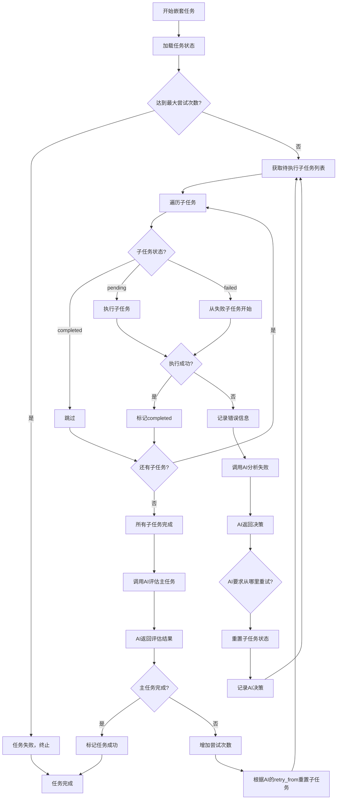
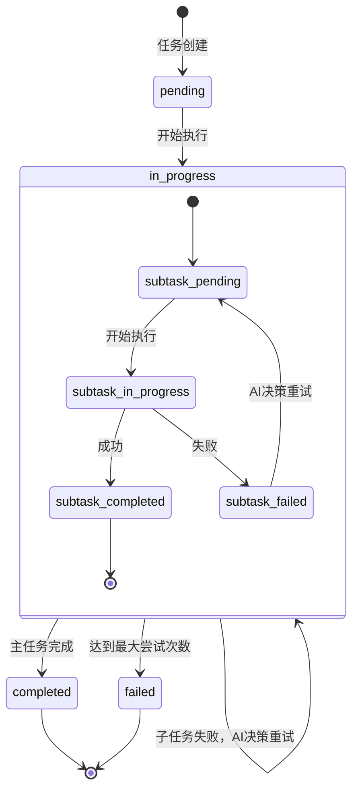

# 架构设计文档

本文档详细描述 CodeBuddy Todo Orchestrator 的架构设计。

## 目录

- [系统架构](#系统架构)
- [核心组件](#核心组件)
- [任务类型](#任务类型)
- [数据流](#数据流)
- [状态管理](#状态管理)
- [长时间任务处理](#长时间任务处理)
- [对话日志系统](#对话日志系统)
- [Ideas 监控与 Idle 模式](#ideas-监控与-idle-模式)
- [错误处理](#错误处理)
- [扩展性设计](#扩展性设计)

## 系统架构

### 分层架构

```
┌─────────────────────────────────────────┐
│  应用层 (Application Layer)             │
│  - orchestrator.py                      │
│  - CLI 命令行接口                        │
└────────────────┬────────────────────────┘
                 │
┌────────────────▼────────────────────────┐
│  业务逻辑层 (Business Logic Layer)      │
│  - TaskOrchestrator 类                  │
│  - 任务调度器                           │
│  - 配置解析器                           │
│  - Context 管理器                       │  ← 管理 CodeBuddy context 生命周期
│  - IdeasWatcher                         │  ← 监控 ideas.md 并转换为 TODO
│  - Idle 模式                            │  ← 任务完成后等待新 ideas
└────────────────┬────────────────────────┘
                 │
┌────────────────▼────────────────────────┐
│  任务执行层 (Task Execution Layer)      │
│  - SimpleTaskExecutor                   │
│  - NestedTaskExecutor                   │
│  - SubtaskExecutor                      │
│  - autoagent_exec.py                    │  ← long_running 任务启动器
└────────────────┬────────────────────────┘
                 │
┌────────────────▼────────────────────────┐
│  AI 能力层 (AI Capability Layer)        │
│  - AIClient 类                           │  ← 统一 AI 客户端（原 CodeBuddyClient）
│  - AIProvider 抽象基类                   │  ← 多 Provider 支持
│  - CodeBuddyProvider / ClaudeCodeProvider│
│  - GeminiCLIProvider                     │
│  - 提示词构造器                         │
│  - 响应解析器（stream-json）             │  ← 实时解析 stream-json 输出
│  - Context 管理（--continue 参数）       │  ← 保持对话上下文连续性
└────────────────┬────────────────────────┘
                 │
┌────────────────▼────────────────────────┐
│  可观测性层 (Observability Layer)       │
│  - ConversationLogger                   │  ← 对话日志记录
│  - 会话目录管理                         │
│  - Markdown 格式日志                    │
└────────────────┬────────────────────────┘
                 │
┌────────────────▼────────────────────────┐
│  基础设施层 (Infrastructure Layer)      │
│  - 文件系统                             │
│  - 子进程执行                           │
│  - Nohup 监控                           │
│  - Git 操作（可选）                     │
└─────────────────────────────────────────┘
```

### 模块依赖关系

```
orchestrator.py
    ├── yaml (配置解析)
    ├── ai_providers.py (Provider 抽象层)
    │   ├── AIProvider (基类)
    │   ├── CodeBuddyProvider
    │   ├── ClaudeCodeProvider
    │   └── GeminiCLIProvider
    ├── task_executor.py (任务执行)
    │   ├── codebuddy_client.py → AIClient (AI 能力)
    │   │   └── ai_providers.py → subprocess (调用各 AI CLI)
    │   ├── autoagent_exec.py (long_running 任务启动器)
    │   │   └── subprocess (启动后台进程 + 信号文件)
    │   └── subprocess (执行命令)
    ├── state_manager.py (状态持久化)
    ├── conversation_logger.py (对话日志)
    ├── ideas_watcher.py (Ideas 监控)
    │   ├── codebuddy_client.py → AIClient (AI 分解 Ideas)
    │   └── yaml (追加任务到 todos.yaml)
    └── monitor.py (长时间任务监控)
        └── subprocess (监控进程)
```

## 核心组件

### 1. TaskOrchestrator

**职责**：任务编排和执行管理

**核心方法**：
```python
class TaskOrchestrator:
    def __init__(self, todos_file: str = "todos.yaml", log_dir: str = None)
    def load_todos(self) -> list
    def load_state(self) -> dict
    def save_state(self, state: dict)
    def run(self)
    def execute_task(self, task: dict)
    def execute_simple_task(self, task: dict)
    def execute_nested_task(self, task: dict)
    def execute_subtask(self, parent_task_id: str, subtask: dict)
    def call_codebuddy(self, prompt: str) -> str
```

**设计要点**：
- 单一职责：只负责任务调度，不涉及具体执行逻辑
- 状态持久化：支持保存和恢复执行状态
- 统一接口：所有任务类型通过统一接口调用

### 2. AI Provider 层（ai_providers.py）

**职责**：抽象不同 AI CLI 工具之间的差异，提供统一的命令构造接口。

**核心类**：

- `AIProvider` — 抽象基类，定义 `build_command()` 和 `get_stdin_command()` 接口
- `CodeBuddyProvider` — CodeBuddy CLI（默认 provider，默认模型 `glm-5.0-ioa`）
- `ClaudeCodeProvider` — Claude Code Internal CLI（默认模型 `claude-sonnet-4-6`）
- `GeminiCLIProvider` — Gemini CLI Internal（默认模型 `gemini-2.5-pro`）

**工厂函数**：

- `get_provider(name, ...)` — 按名称创建 provider 实例（支持别名，如 `cb` → `codebuddy`）
- `list_providers()` — 列出所有可用 provider 及其信息

**命令构造示例**：

```bash
# CodeBuddyProvider
type prompt.txt | codebuddy --debug --verbose --print --output-format stream-json --model glm-5.0-ioa -y -

# ClaudeCodeProvider
type prompt.txt | claude-internal --verbose --print --output-format stream-json --model claude-sonnet-4-6 --dangerously-skip-permissions -

# GeminiCLIProvider
type prompt.txt | gemini-internal --output-format stream-json --model gemini-2.5-pro --yolo -p -
```

**Provider 注册表与别名**：

```python
PROVIDERS = {
    "codebuddy": CodeBuddyProvider,
    "claude": ClaudeCodeProvider,
    "gemini": GeminiCLIProvider,
}

PROVIDER_ALIASES = {
    "cb": "codebuddy",
    "claude-code": "claude",
    "claude-internal": "claude",
    "gemini-cli": "gemini",
    "gemini-internal": "gemini",
}
```

### 3. AIClient（codebuddy_client.py）

**职责**：统一的 AI CLI 客户端，封装 AI 调用、Context 管理和 stream-json 解析。

> **注意**：`AIClient` 是主类名，`CodeBuddyClient` 是为向后兼容保留的别名。

**核心功能**：

- 通过 `AIProvider` 构造正确的 CLI 命令
- 将 prompt 写入临时文件并通过 stdin 管道传递（避免 shell 转义问题）
- 实时解析 stream-json 输出（`_handle_stream_line()`），支持：
  - `assistant` 事件：文本输出和工具调用
  - `user` 事件：工具执行结果
  - `result` 事件：最终结果摘要
- 维护 `last_full_log` 属性，记录包含工具调用的完整对话日志
- 通过 `_session_started` 标志管理 `--continue` 参数的使用

**stream-json 解析**：

AI CLI 工具的 `--output-format stream-json` 模式输出逐行 JSON 对象。`_handle_stream_line()` 方法实时解析这些事件，提取 assistant 文本、显示工具调用摘要，并收集完整日志。

```python
# stream-json 事件类型
assistant  → AI 消息（文本块 + 工具调用）
user       → 工具执行结果
result     → 最终摘要（turns 数、耗时等）
system     → 系统/会话初始化消息
```

### 4. SimpleTaskExecutor

**职责**：执行简单任务（一次性命令 + AI 判断）

**执行流程**：
```python
def execute_simple_task_node(task: dict) -> bool:
    """执行简单任务"""
    attempts = 0
    max_attempts = 20  # 防止无限循环，可在配置中覆盖
    
    while attempts < max_attempts:
        attempts += 1
        
        # 1. 调用 AI 尝试完成任务
        result = call_codebuddy(f"""
        任务：{task['description']}
        
        完成条件：{task['completion_criteria']}
        
        初始提示：{task.get('initial_hint', '无')}
        
        请尝试完成这个任务。
        
        完成后，请回复以下格式：
        - ✅ 完成：如果满足完成条件
        - ❌ 未完成：如果不满足，并说明你打算如何改进
        """)
        
        # 2. AI 自己判断是否达标
        if "✅ 完成" in result:
            mark_task_completed(task.id)
            return True
        
        # 3. AI 决定如何改进，然后继续循环
        # （AI 自己决定改什么、怎么改）
    
    return False
```

**设计要点**：
- AI 完全自主判断完成条件
- AI 完全自主决定如何改进
- 持续迭代直到达标
- 防止无限循环

### 5. NestedTaskExecutor

**职责**：执行嵌套任务（包含子任务）

**核心设计**：AI完全掌控重试策略

**执行流程**：
```python
def execute_nested_task(task: dict):
    """执行嵌套任务"""
    task_id = task['id']
    max_attempts = 20  # 主任务最大尝试次数
    
    while get_task_attempts(task_id) < max_attempts:
        # 1. 获取待执行的子任务列表
        subtasks = get_pending_subtasks(task_id)
        
        # 2. 遍历并执行子任务
        all_subtasks_completed = True
        for subtask in subtasks:
            result = execute_subtask(task_id, subtask)
            
            if not result.success:
                all_subtasks_completed = False
                
                # 3. 子任务失败，立即停止后续子任务，调用AI分析
                ai_decision = call_codebuddy(
                    prompt="分析子任务失败原因并决定重试策略",
                    context={
                        "failed_subtask": subtask,
                        "task_history": get_task_history(task_id),
                        "error_logs": result.logs
                    }
                )
                
                # 4. 根据AI决策重置状态
                reset_subtasks_from(task_id, ai_decision.retry_from)
                
                # 5. 记录AI的决策
                record_ai_decision(task_id, subtask.id, ai_decision)
                
                # 6. 跳出子任务循环，回到 while 开始新一轮尝试
                break
        
        # 如果有子任务失败，跳过主任务评估，直接进入下一轮
        if not all_subtasks_completed:
            increase_task_attempts(task_id)
            continue
        
        # 7. 所有子任务都完成了，调用AI判断主任务是否完成
        ai_evaluation = call_codebuddy(
            prompt="判断主任务是否完成并决定下一步",
            context={
                "task": task,
                "all_results": get_all_results(task_id)
            }
        )
        
        if ai_evaluation.main_task_completed:
            mark_task_completed(task_id)
            return True
        else:
            # 主任务未完成，AI决定从哪里开始重试
            increase_task_attempts(task_id)
            retry_from = ai_evaluation.retry_from  # AI决定重试起点
            reset_subtasks_from(task_id, retry_from)
            record_ai_evaluation(task_id, ai_evaluation)
    
    return False
```

**设计要点**：
- 子任务失败时，**必须调用AI分析**并让AI决定重试起点
- AI可以通过`retry_from`字段指定从哪个子任务开始重试
- 所有子任务完成后，**必须调用AI评估**主任务是否完成
- 如果主任务未完成，AI通过`retry_from`指定从哪个子任务开始新一轮尝试

#### AI决策点1：子任务失败分析

**触发时机**：子任务执行失败（命令返回非零退出码、超时、崩溃等）

**提供给AI的上下文**：
```yaml
failed_subtask:
  id: "task_2.2"
  type: "long_running"
  command: "python train.py --config config.yaml"
  exit_code: 137  # SIGKILL
  error_log: "Killed (CUDA out of memory)"
  
task_history:
  - subtask: "task_2.1"
    status: "completed"
    attempts: 2
    ai_reasoning: "增加了网络层数到10层"
  
  - subtask: "task_2.2"
    attempt: 2
    previous_errors:
      - attempt_1: "GPU内存不足"
      - attempt_2: "训练中段崩溃"
      
related_files:
  - "config.yaml"
  - "logs/train.log"
```

**AI返回的决策**：
```json
{
  "analysis": "任务失败原因是模型太大（10层）导致GPU内存不足。task_2.1的网络层增加是直接原因。",
  "retry_from": "task_2.1",
  "reasoning": "需要重新调整模型结构，减少网络层数",
  "suggested_fix": "将网络层数从10层减少到6层",
  "confidence": "high"
}
```

#### AI决策点2：主任务完成评估

**触发时机**：所有子任务都完成后

**提供给AI的上下文**：
```yaml
main_task:
  id: "task_2"
  name: "优化模型性能"
  completion_criteria: "val_loss < 0.5 且 accuracy > 0.9"
  
execution_results:
  task_2_1:
    status: "completed"
    modifications: "增加了dropout和batch normalization"
    attempts: 3
    
  task_2_2:
    status: "completed"
    training_log:
      val_loss: 0.52
      val_accuracy: 0.88
    attempts: 2
      
  task_2_3:
    status: "completed"
    ai_analysis: "val_loss接近目标但未达标，accuracy还有差距"
    attempts: 1
```

**AI返回的决策**：
```json
{
  "main_task_completed": false,
  "analysis": "val_loss为0.52，距离0.5的目标还差0.04；accuracy为0.88，距离0.9的目标还差0.02。两个指标都接近但未达标。",
  "next_strategy": "继续优化",
  "retry_from": "task_2.1",
  "suggested_improvements": [
    "尝试使用学习率衰减策略",
    "增加数据增强",
    "调整dropout比例"
  ],
  "confidence": "medium"
}
```

**AI的能力**：
- 可以要求从任意子任务重试（包括前面的子任务）
- 可以提出具体的修复建议
- 可以主动终止任务（如果认为无法达成）
- 完全掌控重试策略

## Context 管理

### 设计理念

**重要设计决策**：每个主任务使用独立的 CodeBuddy context，主任务内的所有子任务共享该 context。

### Context 分层策略

#### 1. 主任务级别的 Context 隔离

```python
class TaskOrchestrator:
    def execute_main_task(self, task: dict):
        # 每个主任务创建独立的 CodeBuddyClient
        context_id = f"task_{task['id']}"
        client = CodeBuddyClient(context_id=context_id)
        
        # 第一次调用，不使用 --continue（创建新的 context）
        initial_prompt = self._build_initial_prompt(task)
        client.ask(initial_prompt, continue_session=False)
        
        # 后续所有子任务都使用 --continue（保持 context）
        for subtask in task['subtasks']:
            result = self._execute_subtask(client, subtask)
            # ...
```

**优势**：
- ✅ 不同主任务之间的实验完全隔离
- ✅ 避免 context 污染（比如任务1修改了代码，任务2不受影响）
- ✅ 便于调试和分析（可以追溯特定任务的完整对话历史）

> **注意**：由于 CodeBuddy CLI 的 `--continue` 只能继续最近一次对话，当前主任务必须串行执行。`context_id` 主要用于状态记录和日志追踪。

#### 2. 子任务级别的 Context 共享

```python
def _execute_subtask(self, client: CodeBuddyClient, subtask: dict):
    """执行子任务，共享主任务的 context"""
    
    if subtask['type'] == 'simple':
        # 简单任务：使用 --continue 保持上下文，AI 自主完成
        prompt = self._build_subtask_prompt(subtask)
        result = client.ask(prompt, continue_session=True)
        
    elif subtask['type'] == 'long_running':
        # 长时间任务：启动后台进程，使用 --continue 继续监控
        command = self._build_nohup_command(subtask)
        self._start_background_task(command)
        
        # 监控完成后，使用 --continue 让 AI 分析结果
        monitor_result = self._monitor_task(subtask)
        analysis = client.ask(
            f"分析任务结果：\n{monitor_result}",
            continue_session=True
        )
```

**优势**：
- ✅ AI 可以记住之前的修改和决策
- ✅ 子任务之间可以引用前一个子任务的结果
- ✅ 保持对话的连贯性
- ✅ 减少重复的上下文信息传递

**完成检测三层策略**：

`SimpleTaskExecutor._check_completion()` 使用三层检测策略判断 AI 是否报告任务完成：

1. **严格否定标记**（最高优先级）：检查 `❌ not completed` 等否定标记，匹配则返回 `False`
2. **严格肯定标记**：检查 `✅ completed` 等肯定标记，匹配则返回 `True`
3. **模糊肯定匹配**（兜底）：使用正则表达式匹配 `✅.*completed`、`all criteria met` 等变体，
   同时排除含有 `not completed`、`fail` 等否定词的情况

默认（无匹配）返回 `False`，即认为未完成。

#### 3. Context 生命周期管理

```
主任务开始
    ↓
创建新的 CodeBuddyClient (context_id="task_x")
    ↓
第一次调用：continue_session=False
    ↓
执行子任务 1：continue_session=True
    ↓
执行子任务 2：continue_session=True
    ↓
执行子任务 3：continue_session=True
    ↓
所有子任务完成
    ↓
调用 AI 评估主任务：continue_session=True
    ↓
主任务完成/失败
    ↓
（可选）清理 context 或保留用于后续分析
```

### 状态文件中的 Context 信息

在 `todos_state.yaml` 中记录 context 信息：

```yaml
tasks:
  - id: 2
    status: "in_progress"
    context_id: "task_2"  # ← 新增：记录 context_id
    context_created_at: "2026-03-23 22:00:00"  # ← 新增
    max_attempts: 20
    subtasks:
      - id: 2.1
        status: "completed"
        # ...
```

### CodeBuddy 命令构造

#### 第一次调用（创建新 context）

```bash
codebuddy -m "glm-4.7" -y "请阅读 program.md 并开始执行任务 2"
```

#### 后续调用（继续现有 context）

```bash
codebuddy --continue -m "glm-4.7" -y "检查子任务 2.1 的执行结果"
```

#### 长时间任务的特殊处理

```bash
# 启动后台训练（不使用 --continue，因为是独立的子进程）
nohup python train.py --config config.yaml > logs/2.2.log 2>&1 &

# 训练完成后，使用 --continue 继续 context 分析结果
codebuddy --continue -m "glm-4.7" -y "分析训练日志并判断是否满足完成条件"
```

### 错误处理与 Context 恢复

如果系统在执行过程中崩溃，可以通过 `context_id` 恢复：

```python
# 从状态文件中恢复
state = load_state("todos_state.yaml")
for task in state['tasks']:
    if task['status'] == 'in_progress':
        # 恢复之前的 context
        client = CodeBuddyClient(context_id=task['context_id'])
        
        # 继续执行
        resume_task(client, task)
```

### 实现要点

1. **Context ID 生成规则**：
   - 使用任务 ID 作为 context ID：`task_{task_id}`
   - 确保唯一性：不同主任务的 context ID 不会冲突
   - **注意**：`context_id` 是系统内部标识，用于状态记录和日志追踪。CodeBuddy CLI 的 `--continue` 参数只能继续**最近一次**对话，不支持指定某个 context ID 精确恢复。因此同一时刻只能有一个主任务在执行，或者需要额外的机制（如多用户隔离）来管理多 context。

2. **--continue 参数的使用**：
   - 第一次调用：`continue_session=False`
   - 后续调用：`continue_session=True`
   - 跨系统重启后：如果 context 仍然存在，使用 `continue_session=True`

3. **Context 清理策略**：
   - 主任务成功：保留 context 24小时（用于审计和分析）
   - 主任务失败：立即清理（避免资源浪费）
   - 超过最大尝试次数：清理 context 并记录日志

4. **并发控制**：
   - 由于 `--continue` 只能继续最近一次对话，主任务必须串行执行
   - 同一个主任务的子任务必须串行执行（共享 context）
   - 如果未来 CodeBuddy 支持指定 context ID，可以扩展为并发执行

## 任务类型

### 1. 简单任务 (simple)

**定义**：由 AI 自主完成的任务，涵盖命令执行、代码修改、分析等所有场景

**配置示例**：
```yaml
# 作为顶层任务
- id: 1
  name: "下载数据集"
  type: simple
  completion_criteria: "data.csv 文件存在且大小 > 10MB"
  initial_hint: "使用 python download.py"

# 作为子任务（代码修改场景）
- id: 2.1
  name: "修改训练代码"
  type: simple
  completion_criteria: "代码修改完成，添加了 dropout 层和学习率调度器"
```

> **设计理念**：不区分"执行命令"和"修改代码"——对 AI 来说这是同一件事。AI 看到"修改训练代码"自然知道要改代码，看到"运行测试"自然知道要运行命令。用户只需要回答一个问题：**"这个任务需要在后台长时间运行吗？"** 需要就用 `long_running`，不需要就用 `simple`。

**执行流程**：
```
1. AI 尝试完成任务（根据 initial_hint）
   ↓
2. AI 自我评估是否满足完成条件
   ↓
3. 如果满足：标记完成
   如果不满足：AI 决定如何改进，重新尝试
   ↓
4. 循环直到满足条件或达到最大尝试次数
```

### 2. 嵌套任务 (nested)

**定义**：包含多个子任务的任务

**配置示例**：
```yaml
- id: 2
  name: "优化模型性能"
  type: nested
  completion_criteria: "训练成功完成且 val_loss < 0.5"
  subtasks:
    - id: 2.1
      name: "修改训练代码"
      type: simple
      completion_criteria: "代码修改完成"
      
    - id: 2.2
      name: "运行训练"
      type: long_running
      command: "python train.py --config modified_config.yaml"
      completion_criteria: "训练正常退出且验证集指标满足要求"
```

**执行流程**：
```
1. 执行子任务 2.1（AI 修改代码）
   ↓
2. 如果子任务 2.1 失败：立即停止，AI 分析并决定重试策略
   如果子任务 2.1 成功：继续
   ↓
3. 执行子任务 2.2（运行训练，可能很长）
   ↓
4. 如果子任务 2.2 失败：立即停止，AI 分析并决定从哪个子任务重试
   如果子任务 2.2 成功：继续
   ↓
5. 所有子任务完成后，AI 判断主任务是否完成
   ↓
6. 如果未完成：AI 决定从哪个子任务重新开始
   ↓
7. 循环直到满足条件或达到最大尝试次数
```

### 3. 长时间任务 (long_running)

**定义**：通过 `autoagent-exec` 启动的长时间后台任务，使用 10 秒快速失败检测机制

**配置示例**：
```yaml
- id: 2.2
  name: "运行训练"
  type: long_running
  completion_criteria: "训练正常退出且验证集指标满足要求"
```

> **注意**：`long_running` 类型的子任务不再需要在 YAML 中指定 `command` 字段。AI 会根据任务描述自主决定要运行的命令，并通过 `autoagent-exec` 启动。

**执行流程**：
```
1. AutoAgent 构造 prompt，告知 AI 使用 autoagent-exec 执行长时间命令
   ↓
2. AI 通过 Bash 工具调用 autoagent-exec
   ↓
3. autoagent-exec 启动命令并监视 10 秒：
   ├─ 10 秒内失败（退出码非零）：立即报告错误，AI 可修复并重试
   ├─ 10 秒内成功（退出码 0）：直接完成
   └─ 10 秒后仍在运行：输出 "TASK SUBMITTED"，AI 结束会话
   ↓
4. AI 看到 "TASK SUBMITTED" 后输出 LONG_RUNNING_IN_PROGRESS
   ↓
5. AutoAgent 检测到 LONG_RUNNING_IN_PROGRESS，开始轮询信号文件
   ↓
6. 任务完成后，重新启动 AI 分析结果
   ↓
7. AI 读取输出日志，判断是否满足完成条件
```

**技术实现**：
- 使用 `autoagent_exec.py` 脚本作为 long_running 任务启动器
- 10 秒快速失败检测，避免 AI 反复启动会话
- 信号文件（`lr_tasks/lr_<task_id>_signal.json`）用于进程间通信
- 输出日志（`lr_tasks/lr_<task_id>_output.log`）记录命令完整输出
- 任务完成后 AutoAgent 重启 AI 会话进行结果分析

## 数据流

### 简单任务执行流程

```
1. 加载 todos.yaml
   ↓
2. 解析任务配置
   ↓
3. 尝试 #1：
   ├─ 调用 CodeBuddy
   ├─ AI 尝试完成任务
   ├─ AI 自我评估
   └─ 如果完成：标记完成
      如果未完成：继续
   ↓
4. 尝试 #2：
   ├─ 调用 CodeBuddy
   ├─ AI 根据上次的反馈改进
   ├─ AI 自我评估
   └─ 如果完成：标记完成
      如果未完成：继续
   ↓
5. 循环直到完成或达到最大尝试次数
```

### 嵌套任务执行流程（含AI决策）

```
开始嵌套任务执行
    ↓
读取子任务列表
    ↓
遍历子任务
    ↓
检查子任务状态
    ├─ completed → 跳过
    ├─ pending → 执行
    └─ failed → 从这里开始
          ↓
      执行子任务
          ↓
    成功？ → 更新状态为completed
    │
    失败？ → 更新状态为failed
              ↓
          【AI决策点1：失败分析】
          ↓
          调用CodeBuddy分析失败原因
              ↓
          AI返回：
          - 失败原因分析
          - 建议重试起点（retry_from）
          - 修复策略建议
              ↓
          根据AI的retry_from重置子任务状态
              ↓
          记录AI决策
              ↓
          开始新一轮子任务执行循环
              ↓
    所有子任务完成？
              ↓ 是
        【AI决策点2：主任务评估】
              ↓
          调用CodeBuddy评估主任务是否完成
              ↓
          AI返回：
          - main_task_completed: true/false
          - 结果分析
          - 下一轮策略建议
              ↓
        完成？ → 主任务成功
              ↓ 否
          增加主任务attempt计数
          根据AI的retry_from重置相应子任务
          记录AI评估
              ↓
          从AI指定的子任务重新开始
```

**关键流程说明**：

1. **子任务失败处理**：
   - 子任务执行失败后，立即调用AI分析
   - AI根据失败历史、错误日志、相关文件等信息，决定重试起点
   - 系统完全听从AI的决策，重置相应的子任务状态

2. **主任务完成判断**：
   - 所有子任务都完成后，调用AI评估主任务
   - AI根据所有子任务的执行结果，判断是否满足完成条件
   - 如果未完成，AI提出下一轮的优化策略

3. **重试机制**：
   - 子任务级别：每次失败后，AI决定从哪里开始重试
   - 主任务级别：每轮尝试后，AI决定是否继续或终止
   - 最大限制：子任务5次，主任务20次（可配置）

## 状态管理

### 状态文件结构

```yaml
# todos_state.yaml
tasks:
  - id: 1
    status: "completed"  # pending | in_progress | completed | failed
    attempts: 3
    last_attempt: "2026-03-23 22:30:00"
    
  - id: 2
    status: "in_progress"
    attempts: 3  # 主任务尝试次数
    current_round: 2  # 当前轮次
    max_attempts: 20  # 最大尝试次数
    subtasks:
      - id: 2.1
        status: "completed"
        attempts: 2
        last_success_time: "2026-03-23 22:30:00"
        ai_reasoning: "已添加学习率调度器"
        history:
          - attempt: 1
            time: "2026-03-23 22:00:00"
            action: "修改学习率为 0.001"
            result: "修改完成"
          - attempt: 2
            time: "2026-03-23 22:30:00"
            action: "优化网络结构"
            result: "修改完成，满足条件"
            
      - id: 2.2
        status: "failed"
        attempts: 2
        last_failure_time: "2026-03-23 22:48:00"
        error_type: "timeout"  # timeout | oom | crash | validation_failed
        log_file: "logs/task_2_2_attempt_2.log"
        ai_reasoning: "训练过程中GPU内存不足"
        ai_decisions:
          - attempt: 1
            time: "2026-03-23 22:40:00"
            failed_at: "task_2.2"
            retry_from: "task_2.1"
            reasoning: "需要重新调整模型结构"
            suggested_fix: "减少网络层数"
          - attempt: 2
            time: "2026-03-23 22:48:00"
            failed_at: "task_2.2"
            retry_from: "task_2.2"
            reasoning: "只是超时问题，可以继续"
            suggested_fix: "增加timeout时间"
            
      - id: 2.3
        status: "pending"
        attempts: 0
        
    main_task_evaluations:
      - round: 1
        time: "2026-03-23 22:50:00"
        completed: false
        analysis: "val_loss为0.52，距离0.5的目标还差0.04"
        next_strategy: "继续优化"
        suggested_improvements:
          - "尝试使用学习率衰减策略"
          - "增加数据增强"
```

### 状态流转规则

#### 子任务状态流转

```
pending → in_progress → completed/failed
           ↓              ↓
           ←------failed------←
               (AI决策重试)
```

> `in_progress` 同时覆盖"正在执行"和"长时间任务后台运行"两种场景。

#### 状态重置逻辑

1. **子任务失败后的重置**：
   - 根据AI的`retry_from`决定
   - 从`retry_from`到当前失败子任务之间的所有子任务重置为pending
   - 比如AI返回`retry_from: "task_2.1"`，则2.1和2.2都重置为pending

2. **主任务新一轮尝试**：
   - AI通过`retry_from`指定重试起点
   - 从`retry_from`开始的子任务重置为pending
   - `current_round`加1
   - 主任务`attempts`加1

#### AI决策记录

每次AI决策都需要记录：
- 决策时间
- 失败位置（failed_at）
- 重试起点（retry_from）
- AI的推理过程（reasoning）
- 建议的修复方案（suggested_fix）
- 置信度（confidence）

### 状态持久化

```python
class TaskOrchestrator:
    def __init__(self, todos_file="todos.yaml", log_dir=None):
        self.todos_file = todos_file
        # log_dir defaults to ".autoagent" (relative to CWD)
        # Session directory resolved via .autoagent_log in workspace
        self.session_dir = self._resolve_log_session_dir(log_dir, workspace)
        self.state = StateManager(os.path.join(self.session_dir, "todos_state.yaml"))
        self.todos = self.load_todos()
    
    def load_state(self):
        try:
            with open(self.state_file) as f:
                return yaml.safe_load(f) or {"tasks": {}}
        except FileNotFoundError:
            return {"tasks": {}}
    
    def save_state(self):
        with open(self.state_file, "w") as f:
            yaml.dump(self.state, f)
    
    def get_task_state(self, task_id):
        return self.state["tasks"].get(task_id, {"status": "pending"})
    
    def mark_task_status(self, task_id, status, **kwargs):
        if task_id not in self.state["tasks"]:
            self.state["tasks"][task_id] = {}
        
        self.state["tasks"][task_id]["status"] = status
        self.state["tasks"][task_id].update(kwargs)
        self.save_state()
```

## 长时间任务处理

### 问题背景

**为什么需要长时间任务处理？**

CodeBuddy 有超时限制（通常 1 小时），但某些任务（如模型训练、Profiling）可能需要更长时间。

### 解决方案

**使用 autoagent-exec 启动器 + 10 秒快速失败检测 + 信号文件轮询：**

整个 long_running 任务流程涉及三方协作：

```
┌──────────────┐     prompt      ┌───────────┐     bash call     ┌──────────────────┐
│  AutoAgent   │ ──────────────→ │    AI     │ ───────────────→ │  autoagent-exec  │
│ (Orchestrator│                 │ (CodeBuddy│                   │  (独立脚本)       │
│  轮询信号文件)│ ←── 读取状态 ── │  会话结束) │                   │  10s 快速失败检测 │
└──────────────┘                 └───────────┘                   │  后台进程管理     │
                                                                 │  信号文件写入     │
                                                                 └──────────────────┘
```

### autoagent_exec.py（long_running 任务启动器）

**职责**：作为 AI 通过 Bash 调用的独立脚本，负责启动命令、快速失败检测、后台管理和信号文件写入。

**调用方式**：
```bash
python autoagent_exec.py --log-dir <log_session_dir> --task-id <id> -- <command...>
```

**参数说明**：

| 参数 | 说明 |
|------|------|
| `--log-dir` | 日志会话目录的绝对路径（由 AutoAgent 传递给 AI prompt） |
| `--task-id` | 子任务 ID（如 `1.2`） |
| `-- <command>` | 要执行的命令（`--` 之后的所有内容） |

**10 秒快速失败检测机制**：

```
启动命令
  ↓
等待 10 秒
  ↓
┌──────────────────────────────────────┐
│ 10 秒内退出？                        │
│ ├─ 退出码 = 0 → ✅ 命令快速完成     │
│ │   写入 "finished" 信号文件         │
│ ├─ 退出码 ≠ 0 → ❌ 快速失败         │
│ │   打印错误输出（供 AI 查看并修复）  │
│ │   不写信号文件（AI 可直接重试）     │
│ └─ 仍在运行 → 🚀 转为后台任务       │
│     写入 "running" 信号文件          │
│     打印 "TASK SUBMITTED" 消息       │
│     启动监控线程等待进程结束          │
└──────────────────────────────────────┘
```

**信号文件格式**（`lr_tasks/lr_<task_id>_signal.json`）：

```json
{
  "task_id": "1.2",
  "command": "ncu --set full --csv ./build/Release/main.exe",
  "pid": 12345,
  "output_log": "/path/to/logs/lr_tasks/lr_1.2_output.log",
  "status": "running",
  "submitted_at": "2026-03-25T15:30:00",
  "finished_at": null,
  "exit_code": null
}
```

`status` 字段变化：`running` → `finished`（退出码 0）或 `error`（退出码非 0）

### SubtaskExecutor 中的 long_running 流程

```python
def _execute_long_running_subtask(self, subtask, client, ...):
    # 1. 构造 prompt，告知 AI 使用 autoagent-exec
    #    --log-dir 使用 self.session_dir（从 orchestrator 传入）
    prompt = self._build_long_running_prompt(
        subtask, autoagent_exec_path, self.session_dir, ...
    )
    
    # 2. AI 调用 autoagent-exec，可能出现以下情况：
    result = client.ask(prompt)
    
    # 3a. AI 报告 LONG_RUNNING_IN_PROGRESS
    if self._check_long_running_in_progress(result):
        # 轮询信号文件，等待后台任务完成
        status = self._poll_signal_file(signal_file)
        # 重启 AI 分析结果
        return self._ai_analyze_long_running_result(...)
    
    # 3b. AI 直接完成（快速成功或自行处理）
    if self._check_completion(result):
        return SubtaskResult(success=True)
    
    # 3c. 快速失败，AI 已看到错误，下一轮重试
```

### session_dir 传递机制

**设计要点**：`session_dir`（日志会话目录）由 orchestrator 在初始化时解析，然后逐级传递给所有需要它的执行器。

```
TodoOrchestrator
  │
  │  self.session_dir = _resolve_log_session_dir(log_dir, workspace)
  │
  └─→ NestedTaskExecutor(session_dir=self.session_dir)
        │
        │  self.session_dir = session_dir
        │
        └─→ SubtaskExecutor(session_dir=session_dir)
              │
              │  self.session_dir = session_dir
              │
              └─→ 在 _execute_long_running_subtask 中直接使用 self.session_dir
                  构造 AI prompt 中的 --log-dir 参数
```

这样确保了 AI prompt 中的 `--log-dir` 路径与 orchestrator 的 `--log-dir` 参数一致，而不是硬编码某个默认路径。

### Orchestrator 端的处理

AutoAgent 通过轮询信号文件等待后台任务完成：

```python
def _poll_signal_file(self, subtask_id, signal_file, check_interval=15):
    """每 15 秒检查一次信号文件"""
    while True:
        if os.path.exists(signal_file):
            signal_data = json.load(open(signal_file))
            if signal_data['status'] in ('finished', 'error'):
                return signal_data['status']
        time.sleep(check_interval)

def _ai_analyze_long_running_result(self, subtask, client, status, output_log):
    """重启 AI 会话，让 AI 读取输出日志并判断完成条件"""
    # 提供输出日志文件路径（而非嵌入内容），AI 使用 Read 工具读取
    prompt = f"""Task completed with status: {status}
    Output log: {output_log}
    Please read the log and evaluate..."""
    result = client.ask(prompt, continue_session=True)
    return result
```

### 项目结构

```
autoagent/
├── orchestrator.py           # 主程序、CLI 入口
├── ai_providers.py           # AI Provider 抽象层（多 CLI 工具支持）
├── task_executor.py          # 任务执行器 (Simple/Nested/SubtaskExecutor)
├── autoagent_exec.py         # long_running 任务启动器（AI 通过 Bash 调用）
├── codebuddy_client.py       # AIClient（统一 AI 客户端）
├── state_manager.py          # 状态持久化管理
├── conversation_logger.py    # 对话日志记录
├── ideas_watcher.py          # Ideas 文件监控与任务分解
│
├── todos.yaml                # 任务定义
├── ideas.md                  # 用户的想法记录（可选）
├── .autoagent_log            # 项目对应的日志子文件夹名（自动生成）
│
├── <log_dir>/                # 日志根目录（默认 .autoagent，相对 CWD）
│   └── <project>_<random>/   # 项目专属会话目录（由 .autoagent_log 指定）
│       ├── orchestrator.log           # Orchestrator 运行日志
│       ├── todos_state.yaml           # 任务状态（自动生成）
│       ├── .ideas_processed.yaml      # Ideas 处理记录（自动生成）
│       ├── lr_tasks/                  # long_running 任务文件目录
│       │   ├── lr_<task_id>_signal.json   # long_running 信号文件（自动生成）
│       │   └── lr_<task_id>_output.log    # long_running 命令输出日志（自动生成）
│       └── conversations/             # 对话日志目录
│           ├── ideas.md               # Ideas 拆解日志（prompt + response）
│           ├── task_1.md              # 简单任务的对话日志
│           ├── task_2.md              # 嵌套任务的索引文件
│           └── subtask_2/             # 嵌套任务的子任务目录
│               ├── task_2.1.md
│               ├── task_2.2.md
│               └── _decisions.md      # AI 决策日志
└── README.md
```

### 日志目录管理（.autoagent_log）

为了支持多个项目共用同一个日志根目录，系统在**项目目录**中维护一个 `.autoagent_log` 文件，
内容为该项目对应的日志子文件夹名称，例如 `cufftdx_optimization_ko53bi1b`。

- 首次运行时自动生成：`<项目目录名>_<随机8位字符>`
- 后续运行读取该文件，确保同一个项目始终写入同一个日志子文件夹
- 最终日志路径为 `<log_dir>/<.autoagent_log中的内容>/`
- 所有运行时状态文件（`todos_state.yaml`、`orchestrator.log`、`.ideas_processed.yaml`、`conversations/`）
  均位于该目录下，**不会出现在项目目录中**

## 系统与AI的协作流程图

### 完整的嵌套任务执行流程（包含所有AI决策点）



### AI决策详细流程

#### 决策点1：子任务失败分析

```
系统检测到子任务失败
    ↓
系统构造上下文：
  - 失败的子任务信息（命令、退出码、错误日志）
  - 任务历史记录（之前尝试的信息）
  - 相关文件路径
  - 完成条件
    ↓
系统调用CodeBuddy
    ↓
AI分析：
  1. 读取错误日志
  2. 分析失败原因
  3. 检查历史尝试
  4. 评估是否是前面子任务的问题
    ↓
AI返回决策：
  {
    "analysis": "...",          // 失败原因分析
    "retry_from": "task_2.1",   // 从哪个子任务重试
    "reasoning": "...",         // 推理过程
    "suggested_fix": "...",     // 修复建议
    "confidence": "high"        // 置信度
  }
    ↓
系统解析AI决策
    ↓
系统根据retry_from重置子任务状态
    ↓
系统记录AI决策到状态文件
    ↓
系统重新开始子任务循环
```

#### 决策点2：主任务完成评估

```
所有子任务都完成
    ↓
系统构造上下文：
  - 主任务信息（名称、完成条件）
  - 所有子任务的执行结果
  - 训练日志、指标数据
  - 历史评估记录
    ↓
系统调用CodeBuddy
    ↓
AI评估：
  1. 检查每个子任务的结果
  2. 评估是否满足完成条件
  3. 分析结果与目标的差距
  4. 提出下一轮的优化方向
    ↓
AI返回评估：
  {
    "main_task_completed": false,
    "analysis": "...",                    // 结果分析
    "next_strategy": "继续优化",         // 下一轮策略
    "suggested_improvements": [...],     // 改进建议
    "confidence": "medium"
  }
    ↓
系统解析AI评估
    ↓
系统根据main_task_completed决定：
  - true: 标记任务成功
  - false: 增加尝试次数，根据AI的retry_from重置子任务，开始新一轮
    ↓
系统记录AI评估到状态文件
    ↓
系统继续执行
```

### 状态管理流程



## 错误处理

### 错误分类

1. **配置错误**
   - YAML 语法错误
   - 缺少必需字段
   - 字段类型错误

2. **执行错误**
   - 命令执行失败（退出码 != 0）
   - 超时
   - OOM（内存溢出）

3. **AI 错误**
   - CodeBuddy 调用失败
   - 响应解析失败
   - AI 返回无效响应

## 错误处理策略

```python
def execute_task(self, task: dict) -> bool:
    try:
        # 1. 验证配置
        self._validate_task(task)
        
        # 2. 执行任务
        if task['type'] == 'simple':
            result = self.execute_simple_task(task)
        elif task['type'] == 'nested':
            result = self.execute_nested_task(task)
        
        return result
    
    except ConfigError as e:
        print(f"❌ 配置错误: {e}")
        return False
    
    except ExecutionError as e:
        print(f"❌ 执行错误: {e}")
        return False
    
    except AICallError as e:
        print(f"❌ AI 调用错误: {e}")
        return False
    
    except Exception as e:
        print(f"❌ 未知错误: {e}")
        self._log_error(e)
        return False
```

## 扩展性设计

### 1. 新增任务类型

```yaml
# 并行任务
- id: 1
  name: "并行数据预处理"
  type: parallel
  commands:
    - "python process_part1.py"
    - "python process_part2.py"
    - "python process_part3.py"
```

### 2. 新增验证器

```python
class CompletionValidator:
    """完成标准验证器"""
    
    def validate(self, criteria: str, context: dict) -> bool:
        # 将自然语言标准转换为验证逻辑
        # 可以使用 AI 或规则引擎
        
        # 示例：简单的关键词匹配
        if "accuracy >=" in criteria:
            threshold = float(criteria.split("accuracy >= ")[1].split()[0])
            return context['accuracy'] >= threshold
        
        # 更复杂的逻辑可以调用 AI
        return self._ask_ai(criteria, context)
```

### 3. 新增通知方式

```python
class Notifier:
    """任务完成通知"""
    
    def notify(self, task_id: int, status: str, message: str):
        # 支持：邮件、企业微信、Slack 等
        pass
```

## AI与系统的职责分工

### 核心原则

**系统负责流程控制，AI负责智能决策**

### 系统职责（Python程序）

1. **执行框架**：
   - 管理任务队列
   - 执行命令（包括nohup后台任务）
   - 监控长时间任务状态
   - 持久化状态到文件

2. **状态管理**：
   - 维护任务和子任务的状态
   - 追踪尝试次数
   - 记录执行历史和日志
   - 根据AI决策重置状态

3. **AI调用**：
   - 在关键时刻调用AI（子任务失败、主任务评估）
   - 提供结构化的上下文
   - 解析AI的决策结果

4. **流程控制**：
   - 根据AI的决策执行后续操作
   - 控制最大重试次数
   - 处理异常情况
   - 防止无限循环

### AI职责（通过CodeBuddy）

1. **失败分析**（决策点1）：
   - 分析子任务失败原因
   - 识别根本原因（是当前子任务的问题，还是前面子任务的问题）
   - 评估历史尝试记录
   - 检查错误日志和相关文件

2. **重试决策**（决策点1）：
   - 决定从哪个子任务开始重试（`retry_from`字段）
   - 提出具体的修复方案（`suggested_fix`字段）
   - 给出推理过程（`reasoning`字段）
   - 提供置信度评估（`confidence`字段）

3. **完成判断**（决策点2）：
   - 判断主任务是否完成（`main_task_completed`字段）
   - 评估结果与目标的差距
   - 分析所有子任务的执行结果

4. **策略建议**（决策点2）：
   - 提出下一轮的优化方向（`next_strategy`字段）
   - 建议具体的改进措施（`suggested_improvements`字段）
   - 可以主动终止任务（如果认为无法达成）

### 通信协议

#### 系统发送给AI

```yaml
# 子任务失败分析请求
prompt: "分析子任务失败原因并决定重试策略"

context:
  failed_subtask:
    id: "task_2.2"
    type: "long_running"
    command: "python train.py --config config.yaml"
    exit_code: 137
    error_log: "Killed (CUDA out of memory)"
    
  task_history:
    - subtask: "task_2.1"
      status: "completed"
      attempts: 2
      ai_reasoning: "增加了网络层数到10层"
    
    - subtask: "task_2.2"
      attempt: 2
      previous_errors:
        - attempt_1: "GPU内存不足"
        - attempt_2: "训练中段崩溃"
        
  related_files:
    - "config.yaml"
    - "logs/train.log"
    
  completion_criteria: "val_loss < 0.5 且 accuracy > 0.9"
```

#### AI返回给系统

```json
{
  "analysis": "任务失败原因是模型太大（10层）导致GPU内存不足。task_2.1的网络层增加是直接原因。",
  "retry_from": "task_2.1",
  "reasoning": "需要重新调整模型结构，减少网络层数",
  "suggested_fix": "将网络层数从10层减少到6层",
  "confidence": "high"
}
```

### 设计优势

1. **完全的AI自主性**：
   - AI完全掌控重试策略
   - AI可以基于实际情况调整
   - 没有硬编码的重试逻辑

2. **避免死循环**：
   - AI能够识别跨子任务的依赖问题
   - AI不会盲目重复失败的操作
   - AI可以主动终止无法完成的任务

3. **灵活性**：
   - AI可以要求从任意子任务重试
   - AI可以提出各种修复方案
   - 系统只负责执行AI的决策

4. **可追踪性**：
   - 所有AI决策都被记录
   - 可以回顾AI的推理过程
   - 便于调试和优化

5. **符合用户核心理念**：
   - "AI自主判断完成条件"
   - "AI根据任务描述自主决策"
   - 系统只提供框架和支持

## 对话日志系统

### 设计目标

对话日志系统记录所有 AI 交互的完整内容（prompt + response），用于调试、审计和回顾 AI 的决策过程。

### 核心组件：ConversationLogger

**职责**：管理对话日志的目录结构、文件写入和索引生成。

```python
class ConversationLogger:
    def __init__(self, log_root_dir: str)
    # Two-step incremental logging (crash-safe: prompt is persisted before AI call)
    def log_prompt(self, task_id, task_name, prompt, attempt, parent_task_id=None, metadata=None)
    def log_response(self, task_id, response, parent_task_id=None)
    # Convenience wrapper (calls log_prompt + log_response atomically)
    def log_conversation(self, task_id, task_name, prompt, response, attempt, parent_task_id=None, metadata=None)
    # Two-step incremental logging for nested task decisions
    def log_nested_prompt(self, task_id, task_name, call_type, prompt, round_num)
    def log_nested_response(self, task_id, task_name, response)
    # Convenience wrapper (calls log_nested_prompt + log_nested_response)
    def log_nested_task_ai_call(self, task_id, task_name, call_type, prompt, response, round_num, metadata=None)
    # Ideas decomposition logging (written to conversations/ideas.md)
    def log_ideas_prompt(self, idea_title, idea_index, prompt)
    def log_ideas_response(self, response)
    def register_nested_task(self, task_id, task_name, subtask_ids)
    def build_index_file(self, task_id)
    def finalize(self)
```

### 目录结构

每次 Orchestrator 运行会在项目对应的会话目录下使用固定的 `conversations` 子目录：

```
<log_dir>/
└── cufftdx_optimization_ko53bi1b/   # 项目专属（由 .autoagent_log 指定）
    ├── orchestrator.log               # Orchestrator 运行日志
    ├── todos_state.yaml               # 任务状态
    ├── .ideas_processed.yaml          # Ideas 处理记录
    └── conversations/                 # 对话日志（固定目录名）
        ├── ideas.md                    # Ideas 拆解日志（prompt + AI 返回的 YAML）
        ├── task_1.md                   # 简单任务：完整对话记录
        ├── task_2.md                   # 嵌套任务：索引文件（含子任务链接）
        └── subtask_2/                  # 嵌套任务的子任务目录
            ├── task_2.1.md             # 子任务 2.1 的对话记录
            ├── task_2.2.md             # 子任务 2.2 的对话记录
            └── _decisions.md           # AI 决策日志（失败分析、主任务评估）
```

### 日志内容格式

每个日志文件使用 Markdown 格式，包含：

```markdown
# Task 1: 下载数据集

## Attempt #1

### Prompt

```
完整的 prompt 内容...
```

### Response

AI 的完整响应内容...

---

## Attempt #2 (failure_analysis)

...
```

Ideas 拆解日志（`ideas.md`）格式：

```markdown
# Ideas Decomposition Log

## Idea #1: 想法标题

### Prompt

```
AI 分解 prompt...
```

### Response

```yaml
AI 返回的 YAML 任务定义...
```

---
```

### 日志类型

| 日志类型 | 文件位置 | 触发场景 |
|----------|----------|----------|
| 任务对话 | `task_<id>.md` | 简单任务的每次 attempt |
| 子任务对话 | `subtask_<parent_id>/task_<id>.md` | 子任务的每次 attempt |
| AI 决策 | `subtask_<parent_id>/_decisions.md` | 失败分析、主任务评估 |
| Ideas 拆解 | `ideas.md` | Ideas 分解为 TODO 时的 AI 调用 |
| 索引文件 | `task_<id>.md` | 嵌套任务的导航索引 |

### 使用方式

通过 CLI 的 `--log-dir` 参数指定日志根目录（默认 `.autoagent`，相对于 CWD）：

```bash
# 使用默认日志目录 .autoagent（相对于当前工作目录）
python orchestrator.py

# 指定自定义日志根目录
python orchestrator.py --log-dir logs
```

日志根目录下，会自动创建以项目名+随机后缀命名的子目录。
子目录名存储在项目目录的 `.autoagent_log` 文件中，确保同一项目多次运行复用同一目录。

### 崩溃安全写入

为避免 Ctrl+C 中断时丢失正在进行的对话，日志系统采用**两步写入**策略：

1. **AI 调用前**：立即调用 `log_prompt()` 将 prompt 写入文件
2. **AI 返回后**：调用 `log_response()` 追加 response 到同一文件

这样即使进程在等待 AI 响应时被中断，prompt 部分也已持久化到磁盘。
旧的 `log_conversation()` 方法仍然保留作为便捷包装器（内部调用两步方法）。

日志在 Orchestrator 执行结束时（或 Ctrl+C 中断时）会调用 `finalize()` 生成最终的索引文件。

## Ideas 监控与 Idle 模式

### 设计目标

实现一个持续运行的工作流：用户在 `ideas.md` 中记录想法 → 系统自动检测 → AI 将想法分解为结构化 TODO → 自动执行。

### 核心组件：IdeasWatcher

**职责**：监控 ideas.md 文件变化，调用 AI 分解想法为 TODO 任务，追加到 todos.yaml。

```python
class IdeasWatcher:
    def __init__(self, ideas_file, todos_file, processed_state_file)
    def has_new_ideas(self) -> bool
    def parse_ideas(self) -> List[dict]
    def process_new_ideas(self, client: CodeBuddyClient, conv_logger: ConversationLogger = None) -> int
    def mark_all_processed(self)
    def reset(self)
```

### Ideas 文件格式

`ideas.md` 中的想法通过 Markdown 标题（`##`、`###`）或水平分隔线（`---`）分隔：

```markdown
## 添加单元测试

给 state_manager 添加完整的单元测试覆盖，包括边界情况。

---

## 优化内存访问模式

参考 ncu profiling 结果，针对 AXIS=2 的情况优化全局内存访问的 coalescing。
可以考虑使用 shared memory 作为转置缓冲区。

---

## 支持多 GPU

探索将 DCT3D 分布到多个 GPU 上的可能性。
```

### 去重机制

使用 SHA256 hash 跟踪已处理的想法，存储在会话目录的 `.ideas_processed.yaml` 中：

```yaml
processed_hashes:
  - a1b2c3d4e5f6g7h8
  - i9j0k1l2m3n4o5p6
```

已处理的想法不会被重复分解为任务。

### Idea → TODO 转换流程

```
1. 检测 ideas.md 变更（基于文件修改时间）
   ↓
2. 解析 ideas.md，提取各个 idea section
   ↓
3. 过滤掉已处理的 ideas（hash 去重）
   ↓
4. 对每个新 idea：
   ├─ 加载现有 todos.yaml 确定下一个可用 task ID
   ├─ 构造 prompt 发送给 AI
   ├─ 记录 prompt 到 conversations/ideas.md（如果提供了 conv_logger）
   ├─ AI 返回 YAML 格式的任务定义
   ├─ 记录 response 到 conversations/ideas.md（如果提供了 conv_logger）
   ├─ 解析 AI 响应（支持纯 YAML、代码块包裹、混合文本提取）
   ├─ 追加新任务到 todos.yaml
   └─ 标记该 idea 为已处理
   ↓
5. 通知 Orchestrator 重新加载任务列表
```

### AI 分解 Prompt 模板

系统向 AI 发送以下格式的 prompt：

```
You are a task planner. Given the following idea, decompose it into one or more
concrete, actionable TODO tasks in YAML format.

## Idea Title
{title}

## Idea Content
{content}

## Instructions
1. Each task should have: id, name, type, completion_criteria
2. Task IDs should start from {next_id}
3. Task types can be: "simple" or "nested"
4. For nested tasks, include "subtasks" list
...

## Output Format
Respond with ONLY valid YAML...
```

AI 返回的 YAML 被解析后直接追加到 `todos.yaml` 的 `tasks` 列表中。

### Idle 模式

**设计理念**：任务完成后不退出，而是进入 idle 状态持续等待新内容。

**核心方法**：`run_with_idle()`

```
┌─────────────────────────┐
│ 检查并处理新 ideas      │←──────────────────────┐
└──────────┬──────────────┘                       │
           ↓                                      │
┌──────────────────────────┐                      │
│ 执行所有待处理任务        │                      │
└──────────┬──────────────┘                       │
           ↓                                      │
┌──────────────────────────┐                      │
│ 进入 idle 等待           │                      │
│ (每 N 秒轮询一次)        │                      │
└──────────┬──────────────┘                       │
           ↓                                      │
    检测到变更？ ─── 是 ──────────────────────────┘
           │
          否（继续等待）
```

**Idle 等待检测**：
- 检查 `ideas.md` 的文件修改时间
- 检查 `todos.yaml` 是否被外部修改（任务数量增加）
- 可通过 `--idle-interval` 配置轮询间隔（默认 30 秒）
- 用户按 Ctrl+C 退出 idle 模式

### CLI 使用

```bash
# 启用 ideas 处理（处理完即退出）
python orchestrator.py --ideas ideas.md

# 启用 idle 模式（持续运行）
python orchestrator.py --ideas ideas.md --idle

# 自定义轮询间隔
python orchestrator.py --ideas ideas.md --idle --idle-interval 60

# 同时启用对话日志和 ideas
python orchestrator.py --ideas ideas.md --idle --log-dir logs
```

## 总结

本架构设计实现了：

- ✅ 统一的任务执行模型（不再区分简单任务和循环任务）
- ✅ 精简的任务类型体系（simple / nested / long_running）
- ✅ 多 AI Provider 支持（CodeBuddy / Claude Code / Gemini CLI）
- ✅ AI完全自主判断完成条件（三层检测策略）
- ✅ 支持嵌套任务
- ✅ 支持长时间任务处理（autoagent-exec 10 秒快速失败 + 信号文件轮询）
- ✅ AI完全掌控重试策略
- ✅ 清晰的分层结构
- ✅ 完善的状态管理（独立 StateManager 模块）
- ✅ 可扩展的设计
- ✅ 系统与AI的清晰职责分工
- ✅ 对话日志系统（完整记录 AI 交互，含工具调用，支持审计和回顾）
- ✅ stream-json 实时解析（实时显示 AI 工具调用和执行结果）
- ✅ Ideas 监控（自动将 ideas.md 中的想法分解为 TODO 任务）
- ✅ Idle 模式（任务完成后持续等待新输入，实现持续工作流）
