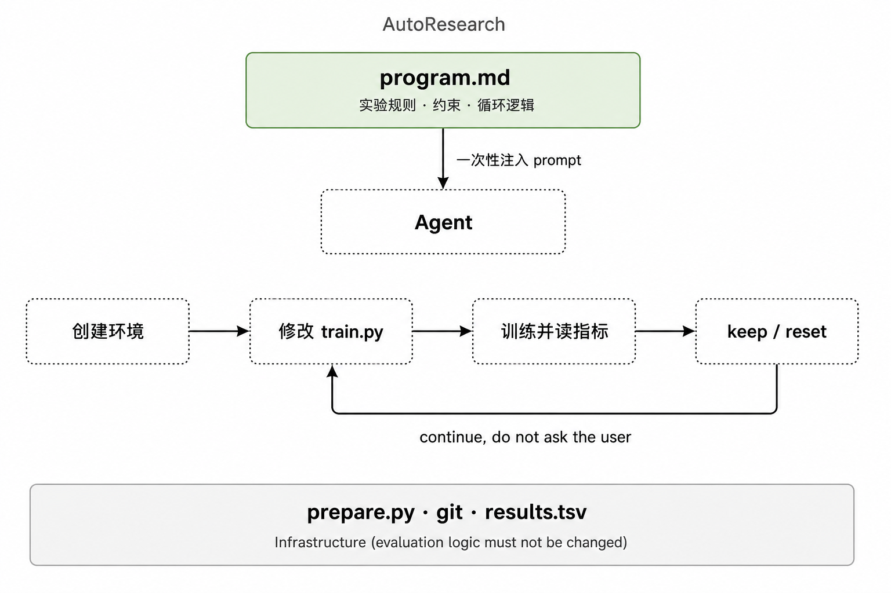
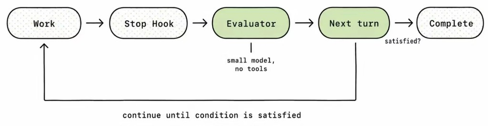
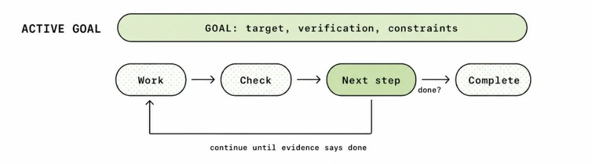

<div align="center">

# AutoAgent

**写一份 YAML，让 AI 自己把活干完。**

你定义目标和完成标准，AutoAgent 驱动 AI 自主执行、评估、重试，直到任务完成。

[30 秒上手](#-30-秒上手) · [为什么用 AutoAgent](#-为什么用-autoagent) · [使用场景](#-使用场景) · [文档](#-文档)

</div>

---

## 📋 Release Notes

### v2.0

**新功能：**

- **AI Scheduling**：新增 AI 调度模式，由 AI 动态决定下一个要执行的任务。

---

## 🚀 30 秒上手

### Step 1：安装依赖

```bash
pip install -r requirements.txt
```

### Step 2：确保 AI 工具已登录 ⚠️

AutoAgent 通过调用 AI 编程助手来执行任务，**运行前必须确保你选用的 AI 工具已安装并完成登录认证**：

| AI Provider | 安装 & 登录 |
|-------------|------------|
| **CodeBuddy**（默认） | 安装 CodeBuddy IDE 插件或 CLI，确保已登录账号 |
| **Claude Code** | `npm install -g @anthropic-ai/claude-code`，运行 `claude` 完成登录 |
| **Gemini CLI** | `npm install -g @google/gemini-cli`，运行 `gemini` 完成登录 |
| **Codex** | `npm install -g @openai/codex`，运行 `codex` 完成登录 |
| **OpenCode** | 安装 OpenCode CLI，配置 API Key |

验证工具可用：

```bash
# 以 CodeBuddy 为例
codebuddy --version

# 或 Claude Code
claude --version
```

### Step 3：创建任务

创建 `todos.yaml`，定义目标、完成标准和执行提示。以下是一个全自动优化 CUDA 程序性能的示例：

```yaml
# description 提供全局上下文，AI 在执行每个任务时都能看到
description: |
  你的目标是优化 CUDA 图像处理管线的性能。
  项目使用 CMake + CUDA 12，目标 RTX 4090，正确性测试必须保持 100/100。
  基准数据记录在 results.tsv 中，SOTA 行为当前最优。
  你是全自动运行的，遇到问题请自行决策，不要停下来问问题。

tasks:
  # 一次性前置任务：编译项目、建立基准
  - id: 1
    name: "编译项目并建立基准性能"
    type: simple
    model: lite                # 只是跑编译命令，用便宜模型
    completion_criteria: |
      1. cmake --build build 编译成功
      2. build/main 运行输出 "Score: 100/100"
      3. 基准耗时已写入 results.tsv
    initial_hint: |
      1. mkdir -p build && cd build && cmake .. && cmake --build . -j$(nproc)
      2. 运行 ./build/main，确认输出 "Score: 100/100"
      3. 将耗时写入 results.tsv 作为 baseline（status=SOTA）
      4. git add -A && git commit -m "baseline established"

  # 核心：自动迭代优化循环，AI 自主跑 100 轮
  - id: 2
    name: "迭代优化 CUDA 内核"
    type: looping
    repeat_count: 100           # 自动循环 100 轮
    max_attempts_per_loop: 3   # 每轮遇到错误最多重试 3 次
    completion_criteria: "完成一轮 分析→优化→验证 循环"
    subtasks:
      - id: 2.1
        name: "分析瓶颈并提出优化方案"
        type: simple
        completion_criteria: |
          1. 已读取 results.tsv 中的 SOTA 数据
          2. 优化方案已记录到 ideas/<N>.md
        initial_hint: |
          Step 1: 读取 results.tsv 找到 status=SOTA 的行，了解当前最优性能
          Step 2: 读取 failure_log.md，了解哪些方向已经失败过，避免重复
          Step 3: 用 ncu --set full ./build/main 做 profiling，找到耗时最长的 kernel
          Step 4: 基于 profiling 数据提出一个具体的优化假设。注意优化假设一次只生成一个想法
          Step 5: 将方案写入 ideas/<N>.md（含：假设、预期收益、风险）并提交

      - id: 2.2
        name: "实现代码优化"
        type: simple
        completion_criteria: |
          代码修改已提交
        initial_hint: |
          1. 读取 ideas/<N>.md 了解本轮优化方案
          2. 修改代码
          3. 提交代码修改

      - id: 2.3
        name: "编译并运行基准测试"
        type: long_running
        model: lite            # 纯跑命令，用便宜模型
        completion_criteria: |
          基准测试运行完成，日志已保存到 logs/exp_<N>.log
        initial_hint: |
          1. cmake --build build -j$(nproc) 编译
          2. 运行 ./build/main 2>&1 | tee logs/exp_<N>.log

      - id: 2.4
        name: "评估结果：保留或回滚"
        type: simple
        completion_criteria: |
          1. 新结果已追加到 results.tsv
          2. 若性能提升 ≥5%：保留代码，更新 SOTA
             若无提升或正确性下降：git reset 回滚，记录失败原因到 failure_log.md
        initial_hint: |
          Step 1: 从 logs/exp_<N>.log 提取本轮耗时
          Step 2: 与 results.tsv 中 SOTA 行对比，计算提升百分比
          Step 3: 决策——
            - 提升 ≥5% 且 Score=100/100 → 保留，将新行写入 results.tsv（status=SOTA）
            - 否则 → git reset --hard HEAD~1 回滚代码，
              将失败原因追加到 failure_log.md（含：方向、现象、结论）
          Step 4: git add -A && git commit -m "doc: experiment <N> results"
```

> [!TIP]
> **不想手写这么复杂的 YAML？让 AI 帮你写。**
>
> 你只需要用自然语言描述你想做的事情，然后把 [TASK_DESIGN_GUIDE.md](task_design_guide/linear/TASK_DESIGN_GUIDE.md) 喂给任意 AI（ChatGPT、Claude、CodeBuddy 等），让它按照这份指南帮你拆解成 `todos.yaml`。这份指南详细定义了任务类型、字段含义、最佳实践和常见陷阱，AI 读完就能生成高质量的任务配置。
>
> ```
> 你：「我想让 AI 自动把项目的测试覆盖率从 60% 提到 90%」
> AI：（读取 TASK_DESIGN_GUIDE.md）→ 生成完整的 todos.yaml
> 你：python orchestrator.py --config todos.yaml
> ```

### Step 4：启动，然后去喝咖啡

```bash
python orchestrator.py --config todos.yaml
```

AutoAgent 会自动按顺序执行任务。遇到 `looping` 任务时，AI 会自主循环迭代，每轮独立决策，持续优化直到跑完所有轮次。

---

## 💡 为什么用 AutoAgent？

现有方案已经能让 Agent「不要那么容易停下来」，但长周期任务真正缺的是一层调度：把目标拆成可检查的节点，跨 session 传递状态，并在中断后自己恢复。AutoAgent 就是补上这一层。

### 现有方案的问题

开发 AutoAgent 之前，我们先试过几条现成路。

#### AutoResearch：一次注入 program.md，长任务容易跑偏

3 月，Karpathy 发布了 [AutoResearch](https://github.com/karpathy/autoresearch)。一份 `program.md` 写清实验规则、约束和循环逻辑，Agent 就能自己改代码、训练、评估、迭代。它证明了 AI 可以走完「提出假设 → 跑实验 → 读结果 → 做决策」的闭环，实际任务里也确实能迭代优化。但问题出在设计本身。

AutoResearch 的核心是在 `program.md` 里写死一套研究流程：创建实验环境、修改训练文件、运行并读取指标，再按指标 keep 或 reset。文件里还会要求 Agent 进入实验循环后不要停下来问用户，一直往下推。把这份文件当作 prompt 一次性交给 Agent，它就会按定义持续推进。

<p align="center">
  
</p>
<p align="center"><em>图 2　AutoResearch 结构图（基于 DeepWiki / program.md 流程整理）</em></p>

它会遇到三个问题：

1. **长任务容易失控。** `program.md` 只在一开始注入。短任务没问题；一旦训练拉长、上下文超出窗口，Agent 会压缩记忆。压缩时约束容易漂移，「不要停下来问用户」「不要擅自改评价逻辑」这些硬规则后续不再稳定遵守。
2. **执行逻辑是固定单线。** 提出方案 → 训练 → 总结 → 保留或回退。简单实验够用；一旦要根据中间结果动态分支，或同时探索多个方向再择优合并，单线循环就不够用。
3. **没有 token 成本控制。** 长周期任务会拆成环境检测、提方案、写代码、跑程序、判指标、失败归因。这些子任务并不都需要最强模型。闭环一旦跑起来、时间一长，成本就会顶上来。

#### Claude Code / Codex Goal：续跑增强，不是调度器

5 月，Claude Code 和 Codex 的 Goal 模式先后上线。官方说法是：用户设定持续目标后，Agent 每轮结束会再检查目标是否完成；未满足就继续，直到完成、用户暂停或预算耗尽。

Claude Code 主要靠 stop hook 拦住 Agent 原本要停的时刻。主 Agent 跑完一轮后，独立评估器读取本轮 transcript，对照目标判断是否真完成。未满足则 hook 回一条继续指令，进入下一轮。评估器通常是小模型、不带工具。

<p align="center">
  
</p>
<p align="center"><em>图 3　Claude Code Goal 模式执行逻辑（Keep Claude working）</em></p>

Codex 则把目标持久化，并在每轮自动续跑时作为 continuation prompt 重新注入。线程进入 idle 且目标仍 active 时，会自动发起下一轮。

<p align="center">
  
</p>
<p align="center"><em>图 4　Codex Goal 模式执行逻辑（Using Goals in Codex）</em></p>

两者都是在现有 Agent 会话上做续跑增强：Claude Code 用 hook 拦截，Codex 用线程 idle 自动续跑。Agent 不那么容易过早停下。但长任务仍然没有独立调度器。模型连接一异常，续跑逻辑往往触发不了，也就不能主动恢复会话、继续往下做。

#### 续跑解决的是「别停」，不是「别丢」

AutoResearch、Claude Code Goal、Codex Goal 解决的都是续跑：别让 Agent 自己停下来。实质仍是把整块复杂任务一次性交给同一个 Agent 去迭代。任务拆分、上下文传递、异常恢复，都还靠它自己。跑到几十轮实验或多小时之后，问题会被放大：

1. 上下文随压缩逐渐稀释
2. 长时间命令容易撞上 SDK timeout 或会话中断，失败后缺少稳定的恢复入口
3. 不同步骤无法按难度选不同模型，成本很难控

Anthropic 在 [Effective harnesses for long-running agents](https://www.anthropic.com/engineering/effective-harnesses-for-long-running-agents) 里写过：复杂任务无法总在一个上下文窗口里完成；新会话天然缺少上一段工作的完整记忆，单靠上下文压缩撑不住长期任务，Agent 需要一种方法弥合会话之间的间隙。他们的改进是：长期运行时把进度文件、feature list 和 git 记录结构化保存，让后续 Agent 可以渐进推进，也方便还原错误代码。

这条判断和我们一致。**AutoAgent 是补在长周期工程任务上的调度层**：上面承接用户目标，下面连接 Agent provider，把中间那段漫长、容易丢状态的运行过程，拆成一组可检查、可复用的任务节点，并按既定规则自动串联多个 session。最终把 AutoResearch 这类 harness 的闭环能力从特定实验里抽出来，变成面向长周期任务的通用调度框架。**只有任务本身被结构化，模型能力才能被稳定释放。**


### 🎯 声明式：YAML 定义目标，不用写执行逻辑

你只描述"做什么"和"做到什么程度"，AutoAgent 负责"怎么做"和"做到为止"。

```
你的目标 → YAML 配置 → AutoAgent 编排 → AI 自主执行 → 任务完成
```

### 🔄 自主迭代：AI 自动 尝试 → 评估 → 改进 → 重试

不是跑一次就结束。AI 会评估自己的执行结果，分析失败原因，自动调整策略重试，直到满足你定义的完成标准。

### 💰 省 Token：按任务分配模型，简单活不烧钱

AI 迭代优化动辄跑几十轮，Token 消耗是真实痛点。AutoAgent 支持**五级模型分配**，让你把贵的模型用在刀刃上：

```bash
# 全局：plan 用强模型拆任务，default 执行复杂任务，lite 跑简单活，evaluation 做失败分析和主任务评估，scheduler 做 AI 调度决策
python orchestrator.py --model "plan:claude-opus-4.6;default:claude-sonnet-4;lite:glm-4-flash;evaluation:claude-opus-4.6;scheduler:claude-opus-4.6"
```

还可以在 `todos.yaml` 中**逐任务指定模型**——跑命令、提交代码这类不需要推理的任务用 `lite`，分析瓶颈、设计方案用 `default`：

```yaml
- id: 2.2
  name: "运行基准测试"
  type: long_running
  model: lite              # 只是跑命令，用便宜模型
  completion_criteria: "基准测试完成"

- id: 2.1
  name: "分析瓶颈并提出优化方案"
  type: simple
  model: default           # 需要深度推理，用强模型
  completion_criteria: "优化方案已记录"
```

### 💡 随时投喂想法：Ideas 自动监听 → 拆解 → 执行

AutoAgent 支持 **Idle 监听模式**——agent 在后台持续等待，你随时随地（手机、电脑、任何编辑器）往 `ideas.md` 里写一句想法，agent 自动检测到文件变化，立即将自然语言 idea 拆解成结构化任务并开始执行：

```bash
# 启动后 agent 进入监听状态，所有任务完成后不退出，持续等待新 ideas
python orchestrator.py --ideas ideas.md --config todos.yaml --workspace ./project
```

```markdown
<!-- ideas.md —— 你在地铁上用手机写下一句话 -->
把项目的单元测试覆盖率从 60% 提升到 90%，优先覆盖 core/ 目录下的关键模块
```

Agent 检测到 `ideas.md` 变化后会自动：
1. **AI 拆解**：将自然语言 idea 分解为多个结构化 TODO 任务（含 completion_criteria、initial_hint）
2. **人工审核**（可选）：生成的任务列表可以先让你确认，也可以跳过直接执行
3. **自动执行**：按顺序执行所有任务，失败自动重试，直到全部完成
4. **继续等待**：执行完毕后回到监听状态，等你下一个想法

> **你的工作流**：开着 agent → 想到什么写进 ideas.md → 去忙别的 → 回来看产出。AI 24 小时待命，你的想法随写随跑。

### 🤖 AI 调度模式：让 AI 自己决定执行顺序

线性模式按固定顺序执行任务，但有些场景需要**根据执行结果动态决策**——比如优化到目标就停止、失败后换方向重试、根据分析结果选择下一步。AI 调度模式让 AI 调度器根据当前状态自主决定下一个执行的任务：

```yaml
ai_orchestrator:
  strategy: |
    1. 先执行 Task 1 建立基准
    2. 基准建立后，执行 Task 2 分析瓶颈
    3. 分析完成后，执行 Task 3 实施优化
    4. 优化后执行 Task 4 验证正确性
       - 验证失败 → 再次执行 Task 3 修复
       - 验证成功且提升 >= 20% → 停止
       - 否则 → 回到 Task 2 重新分析
  max_rounds: 20
  stop_condition: |
    性能提升 >= 20% 且正确性验证通过
```

你只需要定义调度策略和停止条件，AI 调度器会根据每轮执行结果自主决定下一步。适合**条件分支、动态优先级、提前终止、重复执行**等场景。

```bash
# 自动检测 ai_orchestrator 配置，启用 AI 调度模式
python orchestrator.py --config todos.yaml

# 非 ideas 运行时，即使包含 ai_orchestrator 字段也可强制使用线性模式
python orchestrator.py --config todos.yaml --mode linear
```

> 注意：当同时启用 `--ideas` 且 `todos.yaml` 包含 `ai_orchestrator` 字段时，`--mode linear` 会被拒绝。此时应移除 `--mode linear` 或禁用 ideas 模式。

### 🔌 多 AI Provider 一键切换

内置支持 CodeBuddy、Claude Code、Gemini CLI、OpenCode、Codex，一个参数切换：

```bash
python orchestrator.py --provider claude
python orchestrator.py --provider gemini
```


### ⏸️ 断点续传：中断后从上次进度继续

长时间任务不怕中断，状态自动持久化：

```bash
python orchestrator.py --continue          # 继续上次会话
python orchestrator.py --resume abc12345   # 恢复指定会话
python orchestrator.py --list-sessions     # 查看会话列表
```

---

## ✨ 核心特性一览

| 特性 | 说明 |
|------|------|
| **任务类型** | 顶层任务支持 simple（单步）、nested（多子任务）、looping（N 轮迭代）、long_running（后台运行）；子任务还支持 simple_once / long_running_once（一次性变体） |
| **Ideas 监听 & 自动拆解** | 后台监听 `ideas.md`，检测到变化自动拆解为任务并执行，随写随跑 |
| **Preset 配置** | `config.yaml` 预设参数组合，避免每次输入大量参数 |
| **完整日志系统** | 记录 AI 对话全过程，支持回溯和调试 |
| **智能失败分析** | AI 自动分析失败根因，决定从哪个步骤重试 |
| **AI 调度模式** | AI 调度器根据执行结果动态决定下一个任务，支持条件分支、提前终止、重复执行 |
| **模型分级调度** | 全局五角色（plan/default/lite/evaluation/scheduler）+ 任务级 `model` 字段，Token 精细控制 |

---

## 🎯 使用场景

AutoAgent 适合任何需要 **AI 长时间自主工作** 的场景：

| 场景 | 任务类型 | AI 做什么 |
|------|---------|----------|
| **模型训练迭代优化** | `looping` | 每轮自主提出假设 → 改代码 → 跑训练 → 评估指标 → 保留或回滚 |
| **CUDA / 性能优化** | `looping` 或 AI 调度 | 自动 profile → 找瓶颈 → 优化 → benchmark → 记录结果 |
| **目标驱动的优化** | AI 调度模式 | AI 调度器根据结果动态决定：分析 → 优化 → 验证，达标即停 |
| **代码质量改进** | `nested` | 分析 lint 警告 → 逐个修复 → 验证通过 |
| **数据处理管线** | `nested` + `long_running` | 下载 → 清洗 → 转换 → 验证，长时间步骤后台运行 |
| **自动化测试修复** | `simple` | 跑测试 → 分析失败 → 修复代码 → 重跑直到全绿 |

> 核心思路：**你定义「做什么」和「做到什么程度」，AI 负责 24 小时不间断地自主执行和迭代。**

更多示例和任务编写指南见 [任务设计指南](task_design_guide/linear/TASK_DESIGN_GUIDE.md)。

---

## 📖 常用命令

```bash
# 全自动：ideas → 任务拆解 → 执行
python orchestrator.py --ideas ideas.md --config todos.yaml --workspace ./project

# 先拆解 ideas 并人工审核，再运行
python orchestrator.py --ideas ideas.md --config todos.yaml --ideas-only
python orchestrator.py --config todos.yaml --workspace ./project

# AI 调度模式（自动检测 todos.yaml 中的 ai_orchestrator 配置）
python orchestrator.py --config todos.yaml --workspace ./project

# 显式指定 AI 调度模式
python orchestrator.py --config todos.yaml --mode ai

# 只执行某个任务（线性模式）
python orchestrator.py --task 2

# 重置 / 回退 / 重跑
python orchestrator.py --reset
python orchestrator.py --back
python orchestrator.py --redo

# 使用 Preset 配置
python orchestrator.py --preset default
```

完整命令行参数和 Preset 配置说明见 [使用指南](doc/USAGE.md)。

---

## 🏗️ 架构概览

```
┌───────────────────────────────────────┐
│           TodoOrchestrator            │
│       任务解析 · 调度 · 状态管理       │
└──────────────────┬────────────────────┘
                   │
       ┌───────┬───┼───────┐
       ▼       ▼   ▼       ▼
 ┌────────┐ ┌────────┐ ┌────────┐
 │ Simple │ │ Nested │ │Looping │
 │Executor│ │Executor│ │Executor│
 └───┬────┘ └───┬────┘ └───┬────┘
     │          │          │
     └──────────┼──────────┘
                ▼
        ┌───────────────┐
        │SubtaskExecutor│  子任务分发
        └───────┬───────┘  (含 long_running)
                ▼
        ┌───────────────┐
        │  AI Provider  │
        │ CodeBuddy     │
        │ Claude/Gemini │
        │ OpenCode/Codex│
        └───────────────┘
```

更多架构细节见 [架构设计文档](doc/ARCHITECTURE.md)。

---

## 📚 文档

| 文档 | 说明 |
|------|------|
| [架构设计](doc/ARCHITECTURE.md) | 系统架构和核心概念详解 |
| [使用指南](doc/USAGE.md) | 完整使用指南 |
| [任务设计指南](task_design_guide/linear/TASK_DESIGN_GUIDE.md) | 任务编写指南和最佳实践 |
| [文件说明](doc/FILES.md) | 项目文件结构说明 |
| [AI 调度模式指南](task_design_guide/ai_sched/TASK_DESIGN_GUIDE_AI_SCHED.md) | AI 调度模式的任务编写指南 |

---

## 🤝 贡献

欢迎提交 Issue 和 Pull Request！

## 📄 许可证

MIT License
