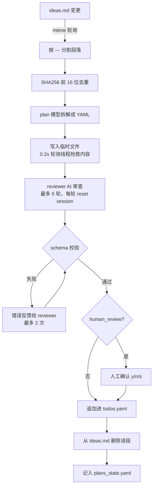

# AutoAgent 深度调研报告

> 调研范围：`master` 分支 (v1.0) 与 `ai-schedule` 分支 (v2.0)
> 调研日期：2026-08-03

---

## 目录

- [一、项目定位](#一项目定位)
- [二、核心机制](#二核心机制)
- [三、应用场景](#三应用场景)
- [四、版本选择](#四版本选择)
- [五、如何启动](#五如何启动)
- [六、如何配置](#六如何配置)
- [七、运行时产物](#七运行时产物)
- [八、上手路径与风险提示](#八上手路径与风险提示)

---

## 一、项目定位

**AutoAgent 是一个"AI 自主长时任务"的编排框架**——用一份 YAML 声明"要做什么"和"做到什么程度"，它驱动 AI 编程助手（CodeBuddy / Claude Code / Gemini CLI / Codex / OpenCode）循环执行、自评、失败分析、重试，直到满足完成标准。

它本身**不是 AI 模型，也不实现任何 Agent 能力**，而是站在现有 AI CLI 之上的**调度层 + 状态机 + 可靠性保障层**。

### 解决的核心痛点

AI CLI 单次会话跑不了几十轮实验、会超时、会中断、会忘记收尾，而科研式的迭代优化（CUDA 调优、模型训练、编译器优化）恰恰需要跑几十上百轮无人值守。

### 项目规模

| 维度 | 规模 |
|---|---|
| Python 代码 | 约 46,000 行 |
| 最大单文件 | `task_executor.py`（约 15 万字符） |
| 文档 | 约 25 万字符（`doc/` + `task_design_guide/`） |
| 依赖 | 仅 `pyyaml>=6.0.1` + `codebuddy-agent-sdk` |

### 模块职责

| 文件 | 职责 |
|---|---|
| `orchestrator.py` | CLI 入口、配置加载、preset 合并、会话解析、任务调度 |
| `task_executor.py` | 六种任务类型的执行器、失败分析、主任务评估、长任务轮询 |
| `ai_providers.py` | 多 AI Provider 抽象，命令行构造 |
| `codebuddy_client.py` | AI 客户端（CLI 子进程 / SDK / 测试三种模式），流式解析 |
| `ideas_watcher.py` | ideas.md 监听、AI 拆解、review、schema 校验 |
| `state_manager.py` | 状态原子持久化、断点续传 |
| `autoagent_exec.py` | 长任务后台启动器与信号文件机制 |
| `conversation_logger.py` | AI 对话全过程记录 |
| `prompts/` | 各场景 prompt 模板 |

---

## 二、核心机制

### 1. 任务类型状态机

顶层任务支持 4 种，子任务额外支持 2 种"一次性"变体：

| 类型 | 层级 | 语义 | 关键字段 |
|---|---|---|---|
| `simple` | 顶层/子任务 | AI 干活 + 自评 ✅/❌，失败重试 | `max_attempts`（默认 5） |
| `long_running` | 顶层/子任务 | 命令丢到后台跑，轮询信号文件 | 同上 |
| `nested` | 顶层/子任务 | 顺序执行子任务，**AI 评估主任务是否达成终态**，未达成则换策略重来 | `subtasks` |
| `looping` | 顶层/子任务 | **固定跑 N 轮**子任务序列，不做终态评估 | `repeat_count`、`max_attempts_per_loop` |
| `simple_once` | 仅子任务 | 完成后跨所有轮次不再执行 | — |
| `long_running_once` | 仅子任务 | 同上，用于昂贵幂等操作（Docker build、baseline profiling） | — |

**`nested` 与 `looping` 的区别是设计上最关键的一点**：nested 是"达标即停"，looping 是"跑满 N 轮"。做实验探索用 looping，做目标驱动的修复用 nested。

`*_once` 的实现：状态 key 不带轮次后缀，因此天然跨轮共享（`task_executor.py:165`）。

```python
def _state_key(subtask: dict, round_label: str | None) -> str:
    st_id = str(subtask['id'])
    if subtask.get('type', '').endswith('_once'):
        return st_id  # 跨 round 共享
    return StateManager.round_key(st_id, round_label)
```

### 2. 长任务的"信号文件"机制

这是整个项目最有工程价值的设计。AI CLI 跑 `python train.py` 这种几小时的命令必然被 bash timeout 杀掉。

**解法**：运行时在会话目录动态生成 `autoagent-exec.bat/.sh` 包装脚本，通过 system prompt 告诉 AI"长命令必须用这个跑"。脚本调用 `autoagent_exec.py`：

| 时间点 | 行为 |
|---|---|
| **T=0** | 原子创建 signal 文件（`starting`），`Popen` detach 子进程，另起 monitor 进程 |
| **T=0~60s**（`fast_fail_timeout`） | 等子进程：<br>· 非零退出 → 打印 `[FAST-FAIL]` + 错误，AI 立刻能看到并修<br>· 零退出 → `[OK]`<br>· 还在跑 → signal 置 `running`，打印 `TASK SUBMITTED`，脚本自己退出 |
| **之后** | AI 输出 `⏳ LONG_RUNNING_IN_PROGRESS` 结束会话；Orchestrator 接管，每 15s 轮询 signal 文件（最长 24h），完成后再开一个 AI 会话读日志判定成败 |

信号状态流转：`starting` → `running` → `finished` / `error`

**关键细节**：先 detach 再写 signal 的顺序（提交 `b65f6ba`）是为了保证 autoagent-exec 自己被 kill 时子进程不会陪葬。monitor 进程负责在主进程被杀后把 `starting` 提升为 `running`。

### 3. Marker Nudge：省钱的小设计

AI 被要求响应末尾输出恰好一个标记：

```
✅ completed
❌ not completed: <原因>
⏳ LONG_RUNNING_IN_PROGRESS
```

但 AI 经常干完活忘了输出标记。朴素做法是判定失败、reset session、整个任务重跑——极其浪费 token。

**AutoAgent 的做法**：在**同一会话内**发一句轻量追问（最多 2 次，`max_marker_nudges`），**不消耗 attempt 配额**。而且 nudge 之前还会先查 signal 文件，如果发现后台任务已经在跑就直接合成 `⏳` 返回，避免 AI 被追问后重复启动训练（`task_executor.py:806`）。

**同类容错思路**：

| 异常 | 处理 |
|---|---|
| `RateLimitError`（429/503） | **回滚 attempt 计数**，不消耗重试次数 |
| `BashTimeoutError` / `StreamTimeoutError` | **不 reset session**，只发轻量续接 prompt |
| `SessionTimeoutError` | reset + 把上次输出带入新 prompt |
| AI CLI 连续失败 | 指数退避 5s→10s→20s→…→`backoff_max_wait` |

标记解析采用三层策略（`task_executor.py:734`）：严格负向优先 → 严格正向 → 模糊正向（仅响应尾部 1000 字符，排除否定词）。

### 4. 模型分级调度

全局四角色（v2.0 是五角色），加任务级 `model` 字段：

| 角色 | 用途 |
|---|---|
| `plan` | ideas 拆解成任务 |
| `default` | 执行需要推理的任务 |
| `lite` | 跑命令、提交代码这类无脑活 |
| `evaluation` | 失败分析、主任务评估 |
| `scheduler`（仅 v2.0） | AI 调度决策 |

对跑 100 轮的场景，把 build / benchmark 子任务标成 `lite` 能省掉相当可观的成本。

### 5. Ideas 监听：自然语言随写随跑

`--ideas ideas.md` 启用后，orchestrator 在所有任务跑完后不退出，每 30s 轮询 `ideas.md` 的 mtime（没用 watchdog，就是简单轮询）。

检测到变化后的完整流程：



**设计要点**：

- AI 被要求把 YAML **写到临时文件**而不是打印，规避长文本被截断
- reviewer 每轮 `reset_session()` 保证无历史污染
- plan 阶段成功后存 checkpoint 到 `plans_state.yaml`，中断重跑可跳过 plan 直接 review
- 首批任务写根级 `description`，后续批次写 `description@{next_id}`

### 6. 失败分析与主任务评估

**失败分析**（子任务失败时触发）：切到 `evaluation` 模型，喂入子任务状态、错误文本、历史决策，要求返回 JSON：

```json
{ "analysis": "...", "retry_from": "<子任务id>", "suggested_fix": "..." }
```

`retry_from` 之前已完成的子任务状态会被 `_carry_forward_completed()` 复制到新轮次，不重跑。

**主任务评估**（仅 `nested`，全部子任务完成后触发）：

```json
{ "main_task_completed": true/false, "analysis": "...", "retry_from": "...", "next_strategy": "..." }
```

不达标就带着 `next_strategy` 进下一轮。`looping` 不做主任务评估，只做每轮内的失败分析。

### 7. 断点续传

Session 目录名为 `{workspace名}_{8位随机}`，注册在 `.autoagent/sessions.csv`，当前活跃会话写在 `<workspace>/.autoagent_log`。

| 能力 | 实现 |
|---|---|
| `--continue` | 读 `.autoagent_log` 定位会话目录 |
| `--resume abc12345` | 支持短 ID 后缀匹配 |
| 状态落盘 | 每次变更立即 `fsync` + `os.replace` 原子替换 |
| AI 会话恢复 | 存了 AI CLI 的 session_id，恢复时 `--resume` 回原会话 |
| Ctrl+C | 记录 `interrupt_pending` + session_id |
| looping 续跑 | 持久化 `current_loop` |
| 长任务续跑 | 检测已有 signal 文件直接接管轮询 |

### 8. 多 Provider 抽象

所有 provider 统一通过 **stdin 管道**传 prompt（`cat prompt.txt | <cmd>`），工作目录由 `subprocess.Popen(cwd=workspace)` 控制。

| 能力 | codebuddy | claude | gemini | opencode | codex |
|---|---|---|---|---|---|
| 原生 system prompt | ✅ `--append-system-prompt` | ✅ | ❌ | ❌ | ❌ |
| 会话续接 | `--resume` | `--resume` | `--resume` | `-s` | `-c session_id=` |
| 模型选择 | `--model` | `--model` | `--model` | `-m`（可选） | `-m`（可选） |
| SDK 模式 | ✅ | ❌ 强制 CLI | ❌ | ❌ | ❌ |
| 额外目录访问 | — | — | `--include-directories` | — | 全权限沙箱 |
| 输出格式 | `stream-json` | `stream-json` | `stream-json` | `json` | `--json` |

不支持原生 system prompt 的 provider，AutoAgent 会自动把它拼到 user prompt 末尾，功能不受影响。

客户端有三种实现：`AIClient`（CLI 子进程，支持所有 provider）、`AIClientSDK`（CodeBuddy Agent SDK，默认）、`AIClientTest`（测试模式）。非 codebuddy/test 的 provider 会被强制切到 CLI 模式。

---

## 三、应用场景

从 `task_design_guide/` 的六篇专题文档看，作者明确针对这些场景做过设计：

| 场景 | 推荐类型 | AI 做什么 |
|---|---|---|
| **CUDA / 性能优化**（项目原生场景） | `looping` | ncu profile → 找瓶颈 → 改 kernel → benchmark → 提升 ≥5% 就保留否则 `git reset` 回滚，跑 100 轮 |
| **模型训练迭代** | `looping` + `long_running` | 每轮提假设 → 改超参 → 后台跑训练 → 评估指标 |
| **编译器 / 解释器增强** | `nested` | sample 里的 mini_compiler：加 f-string、闭包、字节码优化器 |
| **测试覆盖率提升 / 修 CI** | `nested` | 达标即停，末尾放 `max_attempts: 1` 的验证子任务 |
| **数据管线** | `nested` + `long_running_once` | 下载（一次性）→ 清洗 → 转换 → 校验 |
| **环境搭建 / 部署** | `simple_once` + `long_running_once` | 依赖安装、镜像构建这类幂等昂贵操作 |

### 内置示例

`sample/` 下有两个真实示例：

- **`cufftdx_optimization`**：cuFFTDx 3D DCT 内核优化，要求提速 ≥20% 且正确性保持 100/100
- **`mini_compiler`**：Python 实现的 MiniLang 编译器增强（lexer → parser → AST → bytecode → VM）

### 不适合的场景

- 需要人在环反复确认的任务
- 单步就能完成的活（直接用 AI CLI 更快）
- 对破坏性操作零容忍的生产环境（AI 会执行 `git reset --hard`、`--dangerously-skip-permissions` 之类）

---

## 四、版本选择

README 第一行就写了 **master 是 v1.0，v2.0 在 `ai-schedule` 分支**。两者差异有 285 个文件、约 3.8 万行增量，不是小版本迭代。

### v2.0 新增：AI 调度模式

不再按 id 顺序线性执行，而是由一个 scheduler AI 根据每轮结果动态决定下一个任务。在 `todos.yaml` 里加一段：

```yaml
ai_orchestrator:
  strategy: |
    1. 先执行 Task 1 建立基准
    2. 基准建立后，执行 Task 2 分析瓶颈
    3. 分析完成后，执行 Task 3 实施优化
    4. 优化后执行 Task 4 验证正确性
       - 验证失败 → 再次执行 Task 3 修复
       - 验证成功且提升 >= 20% → 停止
       - 否则 → 回到 Task 2 重新分析
  max_rounds: 20
  stop_condition: "性能提升 >= 20% 且正确性验证通过"
```

配置里检测到 `ai_orchestrator` 就自动启用，也可以 `--mode ai` / `--mode linear` 显式指定。

### v2.0 其他增量

| 特性 | 说明 |
|---|---|
| `--back` / `--redo` | 回退 / 重跑 |
| `adversarial_review` | 对抗性（红队）审查任务拆解的漏洞和破坏性 |
| scheduler 两级重试 | 会话内重试（`scheduler_decision_max_retries`）+ 会话重置重试（`scheduler_max_session_retries`） |
| `scheduler_overtime_rounds` | 超过 max_rounds 后的软超时轮数 |
| `default_max_attempts` | 全局 max_attempts 兜底配置 |
| `idle_interval` | 提升为 config.yaml 配置项 |
| 任务设计指南拆分 | `task_design_guide/linear/` 与 `task_design_guide/ai_sched/` |

### 选型建议

- 想要**条件分支 / 提前终止 / 动态优先级** → 上 v2.0
- 只需要**线性跑一串任务 + 循环迭代** → master 更稳（v2.0 的 scheduler 多一层 AI 决策，也多一层失控风险和 token 消耗）

```bash
git checkout ai-schedule   # 用 v2.0
```

> 以下启动与配置说明以 **master (v1.0)** 为准，v2.0 绝大部分兼容。

---

## 五、如何启动

### Step 1：Python 依赖

```bash
pip install -r requirements.txt
```

只有两个依赖：`pyyaml>=6.0.1` 和 `codebuddy-agent-sdk`。后者只有用 CodeBuddy SDK 模式才需要。

### Step 2：准备 AI CLI（关键前置，最容易卡住的一步）

AutoAgent 代码里**完全不读 API Key 环境变量**，认证全部依赖各 CLI 自己。必须先手动登录，否则运行时会抛 `authentication required`。

| Provider | `--provider` 取值 | 安装 | 登录验证 |
|---|---|---|---|
| CodeBuddy（默认） | `codebuddy` / `cb` | CodeBuddy CLI ≥ 2.63.5 | `codebuddy -p "hello"`，检查 `~/.codebuddy/settings.json` |
| Claude Code | `claude` | `npm i -g @anthropic-ai/claude-code` | 跑 `claude` 完成登录 |
| Gemini CLI | `gemini` | `npm i -g @google/gemini-cli` | 跑 `gemini` |
| Codex | `codex` | `npm i -g @openai/codex` | 跑 `codex` |
| OpenCode | `opencode` / `oc` | OpenCode CLI | 配置 API Key |
| 模拟测试 | `test` | 无 | 需配 `--test-rules <规则文件>` |

验证 provider 可用：

```bash
python orchestrator.py --list-providers
```

### Step 3：注意默认 preset 的陷阱

`--preset` 默认值是 `default`，而 master 的 `config.yaml` 里 `default` preset 已经预置了一整套配置：

```yaml
- name: default
  ideas: ${workspace}/ideas.md      # 会自动启用 ideas 监听 + idle 常驻
  config: ${workspace}/todos.yaml
  provider: codebuddy
  model: { plan: claude-opus-4.6, default: claude-opus-4.6, lite: glm-5.0-ioa, evaluation: claude-opus-4.6 }
  human_review: true
  verbose: true
```

所以直接跑 `python orchestrator.py` **不是**你以为的"最小配置"，它会启用 ideas 监听并进入常驻 idle。想要干净启动，用空 preset：

```bash
python orchestrator.py --preset nothing --config todos.yaml --workspace ./project
```

**参数优先级**：命令行 > preset > argparse 默认 > config.yaml 全局。

> 注意 merge 逻辑的实现是"CLI 值等于 argparse 默认值时才用 preset 覆盖"（`orchestrator.py:1152`），意味着你显式传一个恰好等于默认值的参数，仍会被 preset 覆盖。

### Step 4：写 todos.yaml 并启动

强烈建议不要手写。把 `task_design_guide/TASK_DESIGN_GUIDE.md`（2.8 万字符，包含类型选择、字段语义、反模式）喂给任意 AI，用自然语言描述目标让它生成。

```bash
# 校验配置（不执行）
python orchestrator.py --config todos.yaml --validate

# 正式跑
python orchestrator.py --config todos.yaml --workspace ./project
```

### 常用命令速查

```bash
# 全自动：ideas 拆解 → 执行 → 常驻等新 idea
python orchestrator.py --ideas ideas.md --config todos.yaml --workspace ./project

# 只拆解 ideas 并人工审核，不执行
python orchestrator.py --ideas ideas.md --config todos.yaml --ideas-only --human-review

# 只跑单个任务（调试用）
python orchestrator.py --task 2

# 换 provider / 分级模型
python orchestrator.py --provider claude \
  --model "plan:claude-opus-4.6;default:claude-sonnet-4;lite:glm-4-flash;evaluation:claude-opus-4.6"

# 状态管理
python orchestrator.py --status          # 看进度
python orchestrator.py --reset           # 清状态
python orchestrator.py --list-sessions   # 列历史会话
python orchestrator.py --continue        # 续上次
python orchestrator.py --resume abc12345 # 恢复指定会话（支持短 ID）

# 不跳过已完成任务，全部重跑
python orchestrator.py --no-skip
```

### 完整命令行参数

| 参数 | 缩写 | 默认 | 说明 |
|---|---|---|---|
| `--config` | `-c` | `todos.yaml` | 任务配置路径 |
| `--workspace` | `-w` | `.` | AI 的工作目录 |
| `--provider` | `-P` | `codebuddy` | AI 提供商 |
| `--model` | `-m` | 依 provider | 单模型或 `plan:X;default:Y;lite:Z;evaluation:W` |
| `--preset` | — | `default` | 加载 config.yaml 里的预设 |
| `--task` | `-t` | — | 只执行指定 ID |
| `--timeout` | — | 3600 | AI 会话硬超时（秒） |
| `--executable` | — | — | 覆盖 CLI 可执行文件路径 |
| `--extra-args` | — | — | 透传给 AI CLI 的额外参数 |
| `--use-cli` | — | false | 强制 CodeBuddy 走 CLI 而非 SDK |
| `--include-directories` | — | — | Gemini 额外可访问目录（逗号分隔） |
| `--ideas` | — | — | ideas.md 路径，启用监听 |
| `--ideas-only` | — | — | 只拆解不执行 |
| `--human-review` | — | — | ideas 需人工确认 |
| `--no-idle` | — | — | 关闭常驻监听 |
| `--idle-interval` | — | 30 | 轮询间隔（秒） |
| `--log-dir` | — | `.autoagent` | 日志根目录 |
| `--continue` | — | — | 继续上次会话 |
| `--resume` | — | — | 恢复指定会话 |
| `--list-sessions` | — | — | 列出历史会话 |
| `--status` | — | — | 显示状态后退出 |
| `--reset` | — | — | 重置状态后退出 |
| `--validate` | — | — | 校验配置后退出 |
| `--no-skip` | — | — | 不跳过已完成任务 |
| `--list-providers` | — | — | 列出 provider |
| `--test-rules` | — | — | test provider 规则文件 |
| `--verbose` | `-v` | — | debug 日志 |

---

## 六、如何配置

### config.yaml（全局行为）

放在项目根目录，控制超时、重试、截断等运行时行为：

| 配置项 | 默认 | 说明 |
|---|---|---|
| `system_prompt_prefix` | 见文件 | 全局 AI 人设，任务级可覆盖 |
| `default_model` | `glm-5.0-ioa` | 无 CLI/preset 指定时的模型 |
| `session_timeout` | 3600 | 单次 AI 会话总时长上限（秒） |
| `bash_timeout` | 300 | **无新输出**超时（秒），触发后提示 AI 用 autoagent-exec |
| `fast_fail_timeout` | 60 | autoagent-exec 快速失败窗口（秒） |
| `backoff_max_wait` | 300 | AI CLI 连续失败的指数退避上限 5s→10s→…→300s |
| `max_marker_nudges` | 2 | 忘记输出标记时的同会话追问次数 |
| `max_review_rounds` | 5 | ideas 拆解的 AI 审查轮数 |
| `max_validation_retries` | 2 | schema 校验失败重试 |
| `max_plan_retries` | 3 | plan 阶段失败重试 |
| `truncation_limits` | 见下 | prompt 截断字符上限 |
| `autoagent_exec_show_console` | false | Windows 专用，弹出子进程控制台 |
| `preset` | — | 预设列表 |

`truncation_limits` 实际只有 3 个 key 生效：

```yaml
truncation_limits:
  previous_subtask_summary: 4000   # 子任务摘要 / 错误文本 / 日志
  history_summary: 300             # 历史尝试摘要
  max: 50000                       # 防御性上限
```

> `doc/FILES.md` 里提到的 `previous_attempt_output` 目前未被使用。

**调参建议**：

- 构建命令普遍超过 5 分钟又不想改成 `long_running` → 调大 `bash_timeout`
- 长命令经常在 60s 内就该报错 → `fast_fail_timeout` 保持 60，让 AI 能立刻拿到错误
- 跑几十轮的场景 → 把 `history_summary` 调大，让 AI 更好地避免重复失败方向

**preset 与 `${workspace}`**：`${workspace}` 会被替换为 `--workspace` 的绝对路径，**只对 preset 内的字符串值生效**，非递归，不支持其他变量。

preset 可覆盖的字段：`config`、`ideas`、`provider`、`model`、`executable`、`workspace`、`timeout`、`log_dir`、`idle_interval`、`include_directories`、`test_rules`、`verbose`、`no_skip`、`no_idle`、`use_cli`、`ideas_only`、`human_review`。

### todos.yaml（任务定义）

#### 根级字段

| 字段 | 必填 | 说明 |
|---|---|---|
| `description` | 设计上必填（实现上可选） | 项目级上下文，注入每个任务的 prompt |
| `description@N` | 否 | 分批描述：任务 id ≥ N 时用这份 |
| `tasks` | 是 | 任务列表，按 id 升序执行 |

`description@N` 的选取规则是"取所有 ≤ 当前 task id 的 scope 中最大的那个"（`orchestrator.py:435`）。这是为持续追加 ideas 的场景设计的——第二批任务可以有自己的上下文而不污染第一批。

#### 任务字段

| 字段 | 必填 | 默认 | 说明 |
|---|---|---|---|
| `id` | 是 | — | 顶层用整数，子任务用点号（`3.1`、`6.2.1`） |
| `name` | 是 | — | 任务名 |
| `type` | 是 | — | 见前文六种类型 |
| `completion_criteria` | 是 | — | 完成标准，必须**可验证** |
| `initial_hint` | 否 | — | 每次尝试都注入的静态上下文（路径、命令、排障） |
| `model` | 否 | `default` | `default` / `lite` / 具体模型名 |
| `max_attempts` | 否 | 5 | 重试上限 |
| `system_prompt_prefix` | 否 | 继承全局 | 任务级 AI 人设 |
| `subtasks` | nested/looping 必填 | — | 子任务列表 |
| `repeat_count` | looping 必填 | — | 循环轮数，正整数 |
| `max_attempts_per_loop` | 否 | 5 | looping 单轮内重试上限 |

> `long_running` **不需要** `command` 字段——命令由 AI 在运行时通过 `autoagent-exec` 自行决定。

#### 完整示例

```yaml
description: |
  你的目标是优化 CUDA 图像处理管线的性能。
  项目使用 CMake + CUDA 12，目标 RTX 4090，正确性测试必须保持 100/100。
  基准数据记录在 results.tsv 中，SOTA 行为当前最优。
  你是全自动运行的，遇到问题请自行决策，不要停下来问问题。

tasks:
  # 一次性前置任务：编译项目、建立基准
  - id: 1
    name: "编译项目并建立基准性能"
    type: simple
    model: lite
    completion_criteria: |
      1. cmake --build build 编译成功
      2. build/main 运行输出 "Score: 100/100"
      3. 基准耗时已写入 results.tsv
    initial_hint: |
      1. mkdir -p build && cd build && cmake .. && cmake --build . -j$(nproc)
      2. 运行 ./build/main，确认输出 "Score: 100/100"
      3. 将耗时写入 results.tsv 作为 baseline（status=SOTA）

  # 核心：自动迭代优化循环
  - id: 2
    name: "迭代优化 CUDA 内核"
    type: looping
    repeat_count: 100
    max_attempts_per_loop: 3
    completion_criteria: "完成一轮 分析→优化→验证 循环"
    subtasks:
      - id: 2.1
        name: "分析瓶颈并提出优化方案"
        type: simple
        completion_criteria: |
          1. 已读取 results.tsv 中的 SOTA 数据
          2. 优化方案已记录到 ideas/<N>.md
        initial_hint: |
          Step 1: 读取 results.tsv 找到 status=SOTA 的行
          Step 2: 读取 failure_log.md，避免重复已失败方向
          Step 3: 用 ncu --set full ./build/main 做 profiling
          Step 4: 提出一个具体的优化假设（一次只生成一个）
          Step 5: 将方案写入 ideas/<N>.md 并提交

      - id: 2.2
        name: "实现代码优化"
        type: simple
        completion_criteria: "代码修改已提交"

      - id: 2.3
        name: "编译并运行基准测试"
        type: long_running
        model: lite
        max_attempts: 1
        completion_criteria: "基准测试运行完成，日志已保存到 logs/exp_<N>.log"

      - id: 2.4
        name: "评估结果：保留或回滚"
        type: simple
        model: lite
        max_attempts: 1
        completion_criteria: |
          1. 新结果已追加到 results.tsv
          2. 若性能提升 ≥5%：保留代码，更新 SOTA
             若无提升或正确性下降：git reset 回滚，记录到 failure_log.md
```

### 写 YAML 的关键经验

这几点是踩坑总结，比字段表更重要：

1. **子任务之间不共享对话上下文**。每个子任务是独立的 AI 会话，中间结果**必须写文件**（`results.tsv`、`ideas/<N>.md`、`failure_log.md`），下一个子任务才读得到。这是最常见的设计错误。

2. **`initial_hint` 是上下文不是剧本**。给路径、给命令、给已知坑，不要写逐步操作指南——那会压制 AI 的自主决策，退化成 shell 脚本。

3. **`completion_criteria` 要能被机器验证**。"性能有提升"不行，"`results.tsv` 新增一行且 Score=100/100 且耗时比 SOTA 行低 5%" 才行。

4. **执行型子任务设 `max_attempts: 1`**。build、benchmark、test runner 这类，失败了应该交给上层失败分析换策略，而不是原地重试烧钱。配合 `system_prompt_prefix` 禁止它改代码。

5. **别过度拆分**。2~3 个子任务通常够了，拆太细会因为上下文丢失而互相打架。

6. **`looping` 任一轮耗尽 `max_attempts_per_loop` 会终止后续所有轮次**，不是跳过继续。所以每轮开头让 AI 先 `git status` 清理工作区很重要。

7. **`*_once` 要谨慎**。只有输出真正稳定、不会被后续步骤失效的操作才适用（下载数据、装依赖、建 Docker 镜像）。baseline profiling 如果代码会变，就不该用 once。

---

## 七、运行时产物

跑起来后会在两个地方写文件。

### 工作区（`--workspace`）

```
<workspace>/.autoagent_log      # 当前活跃会话目录名（一行文本）
<workspace>/todos.yaml          # ideas 模式下会被追加写入
<workspace>/ideas.md            # 处理过的 idea 会被删除
```

### 日志根目录（默认 `<CWD>/.autoagent/`）

```
.autoagent/
├── sessions.csv                          # 会话注册表
└── <workspace名>_<8位随机>/               # 会话目录
    ├── orchestrator.log
    ├── todos_state.yaml                  # 执行状态（原子写入）
    ├── plans_state.yaml                  # ideas 处理状态 + plan checkpoint
    ├── previous_subtask_summary.txt      # 子任务间传递的摘要
    ├── .ideas_tasks_temp.yaml            # ideas 拆解中间产物
    ├── scripts/autoagent-exec.sh|.bat    # 动态生成，每个任务重新生成
    ├── lr_tasks/
    │   ├── lr_<task_id>_signal.json      # starting → running → finished/error
    │   └── lr_<task_id>_output.log
    └── conversations/                    # 完整 AI 对话记录
        ├── task_<id>_round_<n>.md
        ├── task_<id>.md                  # nested 索引（运行结束时生成）
        ├── ideas.md
        └── subtask_<parent>/
            ├── task_<id>_round_<x>.<y>.md
            ├── failure_analysis_*.md
            ├── looping_failure_analysis_*.md
            └── main_task_evaluation_round_*.md
```

`conversations/` 里存的是含 system prompt、完整 prompt、完整响应（含工具调用）的 markdown，出问题时这是唯一的排查入口，非常有用。

### 状态文件 key 设计

`todos_state.yaml` 的 key 设计值得注意：

| key 形态 | 含义 |
|---|---|
| `"1"` | 顶层任务 |
| `"2.1@3.1"` | 子任务，`@` 后是"主评估轮.失败子轮" |
| `"2.1"`（子任务但无 `@`） | `*_once` 类型，跨轮共享状态 |

---

## 八、上手路径与风险提示

### 推荐上手顺序

1. **先用 `test` provider 跑通流程**。`test/simulation_test/` 下有十几套规则文件和期望日志，可以零成本验证环境和理解状态机行为，不烧任何 token：

   ```bash
   python orchestrator.py --provider test --test-rules test/simulation_test/test_rules_1.txt
   ```

2. **再用 `--preset nothing` + 一个 `simple` 任务**，确认 AI CLI 认证和工作目录都对。

3. **然后上 `nested`**，感受失败分析和主任务评估的决策质量。

4. **最后才上 `looping` 跑长任务**。第一次务必把 `repeat_count` 设成 2~3，先验证一轮的产出物（`results.tsv`、`failure_log.md`）是否按预期积累，再放大到 100。

### 风险提示

> [!WARNING]
> **所有 provider 都是用绕过权限确认的参数启动的**（`-y`、`--dangerously-skip-permissions`、`-s danger-full-access`），AI 拥有完整的文件读写和 shell 执行权限。
>
> 而且 looping 场景的设计里普遍包含 `git reset --hard` 回滚。
>
> **务必在独立的 git 仓库 / 工作副本里跑，不要指着有未提交改动的主仓库跑。**

其他注意事项：

- 长时间无人值守运行会持续消耗 token，建议先用 `lite` 模型跑通再切强模型
- `session_timeout` 默认 1 小时，单个子任务超过这个时长会被强杀，长任务务必用 `long_running` 类型
- ideas 监听模式是常驻进程，不会自动退出，需要 Ctrl+C 手动停止（状态会保存，可 `--continue` 恢复）
