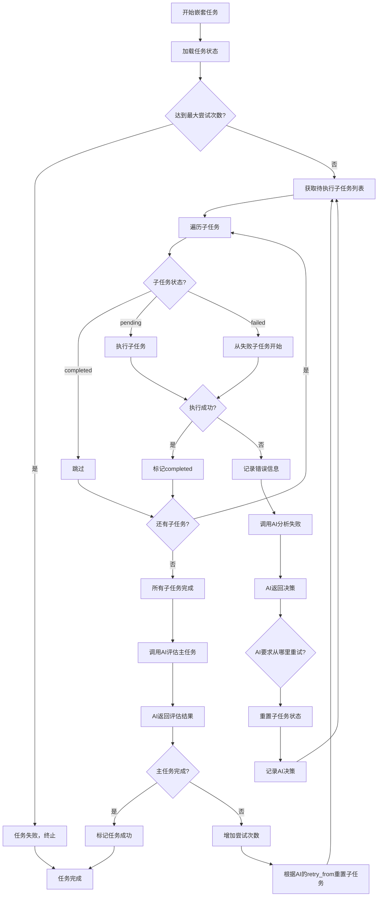
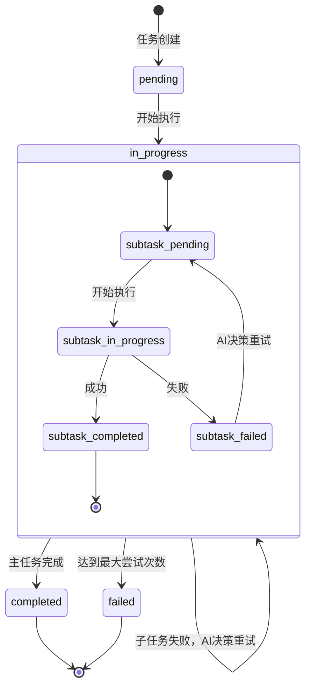
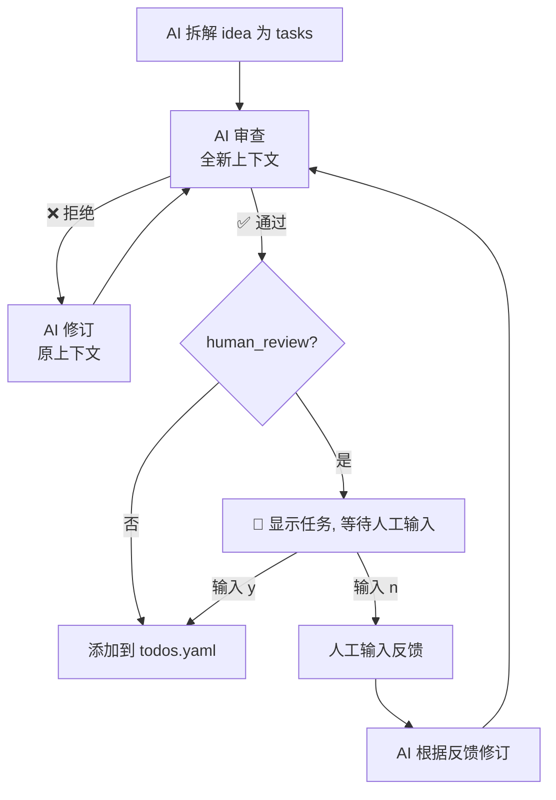

# 架构设计文档

本文档详细描述 AutoAgent 的架构设计。

## 目录

- [系统架构](#系统架构)
- [核心组件](#核心组件)
- [任务类型](#任务类型)
- [数据流](#数据流)
- [状态管理](#状态管理)
- [长时间任务处理](#长时间任务处理)
- [对话日志系统](#对话日志系统)
- [Ideas 监控与 Idle 模式](#ideas-监控与-idle-模式)
- [错误处理](#错误处理)
- [提示词截断机制](#提示词截断机制)
- [多模型支持](#多模型支持)
- [扩展性设计](#扩展性设计)

## 系统架构

### 分层架构

```
┌─────────────────────────────────────────┐
│  应用层 (Application Layer)             │
│  - orchestrator.py                      │
│  - CLI 命令行接口                        │
│  - Preset 配置管理                       │  ← 从 config.yaml 加载预设参数
└────────────────┬────────────────────────┘
                 │
┌────────────────▼────────────────────────┐
│  业务逻辑层 (Business Logic Layer)      │
│  - TodoOrchestrator 类                  │
│  - 任务调度器                           │
│  - 配置解析器                           │
│  - Preset 合并器                        │  ← 合并 preset 与命令行参数
│  - Context 管理器                       │  ← 管理 CodeBuddy context 生命周期
│  - IdeasWatcher                         │  ← 监控 ideas.md 并转换为 TODO
│  - AI 审查 + 人工审核                   │  ← Ideas 拆解质量保障
│  - Idle 模式                            │  ← 任务完成后等待新 ideas
└────────────────┬────────────────────────┘
                 │
┌────────────────▼────────────────────────┐
│  任务执行层 (Task Execution Layer)      │
│  - SimpleTaskExecutor                   │
│  - NestedTaskExecutor                   │
│  - LoopingTaskExecutor                  │
│  - SubtaskExecutor                      │
│  - autoagent_exec.py                    │  ← long_running 任务启动器
└────────────────┬────────────────────────┘
                 │
┌────────────────▼────────────────────────┐
│  AI 能力层 (AI Capability Layer)        │
│  - AIClient 类                           │  ← 统一 AI 客户端（CLI 子进程模式）
│  - AIClientSDK 类                        │  ← CodeBuddy Agent SDK 直连模式
│  - AIClientTest 类                       │  ← 测试模式（读取预定义响应）
│  - AIProvider 抽象基类                   │  ← 多 Provider 支持
│  - CodeBuddyProvider / ClaudeCodeProvider│
│  - GeminiCLIProvider / OpenCodeProvider  │
│  - TestProvider                          │
│  - 提示词构造器                         │
│  - 响应解析器（stream-json）             │  ← 实时解析 stream-json 输出
│  - Context 管理（session_id 自动续接）   │  ← 保持对话上下文连续性
│  - 指数退避（Exponential Backoff）       │  ← CLI 连续失败时自动等待
└────────────────┬────────────────────────┘
                 │
┌────────────────▼────────────────────────┐
│  可观测性层 (Observability Layer)       │
│  - ConversationLogger                   │  ← 对话日志记录
│  - 会话目录管理                         │
│  - Markdown 格式日志                    │
└────────────────┬────────────────────────┘
                 │
┌────────────────▼────────────────────────┐
│  基础设施层 (Infrastructure Layer)      │
│  - 文件系统                             │
│  - 子进程执行                           │
│  - 信号文件 + 监控进程                   │
│  - Git 操作（可选）                     │
└─────────────────────────────────────────┘
```

### 模块依赖关系

```
orchestrator.py
    ├── yaml (配置解析)
    ├── config.yaml (全局配置，包含 preset 定义)
    │   └── preset (预设配置列表)
    ├── ai_providers.py (Provider 抽象层)
    │   ├── AIProvider (基类)
    │   ├── CodeBuddyProvider
    │   ├── ClaudeCodeProvider
    │   ├── GeminiCLIProvider
    │   ├── OpenCodeProvider
    │   └── TestProvider
    ├── task_executor.py (任务执行)
    │   ├── codebuddy_client.py → AIClient (AI 能力)
    │   │   └── ai_providers.py → subprocess (调用各 AI CLI)
    │   ├── autoagent_exec.py (long_running 任务启动器)
    │   │   └── subprocess (启动后台进程 + 信号文件)
    │   ├── truncation_limits.py (截断限制配置)
    │   └── subprocess (执行命令)
    ├── state_manager.py (状态持久化)
    ├── conversation_logger.py (对话日志)
    ├── ideas_watcher.py          # Ideas 文件监控与任务分解
    │   ├── codebuddy_client.py → AIClient (AI 分解 Ideas)
    │   ├── codebuddy_client.py → AIClient (AI 审查 + 修订)
    │   ├── truncation_limits.py (截断限制配置)
    │   └── yaml (追加任务到 todos.yaml)
    └── prompts/                  # Prompt 模板
        ├── shared.py → truncation_limits.py
        ├── ideas_decompose.py → truncation_limits.py
        └── ideas_review.py → truncation_limits.py
```

## 核心组件

### 1. TodoOrchestrator

**职责**：任务编排和执行管理

**核心方法**：
```python
class TodoOrchestrator:
    def __init__(self, todos_file, provider, workspace, timeout, log_dir, ...)
    def _load_todos(self, allow_empty: bool = False) -> list
    def reload_todos(self) -> None
    def validate_config(self) -> bool
    def run(self, task_id=None, skip_completed=True) -> dict
    def execute_task(self, task: dict) -> bool
    def get_status(self) -> dict
    def reset(self) -> None
    def check_and_process_ideas(self, human_review=False) -> int
    def run_with_idle(self, task_id=None, skip_completed=True) -> None
```

**设计要点**：
- 单一职责：只负责任务调度，不涉及具体执行逻辑
- 状态持久化：支持保存和恢复执行状态
- 统一接口：所有任务类型通过统一接口调用

### 2. AI Provider 层（ai_providers.py）

**职责**：抽象不同 AI CLI 工具之间的差异，提供统一的命令构造接口。

**核心类**：

- `AIProvider` — 抽象基类，定义 `build_command()` 和 `get_stdin_command()` 接口
- `CodeBuddyProvider` — CodeBuddy CLI（默认 provider，默认模型从 `config.yaml` 的 `default_model` 加载，回退到 `deepseek-v3.2`）
- `ClaudeCodeProvider` — Claude Code CLI（默认模型 `claude-sonnet-4-6`）
- `GeminiCLIProvider` — Gemini Cli（默认模型 `gemini-2.5-pro`）
- `OpenCodeProvider` — OpenCode CLI（https://opencode.ai，不设默认模型，使用 opencode 自身配置）

**工厂函数**：

- `get_provider(name, ...)` — 按名称创建 provider 实例（支持别名，如 `cb` → `codebuddy`）
- `list_providers()` — 列出所有可用 provider 及其信息

**命令构造示例**：

```bash
# CodeBuddyProvider
type prompt.txt | codebuddy --debug --verbose --print --output-format stream-json --model <default_model> -y -

# ClaudeCodeProvider
type prompt.txt | claude --verbose --print --output-format stream-json --model claude-sonnet-4-6 --dangerously-skip-permissions -

# GeminiCLIProvider
type prompt.txt | gemini --output-format stream-json --model gemini-2.5-pro --yolo -p -

# OpenCodeProvider
type prompt.txt | opencode run --format json -m <model>
```

**Provider 注册表与别名**：

```python
PROVIDERS = {
    "codebuddy": CodeBuddyProvider,
    "claude": ClaudeCodeProvider,
    "gemini": GeminiCLIProvider,
    "opencode": OpenCodeProvider,
    "test": TestProvider,
}

PROVIDER_ALIASES = {
    "cb": "codebuddy",
    "claude-code": "claude",
    "claude": "claude",
    "gemini-cli": "gemini",
    "gemini": "gemini",
    "oc": "opencode",
}
```

### 3. AIClient（codebuddy_client.py）

**职责**：统一的 AI CLI 客户端，封装 AI 调用、Context 管理和 stream-json 解析。

> **注意**：`AIClient` 是主类名，`CodeBuddyClient` 是为向后兼容保留的别名。

**核心功能**：

- 通过 `AIProvider` 构造正确的 CLI 命令
- 将 prompt 写入临时文件并通过 stdin 管道传递（避免 shell 转义问题）
- 实时解析 stream-json 输出（`_handle_stream_line()`），支持：
  - `assistant` 事件：文本输出和工具调用
  - `user` 事件：工具执行结果
  - `result` 事件：最终结果摘要
- 维护 `last_full_log` 属性，记录包含工具调用的完整对话日志
- 通过 `session_id` 自动管理会话续接（`--resume <session_id>`）

**stream-json 解析**：

AI CLI 工具的 `--output-format stream-json` 模式输出逐行 JSON 对象。`_handle_stream_line()` 方法实时解析这些事件，提取 assistant 文本、显示工具调用摘要，并收集完整日志。

```python
# stream-json 事件类型
assistant  → AI 消息（文本块 + 工具调用）
user       → 工具执行结果
result     → 最终摘要（turns 数、耗时等）
system     → 系统/会话初始化消息
```

### 4. SimpleTaskExecutor

**职责**：执行简单任务（一次性命令 + AI 判断）

**执行流程**：
```python
def execute_simple_task_node(task: dict) -> bool:
    """执行简单任务"""
    attempts = 0
    max_attempts = 5  # 防止无限循环，可在配置中覆盖

    while attempts < max_attempts:
        attempts += 1

        # 1. 调用 AI 尝试完成任务
        result = call_codebuddy(f"""
        任务：{task['description']}

        完成条件：{task['completion_criteria']}

        初始提示：{task.get('initial_hint', '无')}

        请尝试完成这个任务。

        完成后，请回复以下格式：
        - ✅ completed：如果满足完成条件
        - ❌ not completed: <原因>：如果不满足，并说明原因
        """)

        # 2. AI 自己判断是否达标（使用英文状态标记）
        if "✅ completed" in result:
            mark_task_completed(task.id)
            return True

        # 3. AI 决定如何改进，然后继续循环
        # （AI 自己决定改什么、怎么改）

    return False
```

**设计要点**：
- AI 完全自主判断完成条件
- AI 完全自主决定如何改进
- 持续迭代直到达标
- 防止无限循环

### 5. NestedTaskExecutor

**职责**：执行嵌套任务（包含子任务）

**核心设计**：AI完全掌控重试策略

**执行流程**：
```python
def execute_nested_task(task: dict):
    """执行嵌套任务"""
    task_id = task['id']
    max_attempts = 5  # 主任务最大尝试次数
    
    while get_task_attempts(task_id) < max_attempts:
        # 1. 获取待执行的子任务列表
        subtasks = get_pending_subtasks(task_id)
        
        # 2. 遍历并执行子任务
        all_subtasks_completed = True
        for subtask in subtasks:
            result = execute_subtask(task_id, subtask)
            
            if not result.success:
                all_subtasks_completed = False
                
                # 3. 子任务失败，立即停止后续子任务，调用AI分析
                ai_decision = call_codebuddy(
                    prompt="分析子任务失败原因并决定重试策略",
                    context={
                        "failed_subtask": subtask,
                        "task_history": get_task_history(task_id),
                        "error_logs": result.logs
                    }
                )
                
                # 4. 根据AI决策重置状态
                reset_subtasks_from(task_id, ai_decision.retry_from)
                
                # 5. 记录AI的决策
                record_ai_decision(task_id, subtask.id, ai_decision)
                
                # 6. 跳出子任务循环，回到 while 开始新一轮尝试
                break
        
        # 如果有子任务失败，跳过主任务评估，直接进入下一轮
        if not all_subtasks_completed:
            increase_task_attempts(task_id)
            continue
        
        # 7. 所有子任务都完成了，调用AI判断主任务是否完成
        ai_evaluation = call_codebuddy(
            prompt="判断主任务是否完成并决定下一步",
            context={
                "task": task,
                "all_results": get_all_results(task_id)
            }
        )
        
        if ai_evaluation.main_task_completed:
            mark_task_completed(task_id)
            return True
        else:
            # 主任务未完成，AI决定从哪里开始重试
            increase_task_attempts(task_id)
            retry_from = ai_evaluation.retry_from  # AI决定重试起点
            reset_subtasks_from(task_id, retry_from)
            record_ai_evaluation(task_id, ai_evaluation)
    
    return False
```

**设计要点**：
- 子任务失败时，**必须调用AI分析**并让AI决定重试起点
- AI可以通过`retry_from`字段指定从哪个子任务开始重试
- 所有子任务完成后，**必须调用AI评估**主任务是否完成
- 如果主任务未完成，AI通过`retry_from`指定从哪个子任务开始新一轮尝试

#### AI决策点1：子任务失败分析

**触发时机**：子任务执行失败（命令返回非零退出码、超时、崩溃等）

**提供给AI的上下文**：
```yaml
failed_subtask:
  id: "task_2.2"
  type: "long_running"
  command: "python train.py --config config.yaml"
  exit_code: 137  # SIGKILL
  error_log: "Killed (CUDA out of memory)"
  
task_history:
  - subtask: "task_2.1"
    status: "completed"
    attempts: 2
    ai_reasoning: "增加了网络层数到10层"
  
  - subtask: "task_2.2"
    attempt: 2
    previous_errors:
      - attempt_1: "GPU内存不足"
      - attempt_2: "训练中段崩溃"
      
related_files:
  - "config.yaml"
  - "logs/train.log"
```

**AI返回的决策**：
```json
{
  "analysis": "任务失败原因是模型太大（10层）导致GPU内存不足。task_2.1的网络层增加是直接原因。",
  "retry_from": "task_2.1",
  "suggested_fix": "将网络层数从10层减少到6层"
}
```

#### AI决策点2：主任务完成评估

**触发时机**：所有子任务都完成后

**提供给AI的上下文**：
```yaml
main_task:
  id: "task_2"
  name: "优化模型性能"
  completion_criteria: "val_loss < 0.5 且 accuracy > 0.9"
  
execution_results:
  task_2_1:
    status: "completed"
    modifications: "增加了dropout和batch normalization"
    attempts: 3
    
  task_2_2:
    status: "completed"
    training_log:
      val_loss: 0.52
      val_accuracy: 0.88
    attempts: 2
      
  task_2_3:
    status: "completed"
    ai_analysis: "val_loss接近目标但未达标，accuracy还有差距"
    attempts: 1
```

**AI返回的决策**：
```json
{
  "main_task_completed": false,
  "analysis": "val_loss为0.52，距离0.5的目标还差0.04；accuracy为0.88，距离0.9的目标还差0.02。两个指标都接近但未达标。",
  "retry_from": "task_2.1",
  "next_strategy": "尝试使用学习率衰减策略、增加数据增强、调整dropout比例"
}
```

**AI的能力**：
- 可以要求从任意子任务重试（包括前面的子任务）
- 可以提出具体的修复建议
- 可以主动终止任务（如果认为无法达成）
- 完全掌控重试策略

## Context 管理

### 设计理念

**重要设计决策**：每个主任务使用独立的 CodeBuddy context。子任务之间会重置 session（防止上下文无限增长），通过 previous_subtask_summary 传递上下文。

### Context 分层策略

#### 1. 主任务级别的 Context 隔离

```python
class TodoOrchestrator:
    def execute_main_task(self, task: dict):
        # 每个主任务创建独立的 CodeBuddyClient
        context_id = f"task_{task['id']}"
        client = CodeBuddyClient(context_id=context_id)
        
        # 子任务之间会重置 session，通过 previous_subtask_summary 传递上下文
        previous_subtask_summary = ""
        for subtask in task['subtasks']:
            if previous_subtask_summary:
                client.reset_session()  # 防止上下文无限增长
            result = self._execute_subtask(client, subtask, previous_subtask_summary)
            previous_subtask_summary = result.summary
```

**优势**：
- ✅ 不同主任务之间的实验完全隔离
- ✅ 避免 context 污染（比如任务1修改了代码，任务2不受影响）
- ✅ 便于调试和分析（可以追溯特定任务的完整对话历史）

> **注意**：每个主任务使用独立的 AIClient 实例，session_id 自动管理会话续接。`context_id` 主要用于状态记录和日志追踪。

#### 2. 子任务级别的 Context 隔离

```python
def _execute_subtask(self, client: CodeBuddyClient, subtask: dict):
    """执行子任务，每个子任务使用独立 session"""
    
    # 在执行新子任务前重置 session（除第一个子任务外）
    # 防止上下文无限增长
    if previous_subtask_summary:
        client.reset_session()
    
    if subtask['type'] == 'simple':
        # 简单任务：新 session，prompt 中包含前一个子任务的摘要
        prompt = self._build_subtask_prompt(subtask, previous_subtask_summary)
        result = client.ask(prompt)
        
    elif subtask['type'] == 'long_running':
        # 长时间任务：新 session，AI 通过 autoagent-exec 启动
        prompt = self._build_long_running_prompt(subtask)
        result = client.ask(prompt)
```

**优势**：
- ✅ 防止上下文无限增长（每个子任务独立 session）
- ✅ 通过 previous_subtask_summary 保持必要的上下文连续性
- ✅ 子任务之间可以引用前一个子任务创建的文件（文件在磁盘上）
- ✅ 同一子任务的重试仍共享 session（保持重试上下文）

**完成检测三层策略**：

`SimpleTaskExecutor._check_completion()` 使用三层检测策略判断 AI 是否报告任务完成：

1. **严格否定标记**（最高优先级）：使用正则表达式匹配 `❌` + 可选空格/星号/下划线 + `not` + 可选空格/星号/下划线 + `complete(d)`，匹配则返回 `False`
2. **严格肯定标记**：使用正则表达式匹配 `✅` + 可选空格/星号/下划线 + `complete(d)`，匹配则返回 `True`
3. **模糊肯定匹配**（兜底）：使用正则表达式匹配 `✅.*completed`、`all criteria met` 等变体，
   同时排除含有 `not completed`、`fail` 等否定词的情况

默认（无匹配）返回 `False`，即认为未完成。

#### 3. Context 生命周期管理

```
主任务开始
    ↓
创建新的 CodeBuddyClient (context_id="task_x")
    ↓
执行子任务 1：创建新 session
    ↓
执行子任务 2：重置 session，传入子任务 1 的摘要
    ↓
执行子任务 3：重置 session，传入子任务 2 的摘要
    ↓
所有子任务完成
    ↓
调用 AI 评估主任务（独立 session）
    ↓
主任务完成/失败
```

### 状态文件中的 Context 信息

在 `todos_state.yaml` 中记录 context 信息：

```yaml
tasks:
  "2":
    status: "in_progress"
    session_id: "abc123"  # AI 会话 ID，用于 --resume 续接
    max_attempts: 5
    attempts: 1
  "2.1":
    status: "completed"
    attempts: 1
  "2.2":
    status: "in_progress"
    attempts: 2
```

> **注意**：状态文件中的任务和子任务使用扁平结构存储，每个任务/子任务 ID 是顶层 key。

### CodeBuddy 命令构造

#### 新子任务调用（创建新 session）

```bash
codebuddy -m "glm-4.7" -y "请阅读 program.md 并开始执行子任务 2.1"
```

#### 同一子任务的重试调用（继续现有 session）

```bash
codebuddy --resume <session_id> -m "glm-4.7" -y "上次尝试失败，请根据以下建议重试..."
```

#### 长时间任务的特殊处理

```bash
# AI 通过 autoagent-exec wrapper 脚本启动后台任务（内部参数由 wrapper 预填）
autoagent-exec.bat python train.py --config config.yaml

# 任务完成后，新 session 分析结果
codebuddy -m "glm-4.7" -y "分析训练日志并判断是否满足完成条件"
```

### 错误处理与恢复

如果系统在执行过程中崩溃，可以通过状态文件中保存的 `session_id` 恢复：

```python
# 从状态文件中恢复
state = load_state("todos_state.yaml")
for task_id, task_state in state['tasks'].items():
    if task_state['status'] == 'in_progress':
        # 恢复之前的会话
        client = AIClient(provider=provider, context_id=f"task_{task_id}")
        if task_state.get('session_id'):
            client.resume_session(task_state['session_id'])

        # 继续执行
        resume_task(client, task_state)
```

### 实现要点

1. **Context ID 生成规则**：
   - 使用任务 ID 作为 context ID：`task_{task_id}`
   - 确保唯一性：不同主任务的 context ID 不会冲突
   - **注意**：`context_id` 主要用于日志追踪。会话续接通过 `session_id` + `--resume` 实现，每个 AIClient 实例独立管理自己的 session_id。

2. **session_id 的自动管理**：
   - 首次调用：不传 session_id，CLI 创建新会话
   - 后续调用：自动使用从 stream 事件中捕获的 session_id
   - 跨系统重启后：从 `todos_state.yaml` 恢复 session_id，通过 `resume_session()` 设置

3. **Context 生命周期**：
   - AutoAgent 不主动管理 session/context 的清理
   - Session 的生命周期由各 AI CLI 工具自身管理（如 CodeBuddy、Claude Code 等）
   - AutoAgent 仅通过 `session_id` 和 `--resume` 实现会话续接

4. **并发控制**：
   - 每个主任务使用独立的 AIClient 实例，理论上可以并发执行
   - 同一个主任务的子任务必须串行执行

## 任务类型

### 1. 简单任务 (simple)

**定义**：由 AI 自主完成的任务，涵盖命令执行、代码修改、分析等所有场景

**配置示例**：
```yaml
# 作为顶层任务
- id: 1
  name: "下载数据集"
  type: simple
  completion_criteria: "data.csv 文件存在且大小 > 10MB"
  initial_hint: "使用 python download.py"

# 作为子任务（代码修改场景）
- id: 2.1
  name: "修改训练代码"
  type: simple
  completion_criteria: "代码修改完成，添加了 dropout 层和学习率调度器"
```

> **设计理念**：不区分"执行命令"和"修改代码"——对 AI 来说这是同一件事。AI 看到"修改训练代码"自然知道要改代码，看到"运行测试"自然知道要运行命令。用户只需要回答一个问题：**"这个任务需要在后台长时间运行吗？"** 需要就用 `long_running`，不需要就用 `simple`。

**执行流程**：
```
1. AI 尝试完成任务（根据 initial_hint）
   ↓
2. AI 自我评估是否满足完成条件
   ↓
3. 如果满足：标记完成
   如果不满足：AI 决定如何改进，重新尝试
   ↓
4. 循环直到满足条件或达到最大尝试次数
```

### 2. 嵌套任务 (nested)

**定义**：包含多个子任务的任务

**配置示例**：
```yaml
- id: 2
  name: "优化模型性能"
  type: nested
  completion_criteria: "训练成功完成且 val_loss < 0.5"
  subtasks:
    - id: 2.1
      name: "修改训练代码"
      type: simple
      completion_criteria: "代码修改完成"
      
    - id: 2.2
      name: "运行训练"
      type: long_running
      completion_criteria: "训练正常退出且验证集指标满足要求"
```

**执行流程**：
```
1. 执行子任务 2.1（AI 修改代码）
   ↓
2. 如果子任务 2.1 失败：立即停止，AI 分析并决定重试策略
   如果子任务 2.1 成功：继续
   ↓
3. 执行子任务 2.2（运行训练，可能很长）
   ↓
4. 如果子任务 2.2 失败：立即停止，AI 分析并决定从哪个子任务重试
   如果子任务 2.2 成功：继续
   ↓
5. 所有子任务完成后，AI 判断主任务是否完成
   ↓
6. 如果未完成：AI 决定从哪个子任务重新开始
   ↓
7. 循环直到满足条件或达到最大尝试次数
```

### 3. 循环任务 (looping)

**定义**：固定循环 N 次执行所有子任务的迭代优化任务

**配置示例**：
```yaml
- id: 3
  name: "迭代优化 CUDA 内核性能"
  type: looping
  repeat_count: 5
  max_attempts_per_loop: 10
  completion_criteria: |
    完成 5 轮优化迭代
  subtasks:
    - id: 3.1
      name: "使用 ncu 分析性能瓶颈"
      type: long_running
      completion_criteria: "ncu 分析完成"
    - id: 3.2
      name: "根据分析结果优化代码"
      type: simple
      completion_criteria: "代码优化完成，编译通过"
```

**与 nested 的区别**：
- `nested`：AI 每轮评估是否完成，可能提前结束或继续重试
- `looping`：固定循环 N 次，不做完成度评估，每轮重置所有子任务状态重新执行

**执行流程**：
```
1. 开始第 1 轮循环
   ↓
2. 重置所有子任务状态
   ↓
3. 按顺序执行所有子任务
   ↓
4. 子任务失败时 AI 分析原因并决定重试策略（在当前轮内重试）
   ↓
5. 本轮完成，进入下一轮
   ↓
6. 循环完指定次数即完成
```

### 4. 长时间任务 (long_running)

**定义**：通过 `autoagent-exec` 启动的长时间后台任务，使用快速失败检测机制（超时时间由 `config.yaml` 的 `fast_fail_timeout` 配置，默认 10 秒）

**配置示例**：
```yaml
- id: 2.2
  name: "运行训练"
  type: long_running
  completion_criteria: "训练正常退出且验证集指标满足要求"
```

> **注意**：`long_running` 类型的子任务不再需要在 YAML 中指定 `command` 字段。AI 会根据任务描述自主决定要运行的命令，并通过 `autoagent-exec` 启动。

**执行流程**：
```
1. AutoAgent 构造 prompt，告知 AI 使用 autoagent-exec wrapper 脚本执行长时间命令
   ↓
2. AI 通过 wrapper 脚本调用 autoagent-exec（内部参数由 wrapper 预填）
   ↓
3. autoagent-exec 启动命令并监视 N 秒（由 config.yaml 的 fast_fail_timeout 配置）：
   ├─ N 秒内失败（退出码非零）：智能输出（短输出内联打印，长输出只给路径），AI 可修复并重试
   ├─ N 秒内成功（退出码 0）：智能输出（短输出内联打印并标注 not truncated，长输出只给路径）
   └─ N 秒后仍在运行：输出 "TASK SUBMITTED"，AI 结束会话
   ↓
4. AI 看到 "TASK SUBMITTED" 后输出 LONG_RUNNING_IN_PROGRESS
   ↓
5. AutoAgent 检测到 LONG_RUNNING_IN_PROGRESS，开始轮询信号文件
   ↓
6. 任务完成后，重新启动 AI 分析结果
   ↓
7. AI 读取输出日志，判断是否满足完成条件
```

**技术实现**：
- 使用 `autoagent_exec.py` 脚本作为 long_running 任务启动器
- 快速失败检测（超时时间由 `config.yaml` 的 `fast_fail_timeout` 配置），避免 AI 反复启动会话
- 信号文件（`lr_tasks/lr_<task_id>_signal.json`）用于进程间通信
- 输出日志（`lr_tasks/lr_<task_id>_output.log`）记录命令完整输出
- 任务完成后 AutoAgent 重启 AI 会话进行结果分析

### 5. 一次性变体 (simple_once / long_running_once)

**定义**：`simple` 和 `long_running` 的一次性变体。一旦执行成功，即使父任务重试也不会重新执行。

**使用场景**：
- `simple_once`：一次性数据准备、环境初始化等，重试时不需要重复的工作
- `long_running_once`：一次性的 Docker 构建、基线性能分析等耗时操作

**配置示例**：
```yaml
subtasks:
  - id: 4.1
    name: "下载和准备训练数据"
    type: simple_once       # 即使主任务重试，数据只准备一次
    completion_criteria: "data/ 目录包含至少 10000 张图片"

  - id: 5.1
    name: "构建 Docker 镜像"
    type: long_running_once  # 即使主任务重试，镜像只构建一次
    completion_criteria: "docker images 显示 myservice:latest"
```

**与基础类型的区别**：
- `simple_once` 在重试循环中，已完成的实例会被跳过
- `long_running_once` 同理，避免重复执行耗时的后台任务
- 适合放在子任务列表的开头，作为一次性的前置步骤

## 数据流

### 简单任务执行流程

```
1. 加载 todos.yaml
   ↓
2. 解析任务配置
   ↓
3. 尝试 #1：
   ├─ 调用 CodeBuddy
   ├─ AI 尝试完成任务
   ├─ AI 自我评估
   └─ 如果完成：标记完成
      如果未完成：继续
   ↓
4. 尝试 #2：
   ├─ 调用 CodeBuddy
   ├─ AI 根据上次的反馈改进
   ├─ AI 自我评估
   └─ 如果完成：标记完成
      如果未完成：继续
   ↓
5. 循环直到完成或达到最大尝试次数
```

### 嵌套任务执行流程（含AI决策）

```
开始嵌套任务执行
    ↓
读取子任务列表
    ↓
遍历子任务
    ↓
检查子任务状态
    ├─ completed → 跳过
    ├─ pending → 执行
    └─ failed → 从这里开始
          ↓
      执行子任务
          ↓
    成功？ → 更新状态为completed
    │
    失败？ → 更新状态为failed
              ↓
          【AI决策点1：失败分析】
          ↓
          调用CodeBuddy分析失败原因
              ↓
          AI返回：
          - 失败原因分析
          - 建议重试起点（retry_from）
          - 修复策略建议
              ↓
          根据AI的retry_from重置子任务状态
              ↓
          记录AI决策
              ↓
          开始新一轮子任务执行循环
              ↓
    所有子任务完成？
              ↓ 是
        【AI决策点2：主任务评估】
              ↓
          调用CodeBuddy评估主任务是否完成
              ↓
          AI返回：
          - main_task_completed: true/false
          - 结果分析
          - 下一轮策略建议
              ↓
        完成？ → 主任务成功
              ↓ 否
          增加主任务attempt计数
          根据AI的retry_from重置相应子任务
          记录AI评估
              ↓
          从AI指定的子任务重新开始
```

**关键流程说明**：

1. **子任务失败处理**：
   - 子任务执行失败后，立即调用AI分析
   - AI根据失败历史、错误日志、相关文件等信息，决定重试起点
   - 系统完全听从AI的决策，重置相应的子任务状态

2. **主任务完成判断**：
   - 所有子任务都完成后，调用AI评估主任务
   - AI根据所有子任务的执行结果，判断是否满足完成条件
   - 如果未完成，AI提出下一轮的优化策略

3. **重试机制**：
   - 子任务级别：每次失败后，AI决定从哪里开始重试
   - 主任务级别：每轮尝试后，AI决定是否继续或终止
   - 最大限制：子任务5次，主任务5次（可通过 `max_attempts` 配置）

## 状态管理

### 状态文件结构

```yaml
# todos_state.yaml — 扁平结构，所有任务/子任务都是顶层 key
tasks:
  "1":
    status: "completed"  # pending | in_progress | completed | failed
    attempts: 3
    last_attempt: "2026-03-23 22:30:00"

  "2":
    status: "in_progress"
    attempts: 3  # 主任务尝试次数
    max_attempts: 5  # 最大尝试次数
    session_id: "abc123"  # AI 会话 ID
    ai_decisions:
      - attempt: 1
        time: "2026-03-23 22:40:00"
        failed_at: "2.2"
        retry_from: "2.1"
        analysis: "需要重新调整模型结构"
        suggested_fix: "减少网络层数"
      - attempt: 2
        time: "2026-03-23 22:48:00"
        failed_at: "2.2"
        retry_from: "2.2"
        analysis: "只是超时问题，可以继续"
        suggested_fix: "增加timeout时间"
    main_task_evaluations:
      - round: 1
        time: "2026-03-23 22:50:00"
        main_task_completed: false
        analysis: "val_loss为0.52，距离0.5的目标还差0.04"
        next_strategy: "尝试使用学习率衰减策略、增加数据增强"

  "2.1":
    status: "completed"
    attempts: 2
    ai_reasoning: "已添加学习率调度器"
    history:
      - attempt: 1
        time: "2026-03-23 22:00:00"
        result: "修改完成"
      - attempt: 2
        time: "2026-03-23 22:30:00"
        result: "修改完成，满足条件"

  "2.2":
    status: "failed"
    attempts: 2
    error_type: "ai_failed"  # ai_failed | nested_failed | looping_failed | max_attempts_exceeded | validation_failed
    log_file: "lr_tasks/lr_2.2_output.log"
    ai_reasoning: "训练过程中GPU内存不足"

  "2.3":
    status: "pending"
    attempts: 0
```

### 状态流转规则

#### 子任务状态流转

```
pending → in_progress → completed/failed
           ↓              ↓
           ←------failed------←
               (AI决策重试)
```

> `in_progress` 同时覆盖"正在执行"和"长时间任务后台运行"两种场景。

#### 状态重置逻辑

1. **子任务失败后的重置**：
   - 根据AI的`retry_from`决定
   - 从`retry_from`到当前失败子任务之间的所有子任务重置为pending
   - 比如AI返回`retry_from: "task_2.1"`，则2.1和2.2都重置为pending

2. **主任务新一轮尝试**：
   - AI通过`retry_from`指定重试起点
   - 从`retry_from`开始的子任务重置为pending
   - `current_round`加1
   - 主任务`attempts`加1

#### AI决策记录

每次AI决策都需要记录：
- 决策时间
- 失败位置（failed_at）
- 重试起点（retry_from）
- AI的分析（analysis）
- 建议的修复方案（suggested_fix）

### 状态持久化

```python
class TodoOrchestrator:
    def __init__(self, todos_file="todos.yaml", log_dir=None):
        self.todos_file = todos_file
        # log_dir defaults to ".autoagent" (relative to CWD)
        # Session directory resolved via .autoagent_log in workspace
        self.session_dir = self._resolve_log_session_dir(log_dir, workspace)
        self.state = StateManager(os.path.join(self.session_dir, "todos_state.yaml"))
        self.todos = self.load_todos()
    
    def load_state(self):
        try:
            with open(self.state_file) as f:
                return yaml.safe_load(f) or {"tasks": {}}
        except FileNotFoundError:
            return {"tasks": {}}
    
    def save_state(self):
        with open(self.state_file, "w") as f:
            yaml.dump(self.state, f)
    
    def get_task_state(self, task_id):
        return self.state["tasks"].get(task_id, {"status": "pending"})
    
    def mark_task_status(self, task_id, status, **kwargs):
        if task_id not in self.state["tasks"]:
            self.state["tasks"][task_id] = {}
        
        self.state["tasks"][task_id]["status"] = status
        self.state["tasks"][task_id].update(kwargs)
        self.save_state()
```

## 长时间任务处理

### 问题背景

**为什么需要长时间任务处理？**

CodeBuddy 有超时限制（通常 1 小时），但某些任务（如模型训练、Profiling）可能需要更长时间。

### 解决方案

**使用 autoagent-exec 启动器 + 快速失败检测（超时由 `config.yaml` 的 `fast_fail_timeout` 配置，默认 10 秒） + 信号文件轮询：**

整个 long_running 任务流程涉及三方协作：

```
┌──────────────┐     prompt      ┌───────────┐     bash call     ┌──────────────────┐
│  AutoAgent   │ ──────────────→ │    AI     │ ───────────────→ │  autoagent-exec  │
│ (Orchestrator│                 │ (CodeBuddy│                   │  (独立脚本)       │
│  轮询信号文件)│ ←── 读取状态 ── │  会话结束) │                   │  快速失败检测     │
└──────────────┘                 └───────────┘                   │  后台进程管理     │
                                                                 │  信号文件写入     │
                                                                 └──────────────────┘
```

### autoagent_exec.py（long_running 任务启动器）

**职责**：作为 AI 通过 wrapper 脚本（`autoagent-exec.bat` / `autoagent-exec.sh`）调用的独立脚本，负责启动命令、快速失败检测、后台管理和信号文件写入。

**调用方式**（AI 通过 wrapper 脚本调用，内部参数由 wrapper 预填）：
```bash
# Windows
autoagent-exec.bat <command...>
# Linux/macOS
bash autoagent-exec.sh <command...>
```

**内部参数**（由 wrapper 脚本预填，AI 不需要也不应该手动指定）：

| 参数 | 说明 |
|------|------|
| `--log-dir` | 日志会话目录的绝对路径（由 AutoAgent 传递给 wrapper 脚本） |
| `--task-id` | 子任务 ID（如 `1.2`） |
| `--fast-fail-timeout` | 快速失败超时时间（秒），由 `config.yaml` 的 `fast_fail_timeout` 配置 |
| `--cmd <command>` | 要执行的命令（由 wrapper 脚本拼接用户参数后传入）。也支持 legacy 格式 `-- <command>` |

**快速失败检测机制**（超时时间由 `config.yaml` 的 `fast_fail_timeout` 配置，默认 10 秒）：

```
启动命令
  ↓
等待 N 秒（fast_fail_timeout）
  ↓
┌──────────────────────────────────────────────────┐
│ N 秒内退出？                                      │
│ ├─ 退出码 = 0 → ✅ 命令快速完成                  │
│ │   智能输出：短输出直接内联打印，长输出只给路径   │
│ │   写入 "finished" 信号文件                      │
│ ├─ 退出码 ≠ 0 → ❌ 快速失败                      │
│ │   智能输出：短输出直接内联打印，长输出只给路径   │
│ │   不写信号文件（AI 可直接重试）                  │
│ └─ 仍在运行 → 🚀 转为后台任务                    │
│     写入 "running" 信号文件                       │
│     打印 "TASK SUBMITTED" 消息                    │
│     启动独立监控进程等待命令结束                     │
└──────────────────────────────────────────────────┘
```

**智能输出策略**（命令在 N 秒内退出时）：

| 输出长度 | 行为 |
|----------|------|
| 无输出 | 打印 `(no output captured)` |
| ≤ 3000 字符 | 直接内联打印完整内容，标注 `(complete, not truncated)` 避免 AI 再去读文件 |
| > 3000 字符 | 只打印 output log 文件路径，AI 可自行读取 |

**信号文件格式**（`lr_tasks/lr_<task_id>_signal.json`）：

```json
{
  "task_id": "1.2",
  "command": "ncu --set full --csv ./build/Release/main.exe",
  "pid": 12345,
  "output_log": "/path/to/logs/lr_tasks/lr_1.2_output.log",
  "status": "running",
  "submitted_at": "2026-03-25T15:30:00",
  "finished_at": null,
  "exit_code": null
}
```

`status` 字段变化：`running` → `finished`（退出码 0）或 `error`（退出码非 0）

### SubtaskExecutor 中的 long_running 流程

```python
def _execute_long_running_subtask(self, subtask, client, ...):
    # 1. 构造 prompt，告知 AI 使用 autoagent-exec wrapper 脚本
    #    wrapper 脚本中已预填 --log-dir（使用 self.session_dir）等内部参数
    prompt = self._build_long_running_prompt(
        subtask, autoagent_exec_path, self.session_dir, ...
    )
    
    # 2. AI 调用 autoagent-exec，可能出现以下情况：
    result = client.ask(prompt)
    
    # 3a. AI 报告 LONG_RUNNING_IN_PROGRESS
    if self._check_long_running_in_progress(result):
        # 轮询信号文件，等待后台任务完成
        status = self._poll_signal_file(signal_file)
        # 重启 AI 分析结果
        return self._ai_analyze_long_running_result(...)
    
    # 3b. AI 直接完成（快速成功或自行处理）
    if self._check_completion(result):
        return SubtaskResult(success=True)
    
    # 3c. 快速失败，AI 已看到错误，下一轮重试
```

### session_dir 传递机制

**设计要点**：`session_dir`（日志会话目录）由 orchestrator 在初始化时解析，然后逐级传递给所有需要它的执行器。

```
TodoOrchestrator
  │
  │  self.session_dir = _resolve_log_session_dir(log_dir, workspace)
  │
  └─→ NestedTaskExecutor(session_dir=self.session_dir)
        │
        │  self.session_dir = session_dir
        │
        └─→ SubtaskExecutor(session_dir=session_dir)
              │
              │  self.session_dir = session_dir
              │
              └─→ 在 _execute_long_running_subtask 中直接使用 self.session_dir
                  构造 AI prompt 中的 --log-dir 参数
```

这样确保了 AI prompt 中的 `--log-dir` 路径与 orchestrator 的 `--log-dir` 参数一致，而不是硬编码某个默认路径。

### Orchestrator 端的处理

AutoAgent 通过轮询信号文件等待后台任务完成：

```python
def _poll_signal_file(self, subtask_id, signal_file, check_interval=15):
    """每 15 秒检查一次信号文件"""
    while True:
        if os.path.exists(signal_file):
            signal_data = json.load(open(signal_file))
            if signal_data['status'] in ('finished', 'error'):
                return signal_data['status']
        time.sleep(check_interval)

def _ai_analyze_long_running_result(self, subtask, client, status, output_log):
    """重启 AI 会话，让 AI 读取输出日志并判断完成条件"""
    # 提供输出日志文件路径（而非嵌入内容），AI 使用 Read 工具读取
    prompt = f"""Task completed with status: {status}
    Output log: {output_log}
    Please read the log and evaluate..."""
    result = client.ask(prompt)
    return result
```

### 项目结构

```
autoagent/
├── orchestrator.py           # 主程序、CLI 入口
├── ai_providers.py           # AI Provider 抽象层（多 CLI 工具支持）
├── task_executor.py          # 任务执行器 (Simple/Nested/Looping/SubtaskExecutor)
├── autoagent_exec.py         # long_running 任务启动器（AI 通过 wrapper 脚本调用）
├── codebuddy_client.py       # AIClient（统一 AI 客户端）
├── state_manager.py          # 状态持久化管理
├── conversation_logger.py    # 对话日志记录
├── ideas_watcher.py          # Ideas 文件监控与任务分解
│
├── todos.yaml                # 任务定义
├── ideas.md                  # 用户的想法记录（可选）
├── .autoagent_log            # 项目对应的日志子文件夹名（自动生成）
│
├── <log_dir>/                # 日志根目录（默认 .autoagent，相对 CWD）
│   └── <project>_<random>/   # 项目专属会话目录（由 .autoagent_log 指定）
│       ├── orchestrator.log           # Orchestrator 运行日志
│       ├── todos_state.yaml           # 任务状态（自动生成）
│       ├── plans_state.yaml            # Ideas 状态跟踪（替代旧的 .ideas_processed.md）
│       ├── lr_tasks/                  # long_running 任务文件目录
│       │   ├── lr_<task_id>_signal.json   # long_running 信号文件（自动生成）
│       │   └── lr_<task_id>_output.log    # long_running 命令输出日志（自动生成）
│       └── conversations/             # 对话日志目录
│           ├── ideas.md               # Ideas 拆解日志（prompt + response）
│           ├── task_1_round_1.md      # 简单任务第 1 轮对话
│           ├── task_1_round_2.md      # 简单任务第 2 轮对话
│           ├── task_2.md              # 嵌套任务的索引文件
│           └── subtask_2/             # 嵌套任务的子任务目录
│               ├── task_2.1_round_1.1.md
│               ├── task_2.1_round_1.2.md
│               ├── failure_analysis_2.2_round_1.1.md
│               └── main_task_evaluation_round_1.md
└── README.md
```

### 日志目录管理（.autoagent_log）

为了支持多个项目共用同一个日志根目录，系统在**项目目录**中维护一个 `.autoagent_log` 文件，
内容为该项目对应的日志子文件夹名称，例如 `cufftdx_optimization_ko53bi1b`。

- 首次运行时自动生成：`<项目目录名>_<随机8位字符>`
- 后续运行读取该文件，确保同一个项目始终写入同一个日志子文件夹
- 最终日志路径为 `<log_dir>/<.autoagent_log中的内容>/`
- 所有运行时状态文件（`todos_state.yaml`、`orchestrator.log`、`plans_state.yaml`、`conversations/`）
  均位于该目录下，**不会出现在项目目录中**

## 系统与AI的协作流程图

### 完整的嵌套任务执行流程（包含所有AI决策点）



### AI决策详细流程

#### 决策点1：子任务失败分析

```
系统检测到子任务失败
    ↓
系统构造上下文：
  - 失败的子任务信息（命令、退出码、错误日志）
  - 任务历史记录（之前尝试的信息）
  - 相关文件路径
  - 完成条件
    ↓
系统调用CodeBuddy
    ↓
AI分析：
  1. 读取错误日志
  2. 分析失败原因
  3. 检查历史尝试
  4. 评估是否是前面子任务的问题
    ↓
AI返回决策：
  {
    "analysis": "...",          // 失败原因分析
    "retry_from": "task_2.1",   // 从哪个子任务重试
    "suggested_fix": "..."      // 修复建议
  }
    ↓
系统解析AI决策
    ↓
系统根据retry_from重置子任务状态
    ↓
系统记录AI决策到状态文件
    ↓
系统重新开始子任务循环
```

#### 决策点2：主任务完成评估

```
所有子任务都完成
    ↓
系统构造上下文：
  - 主任务信息（名称、完成条件）
  - 所有子任务的执行结果
  - 训练日志、指标数据
  - 历史评估记录
    ↓
系统调用CodeBuddy
    ↓
AI评估：
  1. 检查每个子任务的结果
  2. 评估是否满足完成条件
  3. 分析结果与目标的差距
  4. 提出下一轮的优化方向
    ↓
AI返回评估：
  {
    "main_task_completed": false,
    "analysis": "...",                    // 结果分析
    "retry_from": "task_2.1",            // 重试起点
    "next_strategy": "继续优化"          // 下一轮策略
  }
    ↓
系统解析AI评估
    ↓
系统根据main_task_completed决定：
  - true: 标记任务成功
  - false: 增加尝试次数，根据AI的retry_from重置子任务，开始新一轮
    ↓
系统记录AI评估到状态文件
    ↓
系统继续执行
```

### 状态管理流程



## 错误处理

### 指数退避（Exponential Backoff）

当 AI CLI 调用连续失败时，AIClient / AIClientSDK 会自动在下一次调用前等待一段时间，避免频繁重试浪费资源。

**退避策略**：
- 基础等待时间：5 秒
- 指数增长：5s → 10s → 20s → 40s → 80s → ...
- 最大等待时间：由 `config.yaml` 的 `backoff_max_wait` 配置（默认 300 秒）
- 成功后立即重置计数器
- 永远不会主动退出程序，只设置等待上限

```python
delay = min(5 * 2^(consecutive_failures - 1), backoff_max_wait)
```

### 健壮性增强

#### retry_from 验证

NestedTaskExecutor 和 LoopingTaskExecutor 的 `_reset_subtasks_from()` 方法会验证 AI 返回的 `retry_from` ID 是否存在于子任务列表中。如果 ID 无效，回退到第一个子任务，避免无限循环。

#### process.wait() 超时

AIClient 在 stdout 关闭后调用 `process.wait(timeout=30)` 等待进程退出。如果 30 秒内未退出，强制 kill 并再等待 10 秒。避免在 Windows 上因僵尸进程导致挂起。

#### StateManager 线程安全

`StateManager.save_state()` 使用 `threading.Lock` 保护文件写入，防止并发写入导致状态文件损坏。

#### 信号文件容错

`SubtaskExecutor._poll_signal_file()` 对信号文件读取错误（JSON 解析失败、IO 错误）进行计数。连续 10 次读取失败后，将任务视为已完成（error 状态），避免无限轮询。

### 错误分类

1. **配置错误**
   - YAML 语法错误
   - 缺少必需字段
   - 字段类型错误

2. **执行错误**
   - 命令执行失败（退出码 != 0）
   - 超时
   - OOM（内存溢出）

3. **AI 错误**
   - CodeBuddy 调用失败
   - 响应解析失败
   - AI 返回无效响应

## 错误处理策略

```python
def execute_task(self, task: dict) -> bool:
    try:
        # 1. 验证配置
        self._validate_task(task)
        
        # 2. 根据任务类型分发到对应的 Executor
        if task['type'] == 'simple':
            return self.simple_executor.execute(task, client, self.state_manager, ...)
        elif task['type'] == 'nested':
            return self.nested_executor.execute(task, client, self.state_manager, ...)
        elif task['type'] == 'looping':
            return self.looping_executor.execute(task, client, self.state_manager, ...)
    
    except ConfigError as e:
        print(f"❌ 配置错误: {e}")
        return False
    
    except ExecutionError as e:
        print(f"❌ 执行错误: {e}")
        return False
    
    except AICallError as e:
        print(f"❌ AI 调用错误: {e}")
        return False
```

## 多模型支持

### 概述

autoagent 支持在不同阶段使用不同的 AI 模型，通过 `--model` 参数的多角色格式指定：

```
--model "plan:glm-4-flash;default:glm-5;lite:glm-4-flash"
```

### 模型角色

| 角色 | 用途 | 使用场景 |
|------|------|---------|
| `plan` | Idea 分解为 TODO 任务 | `check_and_process_ideas()` 中的 AI 调用 |
| `default` | 任务执行默认模型 | 复杂任务、AI 决策点 |
| `lite` | 轻量模型 | 简单任务（运行命令、简单文件编辑） |

### 模型规格解析

`parse_model_spec()` 函数（`ai_providers.py`）支持两种格式：

1. **单模型**：`"glm-5"` → 三个角色使用同一模型
2. **多角色**：`"plan:X;default:Y;lite:Z"` → 各角色使用指定模型
   - 缺失的角色继承 `default` 的值
   - `default` 角色必须存在

### 模型切换流程

```
main() 解析 --model → model_roles dict
    │
    ├─ TodoOrchestrator.__init__(model_roles=...)
    │   ├─ NestedTaskExecutor(model_roles=...)
    │   │   └─ SubtaskExecutor(model_roles=...)
    │   └─ LoopingTaskExecutor(model_roles=...)
    │       └─ SubtaskExecutor(model_roles=...)
    │
    ├─ check_and_process_ideas()
    │   └─ provider.set_model(plan_model) → 处理 → 恢复原模型
    │
    └─ execute_task(task)
        └─ provider.set_model(model_roles[task.model])
            └─ SubtaskExecutor.execute(subtask)
                └─ provider.set_model(model_roles[subtask.model])
```

### 任务级模型指定

在 `todos.yaml` 中，任务和子任务可以通过 `model` 字段指定使用的模型角色：

```yaml
- id: 1
  name: "运行代码检查"
  type: simple
  model: lite  # 使用轻量模型
  completion_criteria: "pylint 评分 >= 9.0"
```

`model` 字段只接受 `"default"`、`"lite"` 或直接的模型名称，默认为 `"default"`。

### 线程安全

由于任务执行是单线程的，`provider.set_model()` 直接修改 `self.model` 属性是安全的。

## 扩展性设计

### 1. 新增 Preset

在 `config.yaml` 中添加新的 preset 配置：

```yaml
preset:
  - name: my_preset
    ideas: ${workspace}/my_ideas.md
    config: ${workspace}/my_todos.yaml
    provider: gemini
    model: gemini-2.5-pro
    verbose: true
```

使用 `--preset my_preset` 即可应用该配置。

### 2. 新增任务类型

```yaml
# 并行任务
- id: 1
  name: "并行数据预处理"
  type: parallel
  commands:
    - "python process_part1.py"
    - "python process_part2.py"
    - "python process_part3.py"
```

### 3. 新增验证器

```python
class CompletionValidator:
    """完成标准验证器"""
    
    def validate(self, criteria: str, context: dict) -> bool:
        # 将自然语言标准转换为验证逻辑
        # 可以使用 AI 或规则引擎
        
        # 示例：简单的关键词匹配
        if "accuracy >= " in criteria:
            threshold = float(criteria.split("accuracy >= ")[1].split()[0])
            return context['accuracy'] >= threshold
        
        # 更复杂的逻辑可以调用 AI
        return self._ask_ai(criteria, context)
```

### 4. 新增通知方式

```python
class Notifier:
    """任务完成通知"""
    
    def notify(self, task_id: int, status: str, message: str):
        # 支持：邮件、企业微信、Slack 等
        pass
```

## 提示词截断机制

### 设计目标

自动构建的提示词中包含多种动态内容（AI 分析建议、历史记录、日志、YAML 等），这些内容可能随迭代次数增长而膨胀。截断机制确保发送给 AI 的上下文保持在合理范围内，避免 token 浪费和上下文溢出。

### 架构

```
config.yaml (truncation_limits)
        │
        ▼
truncation_limits.py (_Limits 单例)
        │
    ┌───┼───────────────┐
    ▼   ▼               ▼
prompts/  task_executor.py  ideas_watcher.py
```

- `truncation_limits.py` 从 `config.yaml` 的 `truncation_limits` 段加载配置，所有字段都有内置默认值
- 各 prompt 构造器和执行器通过 `from truncation_limits import limits` 获取阈值
- 用户只需在 `config.yaml` 中配置想调整的项

### 截断策略

| 内容类型 | 策略 | 原因 |
|---------|------|------|
| AI 生成的分析/建议 | 保留尾部 | 最新的分析最相关 |
| 用户输入（idea、feedback） | 保留头部 | 开头通常包含核心意图 |
| 结构化数据（YAML、日志、结果） | 保留头尾，中间截断 | 头部有结构信息，尾部有最新数据 |

## AI与系统的职责分工

### 核心原则

**系统负责流程控制，AI负责智能决策**

### 系统职责（Python程序）

1. **执行框架**：
   - 管理任务队列
   - 执行命令（包括nohup后台任务）
   - 监控长时间任务状态
   - 持久化状态到文件

2. **状态管理**：
   - 维护任务和子任务的状态
   - 追踪尝试次数
   - 记录执行历史和日志
   - 根据AI决策重置状态

3. **AI调用**：
   - 在关键时刻调用AI（子任务失败、主任务评估）
   - 提供结构化的上下文
   - 解析AI的决策结果

4. **流程控制**：
   - 根据AI的决策执行后续操作
   - 控制最大重试次数
   - 处理异常情况
   - 防止无限循环

### AI职责（通过CodeBuddy）

1. **失败分析**（决策点1）：
   - 分析子任务失败原因
   - 识别根本原因（是当前子任务的问题，还是前面子任务的问题）
   - 评估历史尝试记录
   - 检查错误日志和相关文件

2. **重试决策**（决策点1）：
   - 决定从哪个子任务开始重试（`retry_from`字段）
   - 提出具体的修复方案（`suggested_fix`字段）
   - 给出分析（`analysis`字段）

3. **完成判断**（决策点2）：
   - 判断主任务是否完成（`main_task_completed`字段）
   - 评估结果与目标的差距
   - 分析所有子任务的执行结果

4. **策略建议**（决策点2）：
   - 提出下一轮的优化方向（`next_strategy`字段）
   - 可以主动终止任务（如果认为无法达成）

### 通信协议

#### 系统发送给AI

```yaml
# 子任务失败分析请求
prompt: "分析子任务失败原因并决定重试策略"

context:
  failed_subtask:
    id: "task_2.2"
    type: "long_running"
    command: "python train.py --config config.yaml"
    exit_code: 137
    error_log: "Killed (CUDA out of memory)"
    
  task_history:
    - subtask: "task_2.1"
      status: "completed"
      attempts: 2
      ai_reasoning: "增加了网络层数到10层"
    
    - subtask: "task_2.2"
      attempt: 2
      previous_errors:
        - attempt_1: "GPU内存不足"
        - attempt_2: "训练中段崩溃"
        
  related_files:
    - "config.yaml"
    - "logs/train.log"
    
  completion_criteria: "val_loss < 0.5 且 accuracy > 0.9"
```

#### AI返回给系统

```json
{
  "analysis": "任务失败原因是模型太大（10层）导致GPU内存不足。task_2.1的网络层增加是直接原因。",
  "retry_from": "task_2.1",
  "suggested_fix": "将网络层数从10层减少到6层"
}
```

### 设计优势

1. **完全的AI自主性**：
   - AI完全掌控重试策略
   - AI可以基于实际情况调整
   - 没有硬编码的重试逻辑

2. **避免死循环**：
   - AI能够识别跨子任务的依赖问题
   - AI不会盲目重复失败的操作
   - AI可以主动终止无法完成的任务

3. **灵活性**：
   - AI可以要求从任意子任务重试
   - AI可以提出各种修复方案
   - 系统只负责执行AI的决策

4. **可追踪性**：
   - 所有AI决策都被记录
   - 可以回顾AI的推理过程
   - 便于调试和优化

5. **符合用户核心理念**：
   - "AI自主判断完成条件"
   - "AI根据任务描述自主决策"
   - 系统只提供框架和支持

## 对话日志系统

### 设计目标

对话日志系统记录所有 AI 交互的完整内容（prompt + response），用于调试、审计和回顾 AI 的决策过程。

### 核心组件：ConversationLogger

**职责**：管理对话日志的目录结构、文件写入和索引生成。

```python
class ConversationLogger:
    def __init__(self, log_root_dir: str)
    # Two-step incremental logging (crash-safe: prompt is persisted before AI call)
    def log_prompt(self, task_id, task_name, prompt, attempt, parent_task_id=None, metadata=None)
    def log_response(self, task_id, response, parent_task_id=None)
    # Convenience wrapper (calls log_prompt + log_response atomically)
    def log_conversation(self, task_id, task_name, prompt, response, attempt, parent_task_id=None, metadata=None)
    # Two-step incremental logging for nested task decisions
    def log_nested_prompt(self, task_id, task_name, call_type, prompt, round_num)
    def log_nested_response(self, task_id, task_name, response)
    # Convenience wrapper (calls log_nested_prompt + log_nested_response)
    def log_nested_task_ai_call(self, task_id, task_name, call_type, prompt, response, round_num, metadata=None)
    # Ideas decomposition logging (written to conversations/ideas.md)
    def log_ideas_prompt(self, idea_title, idea_index, prompt)
    def log_ideas_response(self, response)
    # Two-step incremental logging for ideas review
    def log_ideas_review_prompt(self, review_round, prompt)
    def log_ideas_review_response(self, response)
    # Two-step incremental logging for ideas revision
    def log_ideas_revision_prompt(self, revision_round, prompt)
    def log_ideas_revision_response(self, response)
    # Section separator
    def log_ideas_section_end(self)
    def register_nested_task(self, task_id, task_name, subtask_ids)
    def build_index_file(self, task_id)
    def finalize(self)
```

### 目录结构

每次 Orchestrator 运行会在项目对应的会话目录下使用固定的 `conversations` 子目录：

```
<log_dir>/
└── cufftdx_optimization_ko53bi1b/   # 项目专属（由 .autoagent_log 指定）
    ├── orchestrator.log               # Orchestrator 运行日志
    ├── todos_state.yaml               # 任务状态
    ├── plans_state.yaml               # Ideas 状态跟踪
    └── conversations/                 # 对话日志（固定目录名）
        ├── ideas.md                    # Ideas 拆解日志（prompt + AI 返回的 YAML）
        ├── task_1_round_1.md           # 简单任务：第 1 轮对话
        ├── task_1_round_2.md           # 简单任务：第 2 轮对话
        ├── task_2.md                   # 嵌套任务：索引文件（含子任务和决策链接）
        └── subtask_2/                  # 嵌套任务的子任务目录
            ├── task_2.1_round_1.1.md     # 子任务 2.1，主轮1 子轮1
            ├── task_2.1_round_1.2.md     # 子任务 2.1，主轮1 子轮2（failure后重试）
            ├── task_2.2_round_1.1.md     # 子任务 2.2，主轮1 子轮1
            ├── failure_analysis_2.2_round_1.1.md          # 子任务 2.2 失败分析
            ├── main_task_evaluation_round_1.md    # 主任务评估第 1 轮
            └── main_task_evaluation_round_2.md    # 主任务评估第 2 轮
```

### 日志内容格式

每轮对话写入独立的 Markdown 文件（`task_{id}_round_{N}.md`）：

```markdown
# Task 1: 下载数据集 — Round 1

## System Prompt

```
系统提示词...
```

## Prompt

```
完整的 prompt 内容...
```

## Response

AI 的完整响应内容...
```

嵌套任务的 AI 决策也按类型+轮次拆分为独立文件：

- `failure_analysis_{subtask_id}_round_{N}.md` — 子任务失败分析
- `main_task_evaluation_round_{N}.md` — 主任务完成评估
- `looping_failure_analysis_{subtask_id}_round_{N}.md` — 循环任务失败分析

Ideas 拆解日志（`ideas.md`）格式：

```markdown
# Ideas Decomposition Log

## Idea #1: 想法标题

### Prompt

```
AI 分解 prompt...
```

### Response

```yaml
AI 返回的 YAML 任务定义...
```

### Review #1 Prompt

```
AI 审查 prompt...
```

### Review Response

✅ completed

---

## Idea #2: 另一个想法

### Prompt

```
AI 分解 prompt...
```

### Response

```yaml
AI 返回的 YAML...
```

### Review #1 Prompt

```
AI 审查 prompt...
```

### Review Response

❌ not completed
任务 ID 不连续，缺少 completion_criteria...

### Revision #1 Prompt

```
AI 修订 prompt（含审查反馈）...
```

### Revision Response

```yaml
修订后的 YAML...
```

### Review #2 Prompt

```
AI 再次审查...
```

### Review Response

✅ completed

---
```

### 日志类型

| 日志类型 | 文件位置 | 触发场景 |
|----------|----------|----------|
| 任务对话 | `task_<id>.md` | 简单任务的每次 attempt |
| 子任务对话 | `subtask_<parent_id>/task_<id>.md` | 子任务的每次 attempt |
| AI 决策 | `subtask_<parent_id>/_decisions.md` | 失败分析、主任务评估 |
| Ideas 拆解 | `ideas.md` | Ideas 分解为 TODO 时的 AI 调用 |
| Ideas 审查 | `ideas.md` | AI 审查生成的任务（Review Prompt/Response） |
| Ideas 修订 | `ideas.md` | AI 根据审查反馈修订任务（Revision Prompt/Response） |
| Ideas 人工反馈 | `ideas.md` | 人工审核反馈（以 `[Human Feedback]` 标记） |
| 索引文件 | `task_<id>.md` | 嵌套任务的导航索引 |

### 使用方式

通过 CLI 的 `--log-dir` 参数指定日志根目录（默认 `.autoagent`，相对于 CWD）：

```bash
# 使用默认日志目录 .autoagent（相对于当前工作目录）
python orchestrator.py

# 指定自定义日志根目录
python orchestrator.py --log-dir logs
```

日志根目录下，会自动创建以项目名+随机后缀命名的子目录。
子目录名存储在项目目录的 `.autoagent_log` 文件中，确保同一项目多次运行复用同一目录。

### 崩溃安全写入

为避免 Ctrl+C 中断时丢失正在进行的对话，日志系统采用**两步写入**策略：

1. **AI 调用前**：立即调用 `log_prompt()` 将 prompt 写入文件
2. **AI 返回后**：调用 `log_response()` 追加 response 到同一文件

这样即使进程在等待 AI 响应时被中断，prompt 部分也已持久化到磁盘。
旧的 `log_conversation()` 方法仍然保留作为便捷包装器（内部调用两步方法）。

日志在 Orchestrator 执行结束时（或 Ctrl+C 中断时）会调用 `finalize()` 生成最终的索引文件。

## Ideas 监控与 Idle 模式

### 设计目标

实现一个持续运行的工作流：用户在 `ideas.md` 中记录想法 → 系统自动检测 → AI 将想法分解为结构化 TODO → 自动执行。

### 核心组件：IdeasWatcher

**职责**：监控 ideas.md 文件变化，调用 AI 分解想法为 TODO 任务，追加到 todos.yaml。

```python
class IdeasWatcher:
    max_review_rounds = 3  # 默认值，可通过 config.yaml 的 ideas.max_review_rounds 覆盖

    def __init__(self, ideas_file, todos_file, plans_state_file)
    def has_new_ideas(self) -> bool
    def parse_ideas(self) -> List[dict]
    def process_new_ideas(
        self, client: CodeBuddyClient,
        review_client: CodeBuddyClient = None,
        conv_logger: ConversationLogger = None,
        human_review: bool = False,
    ) -> int
    def mark_all_processed(self)
    def reset(self)
```

### Ideas 文件格式

`ideas.md` 中的想法通过水平分隔线（`---`）分隔：

```markdown
## 添加单元测试

给 state_manager 添加完整的单元测试覆盖，包括边界情况。

---

## 优化内存访问模式

参考 ncu profiling 结果，针对 AXIS=2 的情况优化全局内存访问的 coalescing。
可以考虑使用 shared memory 作为转置缓冲区。

---

## 支持多 GPU

探索将 DCT3D 分布到多个 GPU 上的可能性。
```

### 去重与归档机制

已处理的想法会被记录到会话目录的 `plans_state.yaml` 中（跟踪状态），同时从 `ideas.md` 中删除对应条目：

```yaml
# plans_state.yaml
ideas:
  a1b2c3d4e5f6g7h8:  # idea 的 SHA256 hash 前 16 位
    display_title: "添加单元测试"
    status: completed
    updated_at: "2026-03-30T10:00:00"
  b2c3d4e5f6g7h8i9:
    display_title: "优化内存访问模式"
    status: completed
    updated_at: "2026-03-30T10:05:00"

---
```

每次处理一个 idea 后，该 idea 的状态被记录到 `plans_state.yaml` 中，并从 `ideas.md` 中移除对应条目。

### Idea → TODO 转换流程

```
1. 检测 ideas.md 变更（基于文件修改时间）
   ↓
2. 解析 ideas.md，提取各个 idea section（以 --- 分隔）
   ↓
3. 对每个新 idea：
   ├─ 加载现有 todos.yaml 确定下一个可用 task ID
   ├─ 构造 prompt 发送给 AI（decompose）
   ├─ 记录 prompt 到 conversations/ideas.md
   ├─ AI 返回 YAML 格式的任务定义
   ├─ 记录 response 到 conversations/ideas.md
   ├─ 解析 AI 响应（支持纯 YAML、代码块包裹、混合文本提取）
   │
   ├─ 【AI 审查循环】（如果提供了 review_client）
   │   ├─ 将生成的任务发送给全新上下文的 AI 审查
   │   ├─ 审查通过（✅ completed）→ 跳出循环
   │   └─ 审查拒绝（❌ not completed）→ 反馈给原 AI 修订 → 重新审查
   │       （最多 max_review_rounds 轮，默认 3，可通过 config.yaml 配置）
   │
   ├─ 【人工审核循环】（如果 human_review=True）
   │   ├─ 显示生成的任务 YAML，等待人工输入
   │   ├─ 输入 y → 接受任务
   │   └─ 输入 n → 人工输入反馈 → AI 修订 → AI 重新审查 → 再次人工审核
   │
   ├─ 追加新任务到 todos.yaml
   ├─ 归档 idea 到 plans_state.yaml
   └─ 从 ideas.md 中删除该 idea
   ↓
4. 通知 Orchestrator 重新加载任务列表
```

### AI 审查机制

**设计理念**：每次 AI 生成待添加的 TODO 后，将生成内容交给一个**具有全新上下文的 AI** 进行独立审查，确保任务分解的质量。

**审查流程**：



**审查标准**（由 reviewer AI 判断）：
1. 任务 ID 是否正确且一致（包括子任务点号表示法）
2. 任务类型是否合适（顶层：simple vs nested vs looping，子任务：simple vs long_running vs simple_once vs long_running_once）
3. 完成标准是否清晰、具体、可衡量
4. 分解是否完整覆盖了原始想法
5. 是否有遗漏或冗余的任务
6. YAML 结构是否有效且格式良好

**完成检测**：使用与 `SimpleTaskExecutor._check_completion()` 相同的三层检测策略：
1. 严格否定标记：`❌ not completed` → 拒绝
2. 严格肯定标记：`✅ completed` → 通过
3. 模糊肯定匹配（兜底）

### 人工审核模式（--ideas-only）

**设计理念**：在 AI 审查通过后，增加一个人工审核环节，让用户最终确认任务分解的质量。

**使用方式**：
```bash
python orchestrator.py --ideas ideas.md --ideas-only
```

**交互流程**：
```
────────────────────────────────────────────────────────────
   👤 Human Review Required
────────────────────────────────────────────────────────────
   Idea: 添加单元测试

   Generated Tasks:
────────────────────────────────
   - id: 2
     name: "添加 state_manager 单元测试"
     type: simple
     completion_criteria: |
       1. 测试覆盖率 > 90%
       2. 所有边界情况已覆盖
────────────────────────────────

   Accept these tasks? (y/n): n
   Please provide your feedback (end with an empty line):
   > 需要拆分为多个子任务，分别测试不同模块
   > 
   🔄 Sending human feedback to AI for revision...
```

**`--ideas-only` 模式特点**：
- 只处理 ideas.md，不运行 todo list
- AI 审查通过后挂起等待人工审核
- 人工输入 `y` → 接受任务，程序退出
- 人工输入 `n` → 输入反馈 → AI 修订 → AI 重新审查 → 再次人工审核
- 所有对话（包括人工反馈）都记录到 `conversations/ideas.md`

### AI 分解 Prompt 模板

系统向 AI 发送以下格式的 prompt：

```
You are a task planner. Given the following idea, decompose it into one or more
concrete, actionable TODO tasks in YAML format.

## Idea Title
{title}

## Idea Content
{content}

## Instructions
1. Each task should have: id, name, type, completion_criteria
2. Task IDs should start from {next_id}
3. Task types can be: "simple" or "nested"
4. For nested tasks, include "subtasks" list
...

## Output Format
Respond with ONLY valid YAML...
```

AI 返回的 YAML 被解析后直接追加到 `todos.yaml` 的 `tasks` 列表中。

### Idle 模式

**设计理念**：任务完成后不退出，而是进入 idle 状态持续等待新内容。

**核心方法**：`run_with_idle()`

```
┌─────────────────────────┐
│ 检查并处理新 ideas      │←──────────────────────┐
└──────────┬──────────────┘                       │
           ↓                                      │
┌──────────────────────────┐                      │
│ 执行所有待处理任务        │                      │
└──────────┬──────────────┘                       │
           ↓                                      │
┌──────────────────────────┐                      │
│ 进入 idle 等待           │                      │
│ (每 N 秒轮询一次)        │                      │
└──────────┬──────────────┘                       │
           ↓                                      │
    检测到变更？ ─── 是 ──────────────────────────┘
           │
          否（继续等待）
```

**Idle 等待检测**：
- 检查 `ideas.md` 的文件修改时间
- 检查 `todos.yaml` 是否被外部修改（任务数量增加）
- 可通过 `--idle-interval` 配置轮询间隔（默认 30 秒）
- 用户按 Ctrl+C 退出 idle 模式

### CLI 使用

```bash
# 启用 ideas 处理（默认自动进入 idle 模式持续运行）
python orchestrator.py --ideas ideas.md

# 只处理 ideas（带人工审核），不运行 todo list
python orchestrator.py --ideas ideas.md --ideas-only

# 禁用 idle 模式（处理完即退出）
python orchestrator.py --ideas ideas.md --no-idle

# 自定义轮询间隔
python orchestrator.py --ideas ideas.md --idle-interval 60

# 同时启用对话日志和 ideas
python orchestrator.py --ideas ideas.md --log-dir logs
```

## 总结

本架构设计实现了：

- ✅ 统一的任务执行模型（不再区分简单任务和循环任务）
- ✅ 精简的任务类型体系（顶层：simple / nested / looping；子任务：simple / long_running / simple_once / long_running_once）
- ✅ 多 AI Provider 支持（CodeBuddy / Claude Code / Gemini CLI / OpenCode / Test）
- ✅ AI完全自主判断完成条件（三层检测策略）
- ✅ 支持嵌套任务
- ✅ 支持长时间任务处理（autoagent-exec 快速失败检测 + 信号文件轮询）
- ✅ AI完全掌控重试策略
- ✅ 清晰的分层结构
- ✅ 完善的状态管理（独立 StateManager 模块）
- ✅ 可扩展的设计
- ✅ 系统与AI的清晰职责分工
- ✅ 对话日志系统（完整记录 AI 交互，含工具调用，支持审计和回顾）
- ✅ stream-json 实时解析（实时显示 AI 工具调用和执行结果）
- ✅ Ideas 监控（自动将 ideas.md 中的想法分解为 TODO 任务）
- ✅ Ideas AI 审查（独立上下文的 AI 审查生成的任务质量，支持多轮修订）
- ✅ Ideas 人工审核（`--ideas-only` 模式，AI 审查通过后挂起等待人工确认）
- ✅ Idle 模式（任务完成后持续等待新输入，实现持续工作流）
- ✅ 指数退避（AI CLI 连续失败时自动等待，避免频繁重试）
- ✅ 健壮性增强（retry_from 验证、process.wait 超时、StateManager 线程安全、信号文件容错）
