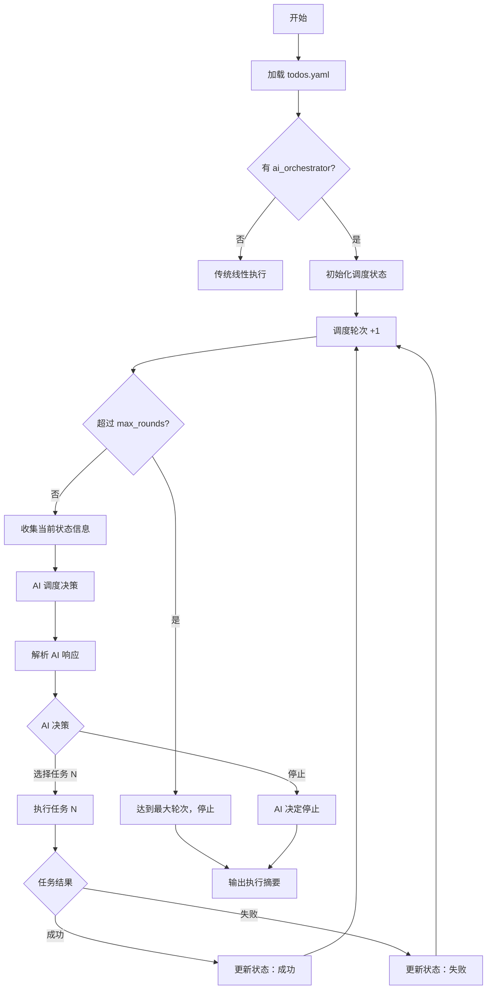

# AI Orchestrator 设计方案

## 1. 动机与目标

### 1.1 问题

当前 AutoAgent 按 `todos.yaml` 中 tasks 的 ID 顺序依次执行所有任务。这种线性执行模型在以下场景中存在局限：

| 场景 | 线性执行的问题 |
|------|---------------|
| **条件分支** | 任务 A 的结果决定接下来执行 B 还是 C，线性模型无法表达 |
| **动态优先级** | 多个待选任务中，应根据当前状态选择最有价值的下一步 |
| **提前终止** | 达到目标后应停止，而非继续执行剩余任务 |
| **重复执行** | 某些任务可能需要在不同条件下被多次调度（不同于 looping 的固定 N 次） |

引入 `if-else`、`break` 等控制流会使 `todos.yaml` 变得过于复杂，违背"用户只定义做什么，系统负责怎么做"的设计哲学。

### 1.2 解决方案

引入 **AI 调度器（AI Orchestrator）**：用户只定义任务集合，不定义顶层执行顺序；每次执行完一个 task 后，由 AI 根据当前状态决定下一个执行的 task，或停止执行。

### 1.3 设计原则

1. **向后兼容**：没有 `ai_orchestrator` 字段时，行为与现有完全一致
2. **职责边界清晰**：AI 只决定 task 级别的调度顺序，不干涉单个 task 内部的 subtask 工作流
3. **最小侵入**：复用现有的 task 执行器（SimpleTaskExecutor、NestedTaskExecutor、LoopingTaskExecutor），只替换外层调度循环
4. **可观测**：所有调度决策记录在状态文件和日志中，可审计和回溯
5. **可恢复**：支持断点续传，中断后能从上次调度状态恢复
6. **任务 schema 尽量干净**：AI 调度相关配置尽量聚合在 `ai_orchestrator` 顶层；task 层只新增确实属于 task 本身的字段

---

## 2. todos.yaml 格式变更

### 2.1 新增顶层字段 `ai_orchestrator`

```yaml
description: |
  项目描述（保持不变）

ai_orchestrator:
  # 调度策略的自然语言描述，注入到调度 AI 的 prompt 中
  strategy: |
    根据当前实验结果决定下一步：
    - 如果尚未建立 baseline，先执行 baseline 任务
    - 如果 baseline 已建立，进入优化循环
    - 如果连续 3 次实验都失败，执行诊断任务
    - 如果达到目标指标，执行最终报告任务并停止

  # 最大调度轮次（防止无限循环，可选，默认 50）
  max_rounds: 30

  # 停止条件的自然语言描述（可选，辅助 AI 判断何时停止）
  stop_condition: |
    当 E2E NRMSE < 0.03 或已完成 30 轮优化时停止。

  # 每个 task 的“最近一次结果文件”配置（可选）
  # 两种类型本质上都会给调度 AI 提供一个文件路径：
  # - type=file: 用户指定文件路径
  # - type=response: 系统自动生成结果文件路径
  last_result:
    1:
      type: file                          # "none" | "response" | "file"
      path: D:/project/results/baseline.txt  # 仅 type=file 时需要；可为绝对路径字符串或绝对路径列表
    2:
      type: file
      path: D:/project/results/experiment_result.txt
    3:
      type: response                      # 系统自动保存最近一次 response 到结果文件
    4:
      type: none                          # 不需要结果

tasks:
  # tasks 定义整体保持不变，但在 ai_orchestrator 模式下：
  # - 任务不再按 ID 顺序执行
  # - AI 每轮从可用任务中选择一个执行
  # - 同一个任务可以被多次调度
  - id: 1
    name: "Baseline training"
    description: |  # 新增必填字段：对 task 本身的详细描述，供调度 AI 了解任务内容
      Run the baseline training pipeline with default hyperparameters.
      Produces baseline_metrics.txt containing E2E NRMSE and training time.
    type: nested
    ...

  - id: 2
    name: "Optimization experiment"
    description: |
      Run one cycle of hyperparameter optimization experiment.
      Each run tries a different configuration and records results to experiment_result.txt.
    type: nested
    ...

  - id: 3
    name: "Diagnostic check"
    description: |
      Analyze recent failure patterns and produce a diagnostic report.
      Helps identify systematic issues blocking optimization progress.
    type: simple
    ...

  - id: 4
    name: "Final report"
    description: |
      Generate a comprehensive final report summarizing all experiments,
      the best configuration found, and key metrics.
    type: simple
    ...
```

### 2.2 字段说明

| 字段 | 类型 | 必填 | 默认值 | 说明 |
|------|------|------|--------|------|
| `ai_orchestrator.strategy` | string | ✅ | - | 调度策略描述，注入 AI prompt |
| `ai_orchestrator.max_rounds` | int | ❌ | 50 | 最大调度轮次 |
| `ai_orchestrator.stop_condition` | string | ❌ | `""` | 停止条件描述 |
| `ai_orchestrator.last_result` | dict | ❌ | `{}` | 每个 task 的最近结果文件配置 |
| `ai_orchestrator.last_result.<id>.type` | string | ✅ | - | `"none"` / `"response"` / `"file"` |
| `ai_orchestrator.last_result.<id>.path` | string \| list[string] | 条件必填 | - | `type=file` 时需要；可为单个绝对路径，或按顺序提供多个绝对路径 |
| `tasks[].description` | string | ✅（AI 调度模式） | - | 对 task 本身的详细描述，供调度 AI 了解任务内容 |

#### `last_result.type` 说明

| type | 含义 | 调度 AI 看到的结果 |
|------|------|--------------------|
| `none` | 不需要结果 | prompt 中不显示 Last Result |
| `response` | 系统把最近一次执行的 response 保存为结果文件 | 自动生成的结果文件路径 |
| `file` | 用户指定结果文件路径或文件集合 | `path` 指定的文件路径 |

#### `type=response` 保存机制

- **保存内容**：最近一次执行单元的 AI 最终 response 文本截断版本
- **保存位置**：`.autoagent/<run>/task_results/result_<task_id>.txt`
- **保存来源**：
  - `simple` 任务：保存该任务的 AI response
  - `nested` 任务：保存最后一个真正执行的 subtask 的 AI response
  - `looping` 任务：保存最后一轮最后一个真正执行的 subtask 的 AI response
- **定位**：
  - `simple task` 的默认推荐方案
  - `nested task` 也可以使用，但前提是最后一个 subtask 必须是面向调度器的总结类 subtask
  - `looping task` 一般不推荐使用
- **注意**：如果预计 response 可能被截断，或任务天然更适合显式维护结果文件，应优先使用 `type=file`。截断策略和 config.yaml 中的 `previous_subtask_summary` 字段相同。

#### `type=file` 的定位

`type=file` 不是冗余设计。虽然理论上可以把“总结输出”塞进 task 内部最后一个 subtask 来实现，但调度器仍然需要一个稳定、结构化、可声明的“这个 task 的结果文件在哪里”的接口。`type=file` 的价值在于：

1. 把“调度器该读哪个文件”声明在 `ai_orchestrator`，而不是散落在 task 内部实现细节里
2. 让 task 内部如何生成该文件保持自由，调度器只关心读取路径
3. 对于 `nested` / `looping` task，它提供了比原始 response 更稳定、可控的调度接口
4. 当 `type=response` 可能受截断影响时，`type=file` 应视为优先方案

#### 不同 task 类型的推荐选择

1. **simple task**：默认推荐 `type=response`
2. **nested task**：
   - 可以用 `type=response`，但最后一个 subtask 必须是总结类 subtask，确保最终 response 适合给调度器阅读
   - 也可以用 `type=file`，由 task 内部显式维护结果文件
3. **looping task**：
   - 首选 `type=file`
   - 设计 nested/loop 内部流程时，应明确谁负责更新结果文件，以及是覆盖写还是结构化追加
   - 如果对总结质量要求更高，可以额外添加 summary task，但这不是 schema 层面的强制要求
4. **截断优先级**：只要 `type=response` 可能因为长度而丢失关键信息（比如不只是让调度 AI 知道任务已经完成的结果时），就应改用 `type=file`，并在 task 设计中明确要求 AI 将结果写入文件

#### `type=file` 支持多个文件

对于 `looping task` 或其他需要同时传递多个产物的场景，`type=file` 应支持通过同一个 `path` 字段引用多个文件，而不是额外引入一个平行字段。建议 schema 语义为：

- 单文件场景：`path: <absolute_path>`
- 多文件场景：`path: [<absolute_path_1>, <absolute_path_2>, ...]`

调度器读取时应按列表声明顺序提供这些文件路径，并在 prompt 中明确这是同一 task 的结果文件集合。

#### Schema 校验规则

| 规则 | 说明 |
|------|------|
| `type` 必须是 `none` / `response` / `file` 之一 | 其他值报 `ConfigError` |
| `type=file` 时 `path` 必填 | 缺少 `path` 报 `ConfigError` |
| `type=file` 时 `path` 可以是绝对路径字符串，或非空的绝对路径列表 | 任一项非法时报 `ConfigError` |
| `type=response` 或 `type=none` 时 `path` 被忽略 | 即使提供也不使用 |
| `last_result` 中的 task_id 必须在 `tasks` 中存在 | 引用不存在的 task_id 报 `ConfigError` |

> 注意：`type=file` 在配置加载时**不要求目标文件已经存在**。文件是否存在是运行期信息，不是 schema 有效性的前置条件。

### 2.3 与现有模式的关系

```
todos.yaml 中有 ai_orchestrator 字段？
    │
    ├── 否 → 传统模式：按 ID 顺序执行所有 tasks（现有行为不变）
    │
    └── 是 → AI 调度模式：由 AI 决定执行顺序和停止时机
```

---

## 3. 调度流程

### 3.1 整体流程图



注：long_running 顶层 task 进入后台运行时，会等待 long_running 顶层 task 完成，不会直接进入下一轮调度，也即没有并行调度。

### 3.2 调度决策的输入

每轮调度时，AI 收到以下信息：

1. **项目描述**（`description`，使用最新的 round-scoped description）
2. **调度策略**（`ai_orchestrator.strategy`）
3. **停止条件**（`ai_orchestrator.stop_condition`）
4. **可用任务列表**：每个任务的 id、name、type、description、执行次数、上次执行结果（成功/失败/未运行）、Last Result 文件路径（仅运行过至少一次时显示）
5. **调度历史**：之前每轮选择了哪个任务、执行结果、AI 的 reasoning
6. **当前轮次**：第 N / max_rounds 轮

### 3.3 调度决策的输出

AI 返回一个 JSON 格式的决策：

```json
{
  "action": "execute",
  "task_id": 2,
  "reasoning": "Baseline 已建立，当前 E2E NRMSE = 0.048，开始优化实验"
}
```

或停止：

```json
{
  "action": "stop",
  "reasoning": "已达到目标 E2E NRMSE < 0.03，生成最终报告后停止"
}
```

### 3.4 任务执行边界

选定 task 后，调用现有 `execute_task()` 逻辑。执行器内部的 subtask 工作流、重试逻辑、主任务评估、failure analysis 等行为保持不变。

AI 调度器的职责到“选择哪个 task”结束，不参与 task 内部 workflow 编排。

### 3.5 原有 task prompt 的修改计划

`tasks[].description` 不应只注入调度 AI prompt，也应注入原先执行 task 时使用的 task prompt。原因是这个字段本质上属于 task 自身元信息，不只是调度器专用说明。

建议把原有 task prompt 的 `<task>` 段调整为：

```xml
[system_prompt_prefix]

<task>
    <task_name>
        [task_name]
    </task_name>

    <task_description>
        [task_description]
    </task_description>

    <completion_criteria>
        [completion_criteria]
    </completion_criteria>

    <initial_hint>
        [initial_hint]
    </initial_hint>
</task>

<context>
（后面保持不变）
```

这里的语义分工应明确为：

1. `task_name`：简短标签，便于快速识别任务
2. `task_description`：说明 task 做什么、产出什么、处于什么上下文
3. `completion_criteria`：约束“什么算完成”
4. `initial_hint`：给执行 AI 的起始建议，而不是 task 定义本身

这样可以避免把 task 背景、任务目标、完成标准、执行提示混在一个字段里，也让 `tasks[].description` 在调度 AI 和执行 AI 两侧保持一致语义。

### 3.6 会话生命周期

这是 AI 调度模式需要明确补充的关键规则。

1. **调度 AI 的会话管理**：每轮调度使用独立 session；若调度执行期间被中断，则使用已有的 `session_id` 恢复，延续未完成的调度工作。
2. **同一调度轮次内的断点恢复**：如果 task 在本轮执行过程中被中断，允许用已有 `session_id` 恢复，延续本轮未完成工作。
3. **同一个 task 被下一次重新调度时**：必须视为一次全新的 task 执行，创建新的顶层 session，不复用上一次调度的 `session_id`。
4. **原因**：不同调度轮次之间，调度器已经做出了新的全局决策；继续复用旧 session 会把上一次 task 的局部上下文错误带入新的调度轮次。
5. **实现语义**：恢复只发生在“未完成的同一轮 task”；重新调度则是“新的 schedule round”，需要干净上下文。

---

## 4. 状态管理

### 4.1 调度状态结构

在 `todos_state.yaml` 中新增 `orchestrator` 顶层键：

```yaml
orchestrator:
  mode: ai                    # "ai" | "linear"
  current_round: 5            # 当前轮次
  max_rounds: 30              # 最大轮次
  status: in_progress         # "in_progress" | "completed" | "stopped"
  session_id: "sched_abc"     # 当前 Active 的调度 AI 的 session id（每轮更新）
  schedule_history:           # 调度历史记录
    - round: 1
      task_id: "1"
      task_name: "Baseline training"
      session_id: "sched_r1"      # 调度 AI 的 session id    
      result: success             # "success" | "failed"
      reasoning: "首先建立 baseline"
      timestamp: "2026-04-14 18:00:00"
    - round: 2
      task_id: "2"
      task_name: "Optimization experiment"
      session_id: "sched_r2"
      result: success
      reasoning: "Baseline 已建立，开始优化"
      timestamp: "2026-04-14 18:20:00"
  task_execution_counts:      # 每个任务被执行的次数
    "1": 1
    "2": 3
    "3": 0
    "4": 0

tasks:
  # 现有的 task 状态
  "1":
    status: completed
    attempts: 1
    session_id: "task_1_latest"

  # 使用新的 round_scoped key（详见 4.5）
  "3.1.2@1.1":
    status: completed
    attempts: 1
    session_id: "subtask_3_1_2_round_1_1"

  # *_once 类型的 subtask 依然使用 plain key（不带 X. 前缀）
  "1.9":
    status: completed
    attempts: 1
```

### 4.2 断点续传

中断恢复时：
1. 读取 `orchestrator.current_round`、`orchestrator.status`、`orchestrator.session_id` 和 `orchestrator.schedule_history`
2. 如果 `orchestrator.status` 已是 `completed` 或 `stopped`，则 `--continue` 不应继续执行
3. 如果当前轮次的调度决策尚未完成，则优先用 `orchestrator.session_id` 恢复该轮调度 AI 会话，避免重复做出新的调度决策
4. 如果最后一轮任务未完成，先恢复执行该任务
5. 如果最后一轮任务已完成且整体仍为 `in_progress`，则继续下一轮调度

#### `orchestrator.session_id` 的语义

- 它表示“当前未完成调度轮次”的调度 AI 会话，而不是某个 task 的执行会话
- 它只用于恢复同一轮调度决策；一旦该轮决策完成并进入 task 执行，可以清空或滚动更新到下一轮
- 当进入新的 schedule round 时，应创建新的调度 session，而不是复用上一轮的 `orchestrator.session_id`
- `tasks.<id>.session_id` 与之分离：前者属于顶层 task 执行上下文，后者属于调度器自身上下文

### 4.3 重复调度同一 task 时的状态规则

在 AI 调度模式下，同一个 task 可能被多次执行。每次被重新调度时：
- 清除上一次调度的 previous_subtask_summary 
- 顶层 task 自身状态会进入新一轮执行
- 该 task 本轮产生的 round-scoped subtask 状态使用新的 schedule-round 前缀，与历史轮次隔离
- 顶层 task 的 `session_id` 不复用旧轮次，重新创建新 session
- 调度器自己的 `orchestrator.session_id` 也不跨轮次复用；每个 schedule round 都有独立的调度会话
- `*_once` subtasks 仍沿用现有语义：它们使用 plain key（不带 `X.` 前缀），不因 task 被再次调度而重复执行。日志文件名仍会加上 `schedule_x` 前缀以便区分。

也就是说：**重复调度会重跑 task，但不会重跑已经完成的 `*_once` subtasks。**

### 4.4 round_scoped key 格式

#### 4.4.1 背景：现有 round_scoped key 格式（Linear 模式）

在现有的 Linear 模式中，`todos_state.yaml` 中的子任务状态使用 **round-scoped key** 格式：

```
subtask_id @ A.B
```

其中 `@` 是分隔符，`A.B` 是 **round_label**：

| 部分 | 含义 | Nested task | Looping task |
|------|------|-------------|-------------|
| `subtask_id` | 子任务 ID（如 `1.2`、`2.3`） | task_id.subtask_id | task_id.subtask_id |
| `A` | 主轮次 | main evaluation round（主任务评估轮次，每次 main_task_evaluation 后 +1） | loop_idx（循环索引） |
| `B` | 子轮次 | failure sub-round（失败分析子轮次，每次 failure_analysis 后 +1） | failure sub-round（同左） |

**Linear 模式示例**：

```yaml
# Nested task（Task 1，含 subtask 1.1, 1.2, 1.3）
"1.1@1.1":   # subtask 1.1, main round 1, failure sub-round 1（初始执行）
"1.2@1.1":   # subtask 1.2, main round 1, failure sub-round 1
"1.3@1.1":   # subtask 1.3, main round 1, failure sub-round 1 → 失败
"1.3@1.2":   # subtask 1.3, main round 1, failure sub-round 2（failure_analysis 后重试）
"1.1@2.1":   # subtask 1.1, main round 2（main_task_evaluation 后重新执行）

# Looping task（Task 2，repeat_count=3，含 subtask 2.1, 2.2）
"2.1@1.1":   # subtask 2.1, loop 1, failure sub-round 1
"2.2@1.1":   # subtask 2.2, loop 1, failure sub-round 1
"2.1@2.1":   # subtask 2.1, loop 2, failure sub-round 1
"2.2@2.1":   # subtask 2.2, loop 2, failure sub-round 1 → 失败
"2.2@2.2":   # subtask 2.2, loop 2, failure sub-round 2（failure_analysis 后重试）
"2.1@3.1":   # subtask 2.1, loop 3, failure sub-round 1
```

> **注意**：`*_once` 类型的子任务使用 plain key（不带 `@`），跨所有轮次共享状态。

#### 4.4.2 AI 调度模式：subtask_id 扩展为 `X.Y.Z`

在 AI 调度模式下，subtask_id 从现有的二级格式 `Y.Z` 扩展为三级格式 `X.Y.Z`：

| 层级 | 含义 | 示例 |
|------|------|------|
| `X` | 调度轮次（schedule round），全局累加 | `1`, `2`, `3`, ... |
| `Y` | 任务 ID（task_id） | `1`, `2`, `3`, ... |
| `Z` | 子任务 ID（subtask_id），与原有格式一致 | `1`, `2`, `3`, ... |

简单来说，就是在 Linear 模式的基础上为所有的 key 加上一个调度轮次的前缀。

> **`*_once` subtask 例外**：`*_once` subtask 的 state key 仍然使用 plain key（不带 `X.` 前缀），与 Linear 模式一致，以保证跨调度轮次的全局唯一性语义。日志文件名仍会加上 `schedule_x` 前缀以便区分，但 state key 不变。

**subtask_id 示例**：

```
调度轮次 1 → 执行 Task 1（nested，含 subtask 1.1, 1.2）
  1.1.1  — 调度轮次 1，Task 1，Subtask 1
  1.1.2  — 调度轮次 1，Task 1，Subtask 2

调度轮次 2 → 执行 Task 2（simple）
  2.2    — 调度轮次 2，Task 2（simple 任务没有 Z 层级，也没有 @A.B 部分，因为 simple task 不存在 round_label。这不会和 Linear 模式产生歧义，因为这两种模式不能同时运行）

调度轮次 3 → 执行 Task 2（再次调度，nested）
  3.2.1  — 调度轮次 3，Task 2，Subtask 1
  3.2.2  — 调度轮次 3，Task 2，Subtask 2

调度轮次 4 → 执行 Task 1（再次调度）
  4.1.1  — 调度轮次 4，Task 1，Subtask 1
  4.1.2  — 调度轮次 4，Task 1，Subtask 2
```

#### 4.4.3 完整的 state key 格式：`X.Y.Z@A.B`

在 AI 调度模式下，完整的 round-scoped state key 是 **subtask_id + `@` + round_label** 的组合：

```
X.Y.Z @ A.B
└─┬─┘   └┬┘
  │      └── round_label（与 Linear 模式含义一致）
  └── subtask_id（AI 调度模式下扩展为三级）
```

**完整 state key 示例**：

```yaml
# 调度轮次 1 → 执行 Task 1（nested，含 subtask 1.1, 1.2, 1.3）
"1.1.1@1.1":   # 调度轮次 1, Task 1, Subtask 1, main round 1, failure sub-round 1
"1.1.2@1.1":   # 调度轮次 1, Task 1, Subtask 2, main round 1, failure sub-round 1
"1.1.3@1.1":   # 调度轮次 1, Task 1, Subtask 3, main round 1, failure sub-round 1 → 失败
"1.1.3@1.2":   # failure_analysis 后重试 → failure sub-round 2
"1.1.1@2.1":   # main_task_evaluation 后 → main round 2

# 调度轮次 2 → 执行 Task 2（simple）
"2.2":         # 调度轮次 2, Task 2（simple task 没有 round_label，使用 plain X.Y 格式）

# 调度轮次 3 → 再次执行 Task 1（nested）
"3.1.1@1.1":   # 调度轮次 3, Task 1, Subtask 1, main round 1, failure sub-round 1
"3.1.2@1.1":   # 调度轮次 3, Task 1, Subtask 2, main round 1, failure sub-round 1

# 调度轮次 4 → 执行 Task 3 (looping)
"4.3.1@1.1":   # 调度轮次 4, Task 3, Subtask 1, main round 1, failure sub-round 1
"4.3.2@1.1":   # 调度轮次 4, Task 3, Subtask 2, main round 1, failure sub-round 1
"4.3.1@2.1":   # 调度轮次 4, Task 3, Subtask 1, main round 2, failure sub-round 1
"4.3.2@2.1":   # 调度轮次 4, Task 3, Subtask 2, main round 2, failure sub-round 1
```

> **对比**：同一个 Task 1 的 Subtask 1 在不同调度轮次中的 state key：
> - 调度轮次 1：`1.1.1@1.1`（X=1）
> - 调度轮次 3：`3.1.1@1.1`（X=3）
> - 通过 `X` 前缀可以立即区分不同调度轮次的状态

**设计理由**：
- `X` 全局累加（不按 task 独立计数），使得在 log 文件中可以看到清晰的全局工作流时间线
- 通过 `X` 前缀，可以立即区分同一个 task 的不同调度轮次的日志
- `@A.B` 部分与 Linear 模式完全一致，复用现有的 round_label 机制
- 在 Linear 模式下，`X` 层级不存在，保持现有的 `Y.Z@A.B` 格式不变

### 4.5 日志命名

现有日志文件名只有 task/subtask 维度，例如：

- `task_1.1_round_1.1.md`

AI 调度模式下建议扩展为包含 schedule round 的命名：

- `schedule_1_task_1.1_round_1.1.md`
- `schedule_1_failure_analysis_1.1_round_1.1.md`
- `schedule_1_main_task_evaluation_1.1_round_1.1.md`
...

也即在原有文件名的基础上加上 `schedule_x` 前缀。`*_once` subtask 的日志文件名也加上此前缀以便区分，但其 state key 仍使用 plain key（不带 `X.` 前缀），保证全局只运行一次的语义不变。

这样做的好处：

1. 人工排查时能直接看出日志属于哪一次顶层调度
2. 同一个 task 被多次调度时，不会在文件名层面混淆
3. 与 `X.Y.Z@A.B` 的 state key 语义一致

说明：

- 普通 task / subtask 日志采用新的 schedule-aware 文件名
- `lr_*` 信号文件和输出文件仍可保持现有命名与覆盖策略，不强制改动（因为先前的设计也是反复覆盖这些文件的）

### 4.6 round_scoped description 行为

在 AI 调度模式下，`description@N` 的语义与 Linear 模式不同：

| 模式 | `description@N` 行为 |
|------|---------------------|
| **Linear** | `description@N` 对 Task N 及之后的任务生效，Task 1~N-1 仍使用根 `description` |
| **AI 调度** | 每次传入**最新的** description，忽略更早的 description |

**AI 调度模式的具体规则**：
1. 调度 AI 和执行 AI 的 prompt 中，`<project_description>` 始终使用**最新的** scoped description
2. "最新"的定义：`scope_id` 最大且 `scope_id <= 当前最大已定义 task_id` 的 description
3. 如果 Ideas Watcher 追加了新任务并带有新的 `description@N`，后续所有调度轮次都使用这个新 description

**示例**：

```yaml
description: |
  Initial project description.

description@3: |
  Updated description after adding optimization tasks.
```

- 如果 tasks 定义到 Task 5：使用 `description@3`（最大 scope_id <= 5）
- Ideas Watcher 追加 Task 6-8 并带有 `description@6`：后续使用 `description@6`

**与 Linear 模式的区别**：Linear 模式按 task_id 分段选择 description，AI 调度模式全局使用最新的 description（因为调度是全局的，不按 task_id 分段）。

---

## 5. config.yaml 格式变更

为了避免在文档不同章节零散写“config.yaml 可配置”，AI 调度模式新增或涉及的配置项统一在本节说明。实现时建议把这些项集中加入 `config.yaml`，并在 CLI / preset / 代码默认值之间维持一致优先级。

### 5.1 新增配置项

```yaml
# AI scheduler model role. If omitted, fall back to model.default.
model:
  plan: claude-opus-4.6
  default: claude-sonnet-4.6
  lite: glm-4-flash
  evaluation: claude-opus-4.6
  scheduler: claude-opus-4.6

# Maximum number of recent schedule_history entries included in scheduler prompt.
scheduler_history_limit: 10

# Maximum number of decision-parse retries when scheduler returns invalid JSON
# or references an invalid task_id.
scheduler_decision_max_retries: 3
```

### 5.2 配置项说明

| 配置项 | 类型 | 默认值 | 说明 |
|------|------|--------|------|
| `model.scheduler` | string | 继承 `model.default` | 调度 AI 专用模型角色；只用于“选择下一个 task / stop”，不参与 task 内部执行 |
| `scheduler_history_limit` | int | 10 | 调度 prompt 中保留的 `schedule_history` 轮次数 |
| `scheduler_decision_max_retries` | int | 3 | 调度 AI 返回无效 JSON、非法 `task_id` 等决策格式错误时的最大重试次数 |

### 5.3 与现有配置的关系

- `ai_orchestrator.max_rounds` 仍然放在 `todos.yaml` 中，因为它属于任务实例本身的执行约束，而不是全局运行时配置。
- `backoff_max_wait` 继续复用现有 `config.yaml` 配置，用于调度 AI 和执行 AI 的底层调用失败重试。
- `truncation_limits.max` 继续作为 `task description` 等长文本字段的统一截断上限，不额外为 scheduler 单独引入一套文本截断配置，除非后续实测表明需要拆分。
- Ideas Watcher 在 AI 调度模式下切换指南文件是功能逻辑，不需要单独新增 `config.yaml` 开关。

### 5.4 model 角色约定调整

现有 model 角色从：

```yaml
model:
  plan: ...
  default: ...
  lite: ...
  evaluation: ...
```

调整为：

```yaml
model:
  plan: ...
  default: ...
  lite: ...
  evaluation: ...
  scheduler: ...
```

语义分工：

- `plan`：Ideas Watcher 的任务分解 / 审查 / 修订流程
- `default`：普通 task / subtask 的默认执行模型
- `lite`：低成本执行任务
- `evaluation`：主任务评估、failure analysis 等评估型调用
- `scheduler`：AI Orchestrator 的顶层调度决策

如果 `model.scheduler` 未显式配置，建议回退到 `model.default`，保证向后兼容。

---

## 6. Prompt 设计

### 6.1 调度 Prompt 结构

```
You are an AI task scheduler. Your job is to decide which task to execute
next, or whether to stop execution.

You must respond with a JSON object in one of these formats:
1. Execute a task: {"action": "execute", "task_id": <id>, "reasoning": "<why>"}
2. Stop execution: {"action": "stop", "reasoning": "<why>"}

You must choose exactly ONE task per round.

<context>
    Current Round: {current_round} / {max_rounds}

    <project_description>
        {project_description}
    </project_description>

    <scheduling_strategy>
        {ai_orchestrator.strategy}
    </scheduling_strategy>

    <stop_condition>
        {ai_orchestrator.stop_condition}
    </stop_condition>

    <available_tasks>
        - Task {id}: {name}
            Type: {type}
            Description:
                {description}
            Executed: {count} time(s)
            Last Result: ✅ success (See {last_result_path})
        - Task {id}: {name}
            Type: {type}
            Description:
                {description}
            Executed: {count} time(s)
            Last Result: ❌ failed (See {last_result_path}) (Not found, probably due to task failures)
        - Task {id}: {name}
            ...
            (tasks not yet executed do not show Last Result line)
    </available_tasks>

    <schedule_history> (last {scheduler_history_limit} rounds)
        - Round {n}: ✅
            Task {id} ({name})
            Reasoning: {reasoning}
        - Round {n}: ❌
            Task {id} ({name})
            Reasoning: {reasoning}
        - Round {n}:
            ...
    </schedule_history>
</context>
```

#### Prompt Notes

1. **System prompt simplification**: Remove redundant instructions such as "Consider the scheduling strategy and stop condition" because they add prompt noise without adding information.
2. **XML structure**: Wrap all context in `<context>` and use semantic inner tags so the scheduler model can parse the state reliably.
3. **Conditional Last Result display**: Show `Last Result` only after a task has run at least once. Use `success (See {path})` or `failed (See {path})`. For `type=file`, append `(Not found, probably due to task failures)` if the file is missing at runtime. For `type=none`, omit the line. For `type=response`, the path points to the auto-saved truncated response file such as `.autoagent/<run>/task_results/result_1.txt`; if the file does not exist yet (e.g. the task has been scheduled but the response was not saved), generate the file from the stored response before building the prompt, rather than showing a "Not found" hint.
4. **Schedule History includes outcome markers**: Each round records success/failure markers so the scheduler can quickly understand prior execution outcomes without reading every result file.

### 6.2 Prompt 截断策略

- `schedule_history`：保留最近 `scheduler_history_limit` 轮的完整记录
- `task description`：截断到 `truncation_limits.max` 字符

---

---

## 7. 与现有功能的交互

### 7.1 Ideas Watcher

AI 调度模式与 Ideas Watcher 兼容：
- Ideas 生成的新任务追加到 `tasks` 列表后，AI 调度器在下一轮可以看到新任务
- `reload_todos()` 后，调度器自动获取更新的任务列表

### 7.2 `--continue` / `--resume`

- 断点续传时，从 `orchestrator` 状态恢复调度进度。
- 如果 orchestrator 已经 `stopped` 或 `completed`，`--continue` / `--resume` 不应继续执行，并提示 "AI Orchestrator has already completed/stopped."

### 7.3 `--status`

状态显示增加调度信息：
```
📊 AI Orchestrator Status
   Mode: AI-scheduled
   Round: 5 / 30
   Schedule: Task 1 ✅ → Task 2 ✅ → Task 2 ✅ → Task 3 ❌ → Task 2 ✅
```

### 7.4 `--reset`

重置时同时清除 `orchestrator` 状态。

### 7.5 `--task`、`skip_completed` 等旧控制参数

这些参数原本服务于线性调度模型，但在 AI 调度模式下语义变得不自然：

- `--task` 绕过调度器，破坏“由系统决定怎么做”的原则。
- `skip_completed` 假设“完成过一次就不该再执行”，与 AI 调度下同一 task 可被重复调度、且每次都创建新 session 的设计冲突。

因此建议：

1. 在线性模式保留现有行为，避免破坏兼容性。
2. 在 AI 调度模式中不再暴露或不再支持这类参数。
3. 文档中明确：AI 调度模式的顶层执行入口就是“让 orchestrator 自己调度”，而不是人工挑 task。

---

## 8. 边界情况处理

| 场景 | 处理方式 |
|------|----------|
| AI 返回无效 JSON | 重试解析（同一调度 session），最多 `scheduler_decision_max_retries` 次，失败则停止 |
| AI 选择了不存在的 task_id | 提示错误，要求重新选择 |
| 所有可调度 task 都为空 | 自动停止 |
| AI 调用失败（网络错误等） | 使用现有的 backoff 重试机制 |
| 调度 AI 的 session 超时 | 每轮调度使用独立 session，无累积风险 |
| `type=file` 配置的结果文件在运行期不存在 | 记录为“结果文件缺失”，但不视为 schema 错误 |
| 同一 task 被重复调度 | 新建 session；`*_once` subtasks 仍不重复执行 |
| 中途切换执行模式（Linear ↔ AI 调度） | **不允许**。一旦 `todos_state.yaml` 中已存在 `orchestrator` 状态，就不能移除 `ai_orchestrator` 字段改回 Linear 模式运行，反之亦然。如需切换，必须先 `--reset` 清除全部状态 |

---

## 9. 示例：NeuralBasisField 优化场景

```yaml
description: |
  NeuralBasisField 训练算法优化...

ai_orchestrator:
  strategy: |
    调度规则：
    1. 如果 baseline 未建立（Task 1 未执行），先执行 Task 1
    2. baseline 建立后，执行 Task 2（优化实验循环）
    3. 每次 Task 2 完成后，检查是否达到目标：
       - 如果 E2E NRMSE < 0.03，执行 Task 3（最终报告）然后停止
       - 如果连续 3 次实验都 discard，执行 Task 4（诊断）
       - 否则继续执行 Task 2
    4. Task 4 完成后，回到 Task 2 继续优化
  max_rounds: 30
  stop_condition: |
    当 E2E NRMSE < 0.03 或已完成 30 轮调度时停止。
  last_result:
    1:
      type: file
      path: D:/project/results/baseline_metrics.txt
    2:
      type: file
      path: D:/project/results/experiment_result.txt
    3:
      type: file
      path: D:/project/results/final_report.txt
    4:
      type: response

tasks:
  - id: 1
    name: "Environment pre-check and baseline"
    description: |
      Verify the training environment is correctly set up, then run the
      baseline training with default hyperparameters. Produces
      baseline_metrics.txt with E2E NRMSE and training time.
    type: nested
    ...

  - id: 2
    name: "Run one optimization experiment cycle"
    description: |
      Execute one round of hyperparameter optimization. Read the latest
      experiment results, choose a new configuration, run training, and
      record the outcome to experiment_result.txt.
    type: nested
    ...

  - id: 3
    name: "Generate final report"
    description: |
      Compile all experiment results into a comprehensive final report
      including best configuration, key metrics, and recommendations.
    type: simple
    ...

  - id: 4
    name: "Diagnostic: analyze failure patterns"
    description: |
      Analyze recent consecutive failures to identify systematic issues.
      Produce a diagnostic report with root cause analysis and suggested
      fixes to unblock optimization progress.
    type: simple
    ...
```

---

## 10. 测试计划

### 10.1 单元测试

- `_load_todos()` 正确解析 `ai_orchestrator` 字段
- `last_result` schema 正确处理 `path` 的单路径和多路径两种 `type=file` 形式
- `state_manager` 正确读写 `orchestrator` 状态

### 10.2 仿真测试

使用 `TestProvider` 创建仿真测试：
- 基本调度流程：AI 选择任务 → 执行 → 选择下一个 → 停止
- 同一 task 被重复调度时会新建 session，且 `*_once` subtasks 不重复执行
- 断点续传：中断后恢复调度进度
- 最大轮次限制
- AI 返回无效决策的错误处理

### 10.3 集成测试

使用真实 AI provider 测试完整的调度流程。

---

## 11. 文档更新计划

| 文档 | 更新内容 |
|------|----------|
| `ARCHITECTURE.md` | 新增 AI Orchestrator 章节 |
| `USAGE.md` | 新增 AI 调度模式使用说明 |
| `API_REFERENCE.md` | 新增调度相关 API |
| `EXAMPLES.md` | 新增 AI 调度模式示例 |
| `todos.example.yaml` | 新增 AI 调度模式示例 |
| `TASK_DESIGN_GUIDE_AI_SCHED.md` | 新增 AI 调度模式的任务设计指南 |