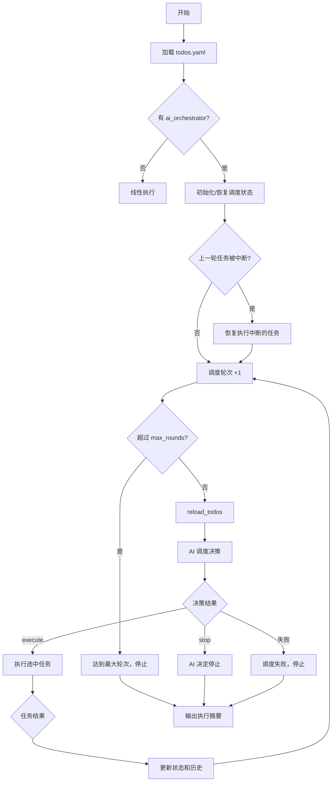

# AI Orchestrator 设计方案

## 1. 概述

### 1.1 背景

AutoAgent 默认按 `todos.yaml` 中 tasks 的 ID 顺序依次执行所有任务（线性模式）。AI Orchestrator 是一种替代调度模式：用户只定义任务集合，不定义顶层执行顺序；每次执行完一个 task 后，由 AI 根据当前状态决定下一个执行的 task，或停止执行。

适用场景：

| 场景 | 说明 |
|------|------|
| **条件分支** | 任务 A 的结果决定接下来执行 B 还是 C |
| **动态优先级** | 多个待选任务中，根据当前状态选择最有价值的下一步 |
| **提前终止** | 达到目标后停止，而非继续执行剩余任务 |
| **重复执行** | 某些任务需要在不同条件下被多次调度 |

### 1.2 设计原则

1. **向后兼容**：没有 `ai_orchestrator` 字段时，行为与线性模式完全一致
2. **职责边界清晰**：AI 只决定 task 级别的调度顺序，不干涉单个 task 内部的 subtask 工作流
3. **最小侵入**：复用现有的 task 执行器（SimpleTaskExecutor、NestedTaskExecutor、LoopingTaskExecutor），只替换外层调度循环
4. **可观测**：所有调度决策记录在状态文件和日志中，可审计和回溯
5. **可恢复**：支持断点续传，中断后能从上次调度状态恢复

---

## 2. todos.yaml 配置格式

### 2.1 顶层字段 `ai_orchestrator`

```yaml
description: |
  项目描述（保持不变）

ai_orchestrator:
  strategy: |
    根据当前实验结果决定下一步：
    - 如果尚未建立 baseline，先执行 baseline 任务
    - 如果 baseline 已建立，进入优化循环
    - 如果连续 3 次实验都失败，执行诊断任务
    - 如果达到目标指标，执行最终报告任务并停止

  max_rounds: 30

  max_attempts: 3

  stop_condition: |
    当 E2E NRMSE < 0.03 或已完成 30 轮优化时停止。

  last_result:
    1:
      type: file
      path: ${workspace}/results/baseline.txt
    2:
      type: file
      path: ${workspace}/results/experiment_result.txt
    3:
      type: response
    4:
      type: none

tasks:
  - id: 1
    name: "Baseline training"
    description: |
      Run the baseline training pipeline with default hyperparameters.
    type: nested
    ...
```

### 2.2 字段说明

| 字段 | 类型 | 必填 | 默认值 | 说明 |
|------|------|------|--------|------|
| `ai_orchestrator.strategy` | string | ✅ | - | 调度策略描述，注入 AI prompt |
| `ai_orchestrator.max_rounds` | int | ❌ | 50 | 最大调度轮次 |
| `ai_orchestrator.max_attempts` | int | ❌ | 继承 `config.yaml` 的 `scheduler_decision_max_retries` | AI 调度器返回无效 JSON 或无效 task_id 时的最大重试次数 |
| `ai_orchestrator.stop_condition` | string | ❌ | `""` | 停止条件描述 |
| `ai_orchestrator.last_result` | dict | ❌ | `{}` | 每个 task 的最近结果文件配置 |
| `ai_orchestrator.last_result.<id>.type` | string | ✅ | - | `"none"` / `"response"` / `"file"` |
| `ai_orchestrator.last_result.<id>.path` | string \| list[string] | 条件必填 | - | `type=file` 时需要；支持 `${workspace}` 占位符 |
| `tasks[].description` | string | ✅（AI 调度模式） | 无 | 对 task 的详细描述，供调度 AI 了解任务内容 |

### 2.3 `${workspace}` 路径占位符

`last_result` 中的 `path` 字段支持 `${workspace}` 占位符，在 YAML 加载时自动替换为实际的 workspace 绝对路径。这使得 todos.yaml 可以跨环境使用而无需硬编码绝对路径。

替换逻辑位于 `TodoOrchestrator._expand_workspace_in_ai_orch()` 中，在 `_load_todos()` 阶段执行。

### 2.4 `last_result.type` 说明

| type | 含义 | 调度 AI 看到的内容 |
|------|------|--------------------|
| `none` | 不需要结果 | prompt 中不显示 Last Result |
| `response` | 系统把最近一次执行的 response 保存为结果文件 | 自动生成的结果文件路径（上一轮调度的 task 额外显示最后 5 行预览） |
| `file` | 用户指定结果文件路径 | `path` 指定的文件路径（上一轮调度的 task 额外显示最后 5 行预览） |

**`type=response` 保存机制**：

- 保存内容：最近一次执行单元的 AI 最终 response 文本（截断到 `truncation_limits.previous_subtask_summary` 字符）
- 保存位置：`<session_dir>/task_results/result_<task_id>.txt`
- 保存来源：
  - `simple` 任务：保存该任务的 AI response
  - `nested` 任务：保存最后一个真正执行的 subtask 的 AI response
  - `looping` 任务：保存最后一轮最后一个真正执行的 subtask 的 AI response

**`type=file` 支持多个文件**：

- 单文件：`path: <path>`
- 多文件：`path: [<path_1>, <path_2>, ...]`

调度器在 prompt 中按列表顺序展示所有文件路径。

### 2.5 Schema 校验规则

| 规则 | 说明 |
|------|------|
| `type` 必须是 `none` / `response` / `file` 之一 | 其他值报 `ConfigError` |
| `type=file` 时 `path` 必填 | 缺少 `path` 报 `ConfigError` |
| `type=file` 时 `path` 必须是绝对路径（字符串或非空列表） | 非法时报 `ConfigError` |
| `type=response` 或 `type=none` 时 `path` 被忽略 | 即使提供也不使用 |
| `last_result` 中的 task_id 必须在 `tasks` 中存在 | 引用不存在的 task_id 报 `ConfigError` |
| `type=file` 不要求目标文件已存在 | 文件是否存在是运行期信息 |

> 注意：`${workspace}` 替换发生在校验之前，因此校验时 path 已经是绝对路径。

### 2.6 与线性模式的关系

```
todos.yaml 中有 ai_orchestrator 字段？
    │
    ├── 否 → 线性模式：按 ID 顺序执行所有 tasks
    │
    └── 是 → AI 调度模式：由 AI 决定执行顺序和停止时机
```

两种模式不能混用。如果 `todos_state.yaml` 中已存在 `orchestrator` 状态，则不能移除 `ai_orchestrator` 字段改回线性模式运行，反之亦然。如需切换，必须先 `--reset` 清除全部状态。

---

## 3. 调度流程

### 3.1 整体流程图



### 3.2 调度决策的输入

每轮调度时，AI 收到以下信息（通过 `build_scheduler_prompt()` 构建）：

1. **项目描述**（`<project_description>`，使用最新的 round-scoped description）
2. **调度策略**（`<scheduling_strategy>`）
3. **停止条件**（`<stop_condition>`）
4. **可用任务列表**（`<available_tasks>`）：每个任务的 id、name、type、description、执行次数、Last Result 文件路径（仅运行过至少一次时显示）。其中只有上一轮调度的 task 会附带 Preview（最后 5 行内容预览），其他 task 只显示文件路径
5. **调度历史**（`<schedule_history>`）：最近 `scheduler_history_limit` 轮的任务和状态（不含 reasoning）
6. **超时警告**（可选）：当 `current_round > max_rounds` 时追加 WARNING，提示 AI 完成必要工作后停止

### 3.3 调度决策的输出

AI 返回 JSON 格式的决策：

```json
{"action": "execute", "task_id": 2, "reasoning": "Baseline 已建立，开始优化实验"}
```

或停止：

```json
{"action": "stop", "reasoning": "已达到目标，停止"}
```

### 3.4 任务执行

选定 task 后，调用现有 `execute()` 逻辑。执行器内部的 subtask 工作流、重试逻辑、主任务评估、failure analysis 等行为保持不变。AI 调度器的职责到"选择哪个 task"结束。

### 3.5 会话生命周期

1. **调度 AI**：每轮调度创建独立 AI session
2. **任务执行**：每个调度轮次的任务使用新 session（不跨轮次复用）
3. **断点恢复**：如果 task 在本轮执行过程中被中断，允许用已有 `session_id` 恢复
4. **重新调度**：同一个 task 被下一次调度时，创建新的顶层 session

---

## 4. 重试机制

### 4.1 两级重试策略

AI 调度器使用两级重试策略处理调度决策失败：

```
┌─────────────────────────────────────────────────────────────┐
│ Level-2: Session-reset retries (max_session_retries 次)      │
│                                                             │
│  ┌───────────────────────────────────────────────────────┐  │
│  │ Level-1: In-session retries (max_retries 次)          │  │
│  │                                                       │  │
│  │  发送 prompt → 解析响应 → 验证合法性                    │  │
│  │       ↓ 失败                                          │  │
│  │  发送错误反馈 → 重新解析 → 验证                         │  │
│  │       ↓ 仍然失败                                      │  │
│  │  ... 直到 max_retries 次                              │  │
│  └───────────────────────────────────────────────────────┘  │
│       ↓ Level-1 耗尽                                        │
│  创建新 AI session，重新发送完整 prompt                       │
│       ↓ 仍然失败                                            │
│  ... 直到 max_session_retries 次                            │
└─────────────────────────────────────────────────────────────┘
```

### 4.2 错误分类与处理

| 错误类型 | 处理方式 | 是否消耗 attempt |
|----------|----------|-----------------|
| 无效 JSON / 无效 action / 无效 task_id | Level-1 重试（同一 session 内发送错误反馈） | ✅ |
| `BashTimeoutError` | Level-1 重试（同一 session） | ✅ |
| `StreamTimeoutError` | Level-1 重试（同一 session） | ✅ |
| `RateLimitError` (429/503) | Level-1 重试（同一 session，backoff 等待） | ❌ |
| `SessionTimeoutError` | 升级到 Level-2（重置 session） | - |
| 其他 `AICallError` | 升级到 Level-2（重置 session） | - |

### 4.3 配置项

| 配置项 | 默认值 | 说明 |
|--------|--------|------|
| `scheduler_decision_max_retries` | 3 | Level-1 最大重试次数 |
| `scheduler_max_session_retries` | 2 | Level-2 最大 session 重置次数 |
| `ai_orchestrator.max_attempts` | 继承上述 | 可在 todos.yaml 中覆盖 Level-1 重试次数 |

---

## 5. 状态管理

### 5.1 调度状态结构

在 `todos_state.yaml` 中的 `orchestrator` 顶层键：

```yaml
orchestrator:
  mode: ai
  current_round: 5
  max_rounds: 30
  status: in_progress         # "in_progress" | "completed" | "stopped"
  session_id: ""              # 当前调度 AI 的 session id（轮次结束后清空）
  schedule_history:
    - round: 1
      task_id: "1"
      task_name: "Baseline training"
      session_id: ""
      result: success         # "success" | "failed" | "stopped" | null(中断)
      reasoning: "首先建立 baseline"
      timestamp: "2026-04-14 18:00:00"
    - round: 2
      task_id: "2"
      task_name: "Optimization experiment"
      session_id: ""
      result: success
      reasoning: "Baseline 已建立，开始优化"
      timestamp: "2026-04-14 18:20:00"
  task_execution_counts:
    "1": 1
    "2": 3
    "3": 0
    "4": 0
```

### 5.2 Task 状态隔离

AI 调度模式下，每个调度轮次的任务使用 `{schedule_round}.{task_id}` 格式的 state key，确保不同调度轮次的同一任务有独立状态：

```yaml
tasks:
  # 调度轮次 1，Task 1
  "1.1":
    status: completed
    context_id: schedule_1_task_1
    session_id: "abc123"

  # 调度轮次 1，Task 1 的 Subtask 1
  "1.1.1@1.1":
    status: completed
    attempts: 1

  # 调度轮次 3，Task 1 再次被调度
  "3.1":
    status: completed
    context_id: schedule_3_task_1
    session_id: "def456"

  # 调度轮次 3，Task 1 的 Subtask 1（独立于轮次 1）
  "3.1.1@1.1":
    status: completed
    attempts: 1
```

### 5.3 State Key 格式

完整的 round-scoped state key 格式为 `X.Y.Z@A.B`：

```
X.Y.Z @ A.B
└─┬─┘   └┬┘
  │      └── round_label（main_round.failure_sub_round）
  └── subtask_id（schedule_round.task_id.subtask_suffix）
```

| 层级 | 含义 | 示例 |
|------|------|------|
| `X` | 调度轮次（schedule round），全局累加 | `1`, `2`, `3`, ... |
| `Y` | 任务 ID（task_id） | `1`, `2`, `3`, ... |
| `Z` | 子任务后缀（subtask suffix） | `1`, `2`, `3`, ... |
| `A` | 主轮次（main evaluation round / loop_idx） | `1`, `2`, ... |
| `B` | 子轮次（failure sub-round） | `1`, `2`, ... |

**Simple task**：使用 `X.Y` 格式（无 `@A.B` 部分）。

**`*_once` subtask**：使用 plain key（不带 `X.` 前缀），跨调度轮次共享状态，保证全局只运行一次。

### 5.4 断点续传

中断恢复时：
1. 读取 `orchestrator` 状态
2. 如果 `status` 为 `completed` 或 `stopped`，检查是否有新 task（Ideas Watcher 重启）
3. 如果 `schedule_history` 最后一条记录的 `result` 为 `None`，说明上一轮任务被中断，先恢复执行
4. 否则继续下一轮调度

### 5.5 重复调度同一 task

同一个 task 被重新调度时：
- 顶层 task 使用新的 state key（`X.Y` 中 X 不同）
- 创建新 session（不复用旧轮次的 session_id）
- `*_once` subtasks 不重复执行（使用 plain key，跨轮次共享状态）
- 日志文件名仍会加上 `schedule_x` 前缀以便区分

---

## 6. 日志

### 6.1 目录结构

```
<session_dir>/
└── conversations/
    ├── ai_scheduler/                    # 调度器决策日志
    │   ├── schedule_1.md
    │   ├── schedule_2.md
    │   └── ...
    ├── schedule_1_task_1.1_round_1.1.md  # 任务执行日志（带 schedule 前缀）
    ├── schedule_1_failure_analysis_1.1_round_1.1.md
    └── ...
```

### 6.2 调度器日志

每轮调度在 `conversations/ai_scheduler/schedule_N.md` 中记录：
- System Prompt
- Scheduler Prompt（完整的 `<context>` XML）
- AI Response（JSON 决策）

### 6.3 任务执行日志

使用 `ScheduleAwareConvLogger` 包装器，为所有日志文件名添加 `schedule_N_` 前缀：
- `schedule_1_task_1.1_round_1.1.md`
- `schedule_1_failure_analysis_1.1_round_1.1.md`
- `schedule_1_main_task_evaluation_1.1_round_1.1.md`

`*_once` subtask 的日志文件名也加上此前缀以便区分。

---

## 7. config.yaml 配置

### 7.1 相关配置项

```yaml
# AI scheduler model role
model:
  plan: claude-opus-4.6
  default: claude-sonnet-4.6
  lite: glm-5.0-ioa
  evaluation: claude-opus-4.6
  scheduler: claude-opus-4.6    # 调度 AI 专用模型

# Level-1: in-session retries for invalid JSON / invalid task_id
scheduler_decision_max_retries: 3

# Level-2: session-reset retries
scheduler_max_session_retries: 2

# Max recent schedule_history entries in scheduler prompt
scheduler_history_limit: 10
```

### 7.2 配置项说明

| 配置项 | 类型 | 默认值 | 说明 |
|--------|------|--------|------|
| `model.scheduler` | string | 继承 `model.default` | 调度 AI 专用模型角色 |
| `scheduler_history_limit` | int | 10 | 调度 prompt 中保留的历史轮次数 |
| `scheduler_decision_max_retries` | int | 3 | Level-1 最大重试次数 |
| `scheduler_max_session_retries` | int | 2 | Level-2 最大 session 重置次数 |

---

## 8. 与现有功能的交互

### 8.1 Ideas Watcher

- Ideas 生成的新任务追加到 `tasks` 列表后，AI 调度器在下一轮可以看到新任务
- `reload_todos()` 后，调度器自动获取更新的任务列表
- 如果调度器已 `stopped`，但 Ideas Watcher 添加了新 task，调度器自动重启（将 `status` 重置为 `in_progress`）

### 8.2 `--continue` / `--resume`

- 从 `orchestrator` 状态恢复调度进度
- 如果 orchestrator 已经 `stopped` 或 `completed`（且无新 task），不继续执行

### 8.3 `--reset`

重置时同时清除 `orchestrator` 状态。

### 8.4 `--task` 参数

AI 调度模式下不支持 `--task` 参数。如果指定了该参数则直接报错退出。

### 8.5 round_scoped description

AI 调度模式下，`description@N` 始终使用**最新的** scoped description（`scope_id` 最大且 ≤ 当前最大已定义 task_id 的那个），而非线性模式的按 task_id 分段选择。

---

## 9. 边界情况处理

| 场景 | 处理方式 |
|------|----------|
| AI 返回无效 JSON | Level-1 重试（同一 session 内发送错误反馈） |
| AI 选择了不存在的 task_id | Level-1 重试（提示有效 task_id 列表） |
| Level-1 重试耗尽 | 升级到 Level-2（重置 session） |
| Level-2 重试耗尽 | 停止调度 |
| 429/503 错误 | 不消耗 attempt，backoff 等待后重试 |
| SessionTimeout | 直接升级到 Level-2 |
| 所有可调度 task 都为空 | 自动停止 |
| `type=file` 结果文件不存在 | 路径后标记 `(NOTFOUND)` |
| 同一 task 被重复调度 | 新建 session；`*_once` subtasks 不重复执行 |
| 中途切换执行模式 | 不允许，必须先 `--reset` |
| 调度器已 `stopped` 但有新 task | 自动重启调度器 |

---

## 10. 代码结构

### 10.1 核心文件

| 文件 | 职责 |
|------|------|
| `orchestrator/ai_orchestrator.py` | `AISchedulerMixin` — 调度循环、决策获取、任务执行 |
| `prompts/scheduler.py` | 调度 prompt 构建、response 结果保存 |
| `logger/schedule_aware_conv_logger.py` | `ScheduleAwareConvLogger` — 日志前缀包装 |
| `orchestrator/linear_orchestrator.py` | `TodoOrchestrator` — 混入 `AISchedulerMixin`，`${workspace}` 展开 |
| `state_manager.py` | `get_orchestrator_state()` / `save_orchestrator_state()` |
| `util/default_value.py` | 默认配置值 |

### 10.2 关键方法

| 方法 | 说明 |
|------|------|
| `run_ai_scheduled()` | 主调度循环 |
| `_get_scheduler_decision()` | 两级重试获取 AI 决策 |
| `_parse_scheduler_response()` | 从 AI 响应中提取 JSON |
| `_execute_scheduled_task()` | 在调度上下文中执行单个任务 |
| `_build_scheduled_task()` | 构建 schedule-round-prefixed task dict |
| `_save_task_response_result()` | 保存 type=response 的结果文件 |
| `_validate_ai_orchestrator()` | 校验 ai_orchestrator 配置 |
| `_expand_workspace_in_ai_orch()` | 展开 `${workspace}` 占位符 |
| `_get_latest_description()` | 获取最新的 round-scoped description |
| `build_scheduler_prompt()` | 构建调度 prompt |

---

## 11. 示例：cuFFTDx 优化场景

```yaml
description: |
  cuFFTDx 3D DCT/IDCT performance optimization project.
  Goal: Achieve at least 20% performance improvement while maintaining correctness.

ai_orchestrator:
  strategy: |
    Scheduling rules:
    1. If baseline has not been established (Task 1 never executed), execute Task 1 first.
    2. After baseline is established, execute Task 2 to analyze profiling results.
    3. After analysis, execute Task 3 to implement one round of optimization.
    4. After each optimization round, execute Task 4 to verify correctness.
       - If Task 4 fails, execute Task 3 again to fix the regression.
       - If Task 4 succeeds and improvement >= 20%, execute Task 5 and stop.
       - Otherwise, execute Task 2 again to re-analyze.
    5. If Task 3 fails 3 consecutive times, execute Task 2 to re-analyze.

  max_rounds: 20

  stop_condition: |
    Stop when performance improvement >= 20% AND correctness verified,
    or 20 scheduling rounds exhausted.

  last_result:
    1:
      type: file
      path: ${workspace}/baseline_profile.txt
    2:
      type: response
    3:
      type: response
    4:
      type: file
      path: ${workspace}/test_result.txt
    5:
      type: file
      path: ${workspace}/final_report.txt

tasks:
  - id: 1
    name: "Environment setup and baseline profiling"
    description: |
      Build the project, verify correctness, and run ncu profiling to
      establish baseline performance metrics.
    type: nested
    subtasks:
      - id: 1.1
        name: "Build project"
        type: simple
        ...
      - id: 1.2
        name: "Run correctness test and ncu baseline profiling"
        type: simple
        ...

  - id: 2
    name: "Performance analysis"
    description: |
      Analyze ncu profiling data to identify bottlenecks and propose strategies.
    type: simple
    ...

  - id: 3
    name: "Optimization implementation"
    description: |
      Implement one round of optimization, rebuild, and re-profile.
    type: nested
    ...

  - id: 4
    name: "Correctness verification"
    description: |
      Run correctness tests to verify optimizations haven't introduced errors.
    type: simple
    ...

  - id: 5
    name: "Final optimization report"
    description: |
      Generate a final report summarizing all optimizations and improvements.
    type: simple
    ...
```

---

## 12. 执行摘要输出

调度循环结束后输出执行摘要：

```
============================================================
  AI Orchestrator Summary
  Rounds: 5/20 | ✅ Success: 4 | ❌ Failed: 1
  Task 1 | Total: 1 | ✅ Success: 1 | ❌ Failed: 0
  Task 2 | Total: 2 | ✅ Success: 2 | ❌ Failed: 0
  Task 3 | Total: 1 | ✅ Success: 0 | ❌ Failed: 1
  Task 4 | Total: 1 | ✅ Success: 1 | ❌ Failed: 0
  Duration: 300.1s
============================================================
```