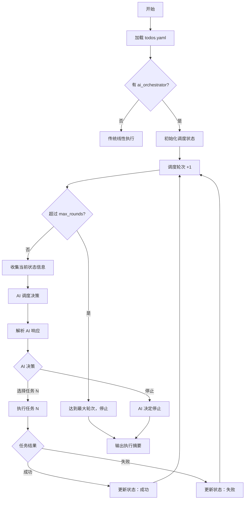

# AI Orchestrator 设计方案

## 1. 动机与目标

### 1.1 问题

当前 AutoAgent 按 `todos.yaml` 中 tasks 的 ID 顺序依次执行所有任务。这种线性执行模型在以下场景中存在局限：

| 场景 | 线性执行的问题 |
|------|---------------|
| **条件分支** | 任务 A 的结果决定接下来执行 B 还是 C，线性模型无法表达 |
| **动态优先级** | 多个待选任务中，应根据当前状态选择最有价值的下一步 |
| **提前终止** | 达到目标后应停止，而非继续执行剩余任务 |
| **重复执行** | 某些任务可能需要在不同条件下被多次调度（不同于 looping 的固定 N 次） |

引入 `if-else`、`break` 等控制流会使 `todos.yaml` 变得过于复杂，违背"用户只定义做什么，系统负责怎么做"的设计哲学。

### 1.2 解决方案

引入 **AI 调度器（AI Orchestrator）**：用户只定义任务集合（无需定义执行顺序），每次执行完一个任务后，由 AI 根据当前状态决定下一个执行的任务（或停止执行）。

### 1.3 设计原则

1. **向后兼容**：没有 `ai_orchestrator` 字段时，行为与现有完全一致
2. **职责边界清晰**：AI 只决定 task 级别的调度顺序，不干涉单个 task 内部的 subtask 工作流
3. **最小侵入**：复用现有的 task 执行器（SimpleTaskExecutor、NestedTaskExecutor、LoopingTaskExecutor），只替换外层调度循环
4. **可观测**：所有调度决策记录在状态文件中，可审计和回溯
5. **可恢复**：支持断点续传，中断后能从上次调度状态恢复

---

## 2. todos.yaml 格式变更

### 2.1 新增顶层字段 `ai_orchestrator`

```yaml
description: |
  项目描述（保持不变）

ai_orchestrator:
  # 调度策略的自然语言描述，注入到调度 AI 的 prompt 中
  strategy: |
    根据当前实验结果决定下一步：
    - 如果尚未建立 baseline，先执行 baseline 任务
    - 如果 baseline 已建立，进入优化循环
    - 如果连续 3 次实验都失败，执行诊断任务
    - 如果达到目标指标，执行最终报告任务并停止

  # 最大调度轮次（防止无限循环，可选，默认 50）
  max_rounds: 30

  # 停止条件的自然语言描述（可选，辅助 AI 判断何时停止）
  stop_condition: |
    当 E2E NRMSE < 0.03 或已完成 30 轮优化时停止。

  # 每个 task 完成后的结果文件配置（可选）
  # 调度 AI 通过读取这些文件了解任务执行结果，从而做出下一步决策
  last_result:
    1:
      type: file                          # "none" | "response" | "file"
      path: D:/project/results/baseline.txt  # 仅 type=file 时需要，必须是绝对路径
    2:
      type: file
      path: D:/project/results/experiment_result.txt
    3:
      type: response                      # 使用 AI 原始 response 的摘要文件
    4:
      type: none                          # 不需要结果

tasks:
  # tasks 定义保持不变，但在 ai_orchestrator 模式下：
  # - 任务不再按 ID 顺序执行
  # - AI 每轮从可用任务中选择一个执行
  # - 同一个任务可以被多次调度（除非标记为 once）
  - id: 1
    name: "Baseline training"
    description: |  # 新增必填字段：对 task 本身的详细描述，供调度 AI 了解任务内容
      Run the baseline training pipeline with default hyperparameters.
      Produces baseline_metrics.txt containing E2E NRMSE and training time.
    type: nested
    once: true  # 新增可选字段：只允许被调度一次
    ...

  - id: 2
    name: "Optimization experiment"
    description: |
      Run one cycle of hyperparameter optimization experiment.
      Each run tries a different configuration and records results to experiment_result.txt.
    type: looping
    ...

  - id: 3
    name: "Diagnostic check"
    description: |
      Analyze recent failure patterns and produce a diagnostic report.
      Helps identify systematic issues blocking optimization progress.
    type: simple
    ...

  - id: 4
    name: "Final report"
    description: |
      Generate a comprehensive final report summarizing all experiments,
      the best configuration found, and key metrics.
    type: simple
    once: true
    ...
```

### 2.2 字段说明

| 字段 | 类型 | 必填 | 默认值 | 说明 |
|------|------|------|--------|------|
| `ai_orchestrator.strategy` | string | ✅ | - | 调度策略描述，注入 AI prompt |
| `ai_orchestrator.max_rounds` | int | ❌ | 50 | 最大调度轮次 |
| `ai_orchestrator.stop_condition` | string | ❌ | `""` | 停止条件描述 |
| `ai_orchestrator.last_result` | dict | ❌ | `{}` | 每个 task 的结果文件配置 |
| `ai_orchestrator.last_result.<id>.type` | string | ✅ | - | `"none"` / `"response"` / `"file"` |
| `ai_orchestrator.last_result.<id>.path` | string | 条件必填 | - | 仅 `type=file` 时需要，必须是绝对路径 |
| `tasks[].description` | string | ✅（AI 调度模式） | - | 对 task 本身的详细描述，供调度 AI 了解任务内容 |
| `tasks[].once` | bool | ❌ | `false` | 是否只允许被调度一次 |

#### `last_result.type` 说明

| type | 含义 | Last Result 来源 |
|------|------|------------------|
| `none` | 不需要结果 | 调度 prompt 中不显示 Last Result |
| `response` | 使用 AI 最终 response 的截断版本 | 自动保存到 `.autoagent/<run>/task_results/result_<task_id>.txt` |
| `file` | 用户指定的结果文件 | 读取 `path` 指定的文件内容 |

#### `type=response` 保存机制

- **保存内容**：AI 最终 response 文本的前 4000 字节截断版本
- **保存来源**：始终保存最后一个执行单元的 response：
  - `simple` 任务：保存该任务的 AI response
  - `nested` 任务：保存最后一个 subtask 的 AI response
  - `looping` 任务：保存最后一轮最后一个 subtask 的 AI response
- **注意**：`nested` 任务通常不应使用 `type=response`，因为最后一个 subtask 的 response 往往不能代表整个任务的结果。推荐使用 `type=file`，在最后一个 subtask 中生成汇总文件
- **与代码中已有行为一致**：此截断保存逻辑与现有 `SubtaskResult.response_text` 的处理方式一致

> **Schema 校验规则**：当 `type=file` 时，`path` 必须存在且为绝对路径（`os.path.isabs(path)` 为 True）。

### 2.3 与现有模式的关系

```
todos.yaml 中有 ai_orchestrator 字段？
    │
    ├── 否 → 传统模式：按 ID 顺序执行所有 tasks（现有行为不变）
    │
    └── 是 → AI 调度模式：由 AI 决定执行顺序和停止时机
```

---

## 3. 调度流程

### 3.1 整体流程图



### 3.2 调度决策的输入

每轮调度时，AI 收到以下信息：

1. **项目描述**（`description`，使用最新的 round-scoped description）
2. **调度策略**（`ai_orchestrator.strategy`）
3. **停止条件**（`ai_orchestrator.stop_condition`）
4. **可用任务列表**：每个任务的 id、name、type、description、执行次数、上次执行结果（成功/失败/未运行）、Last Result 文件路径（仅运行过至少一次时显示）
5. **调度历史**：之前每轮选择了哪个任务、执行结果、AI 的 reasoning
6. **当前轮次**：第 N / max_rounds 轮

### 3.3 调度决策的输出

AI 返回一个 JSON 格式的决策：

```json
{
  "action": "execute",
  "task_id": 2,
  "reasoning": "Baseline 已建立，当前 E2E NRMSE = 0.048，开始优化实验"
}
```

或停止：

```json
{
  "action": "stop",
  "reasoning": "已达到目标 E2E NRMSE < 0.03，生成最终报告后停止"
}
```

### 3.4 任务执行

选定任务后，调用现有的 `execute_task()` 方法执行。执行器内部的 subtask 工作流、重试逻辑、AI 评估等完全不变。

---

## 4. 状态管理

### 4.1 调度状态结构

在 `todos_state.yaml` 中新增 `orchestrator` 顶层键：

```yaml
orchestrator:
  mode: ai                    # "ai" | "linear"
  current_round: 5            # 当前轮次
  max_rounds: 30              # 最大轮次
  status: in_progress         # "in_progress" | "completed" | "stopped"
  schedule_history:           # 调度历史记录
    - round: 1
      task_id: "1"
      task_name: "Baseline training"
      result: success             # "success" | "failed"
      reasoning: "首先建立 baseline"
      timestamp: "2026-04-14 18:00:00"
    - round: 2
      task_id: "2"
      task_name: "Optimization experiment"
      result: success
      reasoning: "Baseline 已建立，开始优化"
      timestamp: "2026-04-14 18:20:00"
  task_execution_counts:      # 每个任务被执行的次数
    "1": 1
    "2": 3
    "3": 0
    "4": 0

tasks:
  # 现有的 task 状态（保持不变）
  "1": { status: completed, ... }
  "2": { status: in_progress, ... }
```

### 4.2 断点续传

中断恢复时：
1. 读取 `orchestrator.current_round` 和 `orchestrator.schedule_history`
2. 检查最后一轮的任务是否完成（通过 `tasks` 中的状态判断）
3. 如果最后一轮任务未完成，先恢复执行该任务
4. 任务完成后，继续下一轮调度

### 4.3 `once` 任务的处理

- 标记 `once: true` 的任务，在 `task_execution_counts` 中计数达到 1 后，不再出现在可用任务列表中
- 这与现有的 `simple_once` / `long_running_once` 不同：后者是 subtask 级别的，前者是 task 级别的

### 4.4 任务状态重置

在 AI 调度模式下，同一个任务可能被多次执行。每次被调度时：
- 非 `once` 任务：重置该任务的状态为 `pending`（清除上一次的 subtask 状态），然后执行
- `once` 任务：只执行一次，后续调度时跳过

### 4.5 round_scoped key 格式

#### 4.5.1 背景：现有 round_scoped key 格式（Linear 模式）

在现有的 Linear 模式中，`todos_state.yaml` 中的子任务状态使用 **round-scoped key** 格式：

```
subtask_id @ A.B
```

其中 `@` 是分隔符，`A.B` 是 **round_label**：

| 部分 | 含义 | Nested task | Looping task |
|------|------|-------------|-------------|
| `subtask_id` | 子任务 ID（如 `1.2`、`2.3`） | task_id.subtask_id | task_id.subtask_id |
| `A` | 主轮次 | main evaluation round（主任务评估轮次，每次 main_task_evaluation 后 +1） | loop_idx（循环索引） |
| `B` | 子轮次 | failure sub-round（失败分析子轮次，每次 failure_analysis 后 +1） | failure sub-round（同左） |

**Linear 模式示例**：

```yaml
# Nested task（Task 1，含 subtask 1.1, 1.2, 1.3）
"1.1@1.1":   # subtask 1.1, main round 1, failure sub-round 1（初始执行）
"1.2@1.1":   # subtask 1.2, main round 1, failure sub-round 1
"1.3@1.1":   # subtask 1.3, main round 1, failure sub-round 1 → 失败
"1.3@1.2":   # subtask 1.3, main round 1, failure sub-round 2（failure_analysis 后重试）
"1.1@2.1":   # subtask 1.1, main round 2（main_task_evaluation 后重新执行）

# Looping task（Task 2，repeat_count=3，含 subtask 2.1, 2.2）
"2.1@1.1":   # subtask 2.1, loop 1, failure sub-round 1
"2.2@1.1":   # subtask 2.2, loop 1, failure sub-round 1
"2.1@2.1":   # subtask 2.1, loop 2, failure sub-round 1
"2.2@2.1":   # subtask 2.2, loop 2, failure sub-round 1 → 失败
"2.2@2.2":   # subtask 2.2, loop 2, failure sub-round 2（failure_analysis 后重试）
"2.1@3.1":   # subtask 2.1, loop 3, failure sub-round 1
```

> **注意**：`*_once` 类型的子任务使用 plain key（不带 `@`），跨所有轮次共享状态。

#### 4.5.2 AI 调度模式：subtask_id 扩展为 `X.Y.Z`

在 AI 调度模式下，subtask_id 从现有的二级格式 `Y.Z` 扩展为三级格式 `X.Y.Z`：

| 层级 | 含义 | 示例 |
|------|------|------|
| `X` | 调度轮次（schedule round），全局累加 | `1`, `2`, `3`, ... |
| `Y` | 任务 ID（task_id） | `1`, `2`, `3`, ... |
| `Z` | 子任务 ID（subtask_id），与原有格式一致 | `1`, `2`, `3`, ... |

**subtask_id 示例**：

```
调度轮次 1 → 执行 Task 1（nested，含 subtask 1.1, 1.2）
  1.1.1  — 调度轮次 1，Task 1，Subtask 1
  1.1.2  — 调度轮次 1，Task 1，Subtask 2

调度轮次 2 → 执行 Task 2（simple）
  2.2    — 调度轮次 2，Task 2（simple 任务没有 Z 层级）

调度轮次 3 → 执行 Task 2（再次调度，nested）
  3.2.1  — 调度轮次 3，Task 2，Subtask 1
  3.2.2  — 调度轮次 3，Task 2，Subtask 2

调度轮次 4 → 执行 Task 1（再次调度）
  4.1.1  — 调度轮次 4，Task 1，Subtask 1
  4.1.2  — 调度轮次 4，Task 1，Subtask 2
```

#### 4.5.3 完整的 state key 格式：`X.Y.Z@A.B`

在 AI 调度模式下，完整的 round-scoped state key 是 **subtask_id + `@` + round_label** 的组合：

```
X.Y.Z @ A.B
└─┬─┘   └┬┘
  │      └── round_label（与 Linear 模式含义一致）
  └── subtask_id（AI 调度模式下扩展为三级）
```

**完整 state key 示例**：

```yaml
# 调度轮次 1 → 执行 Task 1（nested，含 subtask 1.1, 1.2, 1.3）
"1.1.1@1.1":   # 调度轮次 1, Task 1, Subtask 1, main round 1, failure sub-round 1
"1.1.2@1.1":   # 调度轮次 1, Task 1, Subtask 2, main round 1, failure sub-round 1
"1.1.3@1.1":   # 调度轮次 1, Task 1, Subtask 3, main round 1, failure sub-round 1 → 失败
"1.1.3@1.2":   # failure_analysis 后重试 → failure sub-round 2
"1.1.1@2.1":   # main_task_evaluation 后 → main round 2

# 调度轮次 2 → 执行 Task 2（simple）
"2.2@1.1":     # 调度轮次 2, Task 2（simple）, round 1.1

# 调度轮次 3 → 再次执行 Task 1（nested）
"3.1.1@1.1":   # 调度轮次 3, Task 1, Subtask 1, main round 1, failure sub-round 1
"3.1.2@1.1":   # 调度轮次 3, Task 1, Subtask 2, main round 1, failure sub-round 1
```

> **对比**：同一个 Task 1 的 Subtask 1 在不同调度轮次中的 state key：
> - 调度轮次 1：`1.1.1@1.1`（X=1）
> - 调度轮次 3：`3.1.1@1.1`（X=3）
> - 通过 `X` 前缀可以立即区分不同调度轮次的状态

**设计理由**：
- `X` 全局累加（不按 task 独立计数），使得在 log 文件中可以看到清晰的全局工作流时间线
- 通过 `X` 前缀，可以立即区分同一个 task 的不同调度轮次的日志
- `@A.B` 部分与 Linear 模式完全一致，复用现有的 round_label 机制
- 在 Linear 模式下，`X` 层级不存在，保持现有的 `Y.Z@A.B` 格式不变

### 4.6 round_scoped description 行为

在 AI 调度模式下，`description@N` 的语义与 Linear 模式不同：

| 模式 | `description@N` 行为 |
|------|---------------------|
| **Linear** | `description@N` 对 Task N 及之后的任务生效，Task 1~N-1 仍使用根 `description` |
| **AI 调度** | 每次传入**最新的** description，忽略更早的 description |

**AI 调度模式的具体规则**：
1. 调度 AI 和执行 AI 的 prompt 中，`<project_description>` 始终使用**最新的** scoped description
2. "最新"的定义：`scope_id` 最大且 `scope_id <= 当前最大已定义 task_id` 的 description
3. 如果 Ideas Watcher 追加了新任务并带有新的 `description@N`，后续所有调度轮次都使用这个新 description

**示例**：

```yaml
description: |
  Initial project description.

description@3: |
  Updated description after adding optimization tasks.
```

- 如果 tasks 定义到 Task 5：使用 `description@3`（最大 scope_id <= 5）
- Ideas Watcher 追加 Task 6-8 并带有 `description@6`：后续使用 `description@6`

**与 Linear 模式的区别**：Linear 模式按 task_id 分段选择 description，AI 调度模式全局使用最新的 description（因为调度是全局的，不按 task_id 分段）。

---

## 5. Prompt 设计

### 5.1 调度 Prompt 结构

```
You are an AI task scheduler. Your job is to decide which task to execute
next, or whether to stop execution.

You must respond with a JSON object in one of these formats:
1. Execute a task: {"action": "execute", "task_id": <id>, "reasoning": "<why>"}
2. Stop execution: {"action": "stop", "reasoning": "<why>"}

You must choose exactly ONE task per round.

<context>
    Current Round: {current_round} / {max_rounds}

    <project_description>
        {project_description}
    </project_description>

    <scheduling_strategy>
        {ai_orchestrator.strategy}
    </scheduling_strategy>

    <stop_condition>
        {ai_orchestrator.stop_condition}
    </stop_condition>

    <available_tasks>
        - Task {id}: {name}
            Type: {type}
            Description:
                {description}
            Executed: {count} time(s)
            Last Result: ✅ success (See {last_result_path})
        - Task {id}: {name}
            Type: {type}
            Description:
                {description}
            Executed: {count} time(s)
            Last Result: ❌ failed (See {last_result_path}) (Not found, probably due to task failures)
        - Task {id}: {name}
            ...
            (tasks not yet executed do not show Last Result line)
    </available_tasks>

    <schedule_history> (last 10 rounds)
        - Round {n}: ✅
            Task {id} ({name})
            Reasoning: {reasoning}
        - Round {n}: ❌
            Task {id} ({name})
            Reasoning: {reasoning}
        - Round {n}:
            ...
    </schedule_history>
</context>
```

#### Prompt 设计说明

1. **System prompt 精简**：去除了冗余规则（如 "Consider the scheduling strategy and stop condition" 和 "Tasks marked once: true can only be executed once"），因为前者是废话，后者已通过从 available_tasks 中移除已执行的 once 任务来保证。
2. **XML 结构化**：使用 `<context>` 包裹所有上下文信息，内部使用语义化标签，便于 AI 解析。
3. **Last Result 条件显示**：只有任务运行过至少一次时才显示 `Last Result` 行。显示格式为 `✅ success (See {path})` 或 `❌ failed (See {path})`。对于 `type=file`，如果文件不存在则追加 `(Not found, probably due to task failures)`。对于 `type=none` 的任务，不显示 `Last Result` 行。对于 `type=response` 的任务，路径是自动保存的 response 截断文件（如 `.autoagent/<run>/task_results/result_1.txt`）。
4. **Schedule History 包含执行结果**：每轮记录包含 ✅/❌ 标记，让调度 AI 快速了解历史执行情况，无需逐个读取 Last Result 文件。

### 5.2 Prompt 截断策略

- `schedule_history`：保留最近 10 轮的完整记录，更早的只保留 task_id
- `task description`：截断到 `truncation_limits.max` 字符

---

---

## 6. 与现有功能的交互

### 6.1 Ideas Watcher

AI 调度模式与 Ideas Watcher 兼容：
- Ideas 生成的新任务追加到 `tasks` 列表后，AI 调度器在下一轮可以看到新任务
- `reload_todos()` 后，调度器自动获取更新的任务列表

### 6.2 `--task` 参数

指定 `--task N` 时，即使配置了 `ai_orchestrator`，也直接执行指定任务（跳过调度）。

### 6.3 `--continue` / `--resume`

断点续传时，从 `orchestrator` 状态恢复调度进度，继续执行。

### 6.4 `--status`

状态显示增加调度信息：
```
📊 AI Orchestrator Status
   Mode: AI-scheduled
   Round: 5 / 30
   Schedule: Task 1 ✅ → Task 2 ✅ → Task 2 ✅ → Task 3 ❌ → Task 2 ✅
```

### 6.5 `--reset`

重置时同时清除 `orchestrator` 状态。

---

## 7. 边界情况处理

| 场景 | 处理方式 |
|------|----------|
| AI 返回无效 JSON | 重试解析，最多 3 次（config.yaml可配置），失败则停止 |
| AI 选择了不存在的 task_id | 提示错误，要求重新选择，不重置上下文 |
| AI 选择了已用尽的 `once` 任务 | 提示错误，要求重新选择，不重置上下文 |
| 所有 `once` 任务已完成，非 `once` 任务为空 | 自动停止 |
| AI 调用失败（网络错误等） | 使用现有的 backoff 重试机制 |
| 调度 AI 的 session 超时 | 每轮调度使用独立 session，无累积风险 |

---

## 8. 示例：NeuralBasisField 优化场景

```yaml
description: |
  NeuralBasisField 训练算法优化...

ai_orchestrator:
  strategy: |
    调度规则：
    1. 如果 baseline 未建立（Task 1 未执行），先执行 Task 1
    2. baseline 建立后，执行 Task 2（优化实验循环）
    3. 每次 Task 2 完成后，检查是否达到目标：
       - 如果 E2E NRMSE < 0.03，执行 Task 3（最终报告）然后停止
       - 如果连续 3 次实验都 discard，执行 Task 4（诊断）
       - 否则继续执行 Task 2
    4. Task 4 完成后，回到 Task 2 继续优化
  max_rounds: 30
  stop_condition: |
    当 E2E NRMSE < 0.03 或已完成 30 轮调度时停止。
  last_result:
    1:
      type: file
      path: D:/project/results/baseline_metrics.txt
    2:
      type: file
      path: D:/project/results/experiment_result.txt
    3:
      type: file
      path: D:/project/results/final_report.txt
    4:
      type: response

tasks:
  - id: 1
    name: "Environment pre-check and baseline"
    description: |
      Verify the training environment is correctly set up, then run the
      baseline training with default hyperparameters. Produces
      baseline_metrics.txt with E2E NRMSE and training time.
    type: nested
    once: true
    ...

  - id: 2
    name: "Run one optimization experiment cycle"
    description: |
      Execute one round of hyperparameter optimization. Read the latest
      experiment results, choose a new configuration, run training, and
      record the outcome to experiment_result.txt.
    type: nested
    ...

  - id: 3
    name: "Generate final report"
    description: |
      Compile all experiment results into a comprehensive final report
      including best configuration, key metrics, and recommendations.
    type: simple
    once: true
    ...

  - id: 4
    name: "Diagnostic: analyze failure patterns"
    description: |
      Analyze recent consecutive failures to identify systematic issues.
      Produce a diagnostic report with root cause analysis and suggested
      fixes to unblock optimization progress.
    type: simple
    ...
```

---

## 9. 测试计划

### 9.1 单元测试

- `_load_todos()` 正确解析 `ai_orchestrator` 字段
- `_validate_task()` 正确处理 `once` 字段
- `_get_available_tasks()` 正确过滤已用尽的 `once` 任务
- `state_manager` 正确读写 `orchestrator` 状态

### 9.2 仿真测试

使用 `TestProvider` 创建仿真测试：
- 基本调度流程：AI 选择任务 → 执行 → 选择下一个 → 停止
- `once` 任务只执行一次
- 断点续传：中断后恢复调度进度
- 最大轮次限制
- AI 返回无效决策的错误处理

### 9.3 集成测试

使用真实 AI provider 测试完整的调度流程。

---

## 10. 文档更新计划

| 文档 | 更新内容 |
|------|----------|
| `ARCHITECTURE.md` | 新增 AI Orchestrator 章节 |
| `USAGE.md` | 新增 AI 调度模式使用说明 |
| `API_REFERENCE.md` | 新增调度相关 API |
| `EXAMPLES.md` | 新增 AI 调度模式示例 |
| `todos.example.yaml` | 新增 AI 调度模式示例 |
| `TASK_DESIGN_GUIDE_AI_SCHED.md` | 新增 AI 调度模式的任务设计指南 |
